# 经典案例

POLYV保利威直播适用于各类音视频直播场景，比如教育行业的在线教育、网络课堂、双师课堂等；医疗行业的医学在线培训、手术直播、医学会议等； 娱乐行业的带货直播、游戏直播等；金融行业的企业在线培训、投资者教育、大会直播、一对一投资顾问等；另外还适用于展会直播、微信直播、年会直播、企业培训等其他视频相关行业。

## 1.在线教育

#### 1.1服务架构

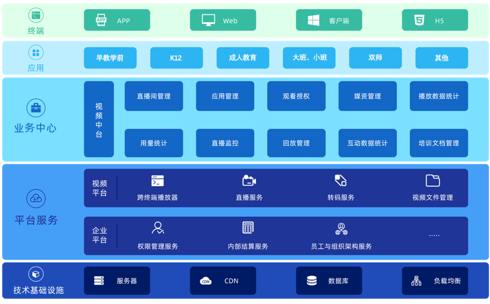

#### 1.2功能特性

##### 丰富课堂互动

- 举手提问、红包打赏、答题互动，让在线课堂更生动
- 支持17人实时连麦，兼容PC和小程序端,师生交流更高效助教管理课堂，解答学员疑问，提高教学效率

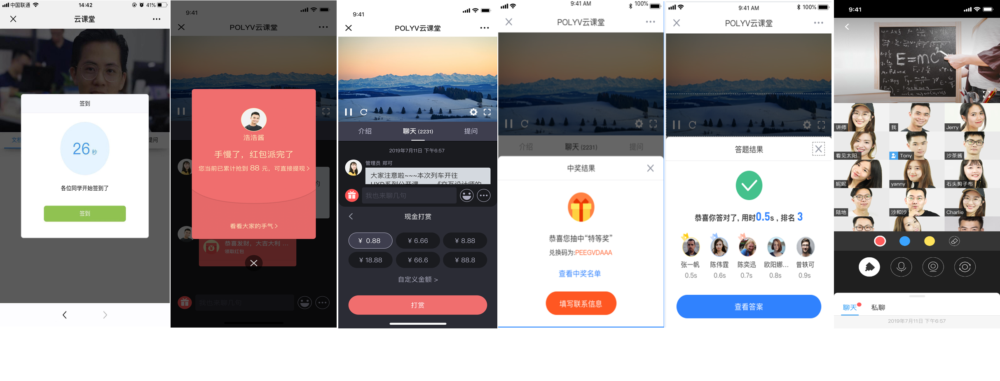

##### 品牌个性化定制

- logo水印，倍速播放，音视频切换，播放器UI等丰富自定义设置
- 支持视频功能、播放界面、微信端及移动APP定制，打造企业品牌一体化

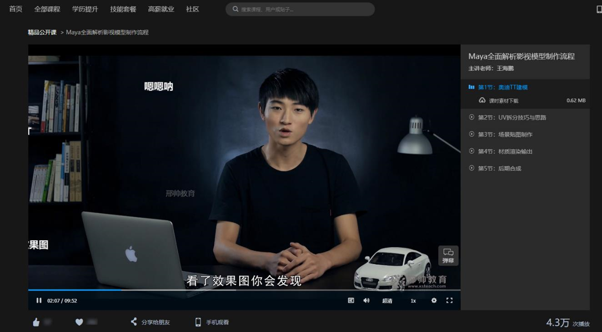

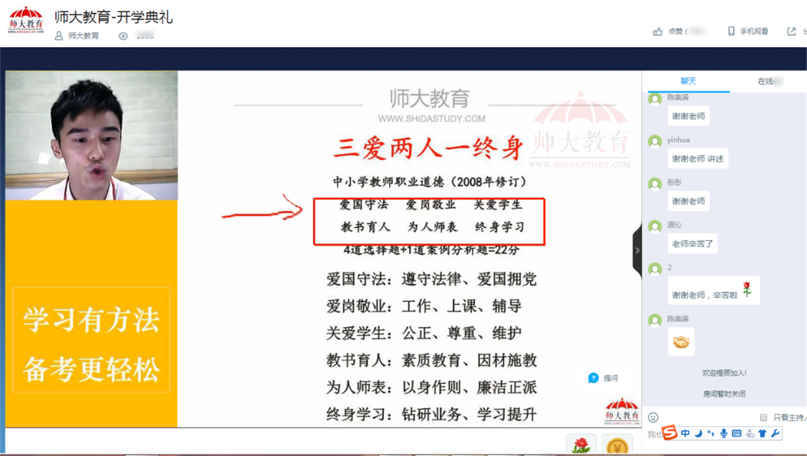

##### 360°视频安全防护

- 自主研发核心加密算法VRM9.0，业内首创H5播放器加密，覆盖PC/Web/APP/小程序等多个平台终端
- 支持OVP防盗链，二次鉴权等，播放器域名限制，防止第三方网站盗取原创视频课程
- 支持ATS/HTTPS数据防劫持，网页防篡改，禁止网页广告插件
- 研发ID跑马灯、浏览器防录屏等多种视频防录技术，追溯录屏者
  信息，震慑录屏者

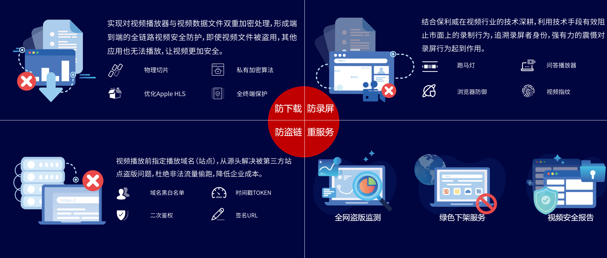

##### 裂变营销招生

- 视频预览购买，访客信息收集，水印/文字提供超链等，精准引流目标学员
- 课程视频资源一键分享至微信、QQ、微博等各社交平台，提升品牌影响力
- 衔接微信，邀请榜，公众号吸粉邀约推广，一步到位

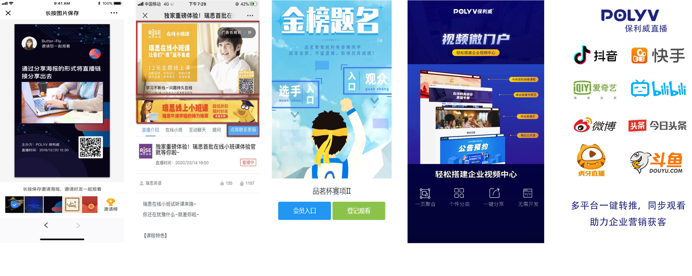

##### 数据司南统计分析

- 直播间视频PV、UV
- 用户平均观看时长
- 用户登录平台统计分析

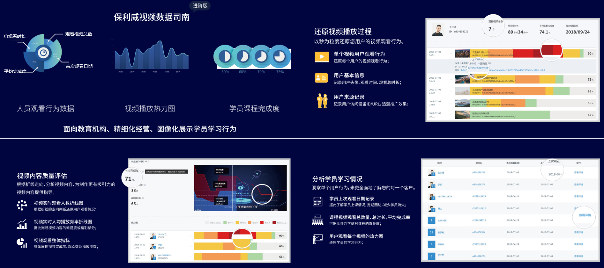

## 2.金融行业

### 2.1 功能特性

#### 投资者教育

- **实时指导：**实时共享屏幕分享行情软件和名师实操，及时指导
- **嘉宾连麦：**一位老师授课&多会场同步观看、一个会场&多位老师授课、视频会议等
- **品牌个性化：**引导图、暖场图片视频、logo、广告、页面菜单自定义
- **多渠道传播：**丰富的API/SDK，无缝嵌入官网/APP/公众号/小程序

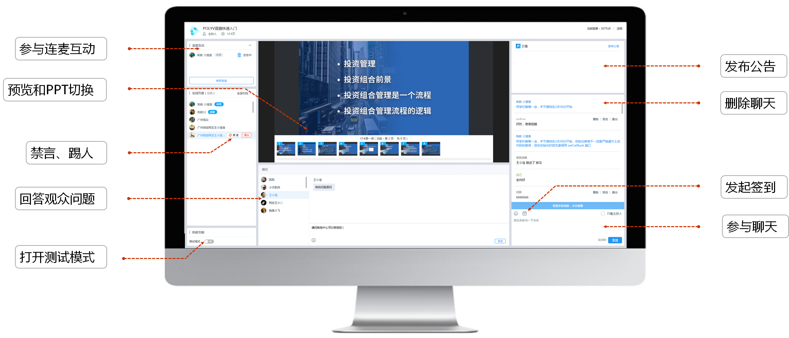

#### 企业在线培训

- **文档演示：**文档+讲师影像、屏幕共享、画笔、白板、发送本地图片、本地多媒体播放
- **身份验证：**支持授权观看/登记观看/自定义观看/验证码观看等，防止泄密
- **数据统计：**实时观看数据统计、观看行为分析、互动数据统计、数据报表、视频分类统计
- **录制回放：**自动录制，在线编辑，一键回放，方便学员随时回顾课程

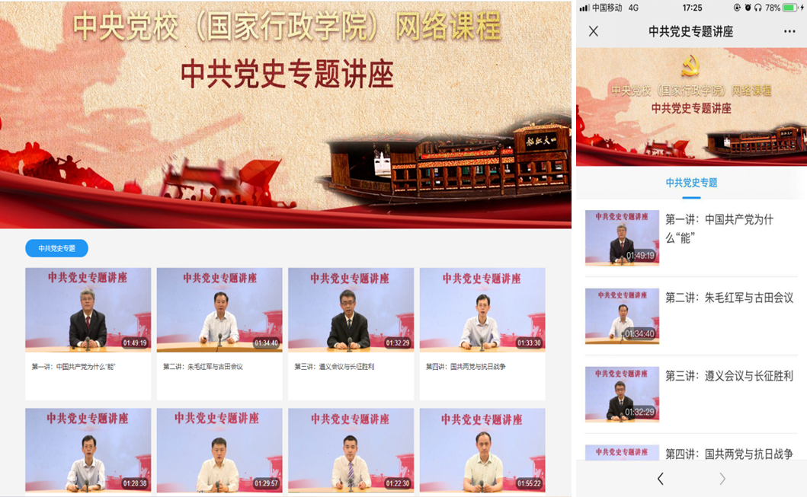

#### 大会直播

- **稳定流畅：**超清画质，百万级并发，春晚、世界杯同级别稳定性
- **驻场支持：**与金牌合作拍摄方深度合作，支持单机位/多机位的拍摄方案
- **丰富互动：**聊天、问答、打赏、弹幕、直播答题、多人音视频通话、问卷投票
- **裂变营销：**微信分享、条件观看、公众号一键关注、邀请榜等

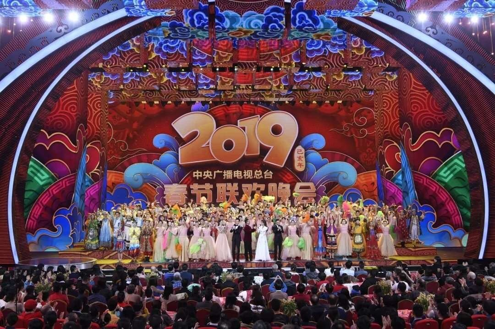

#### 一对一投资顾问

- **方便快捷：**PC、小程序发起和接入，随时随地音视频通话
- **形式多样：**文档展示、屏幕共享、画笔等多种功能，提升沟通效率
- **稳定流畅：**高清画质，稳定流畅，极致用户体验
- **安全管控：**授权观看、视频加密，保障沟通的私密性与安全性

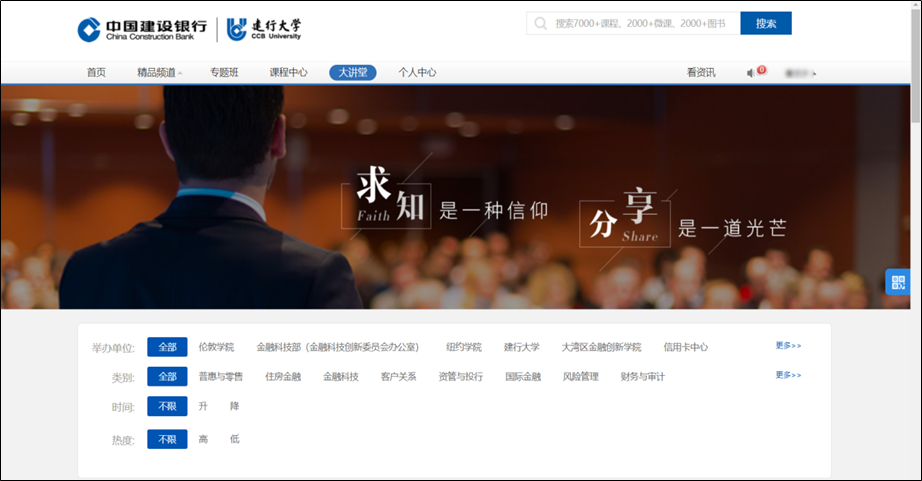

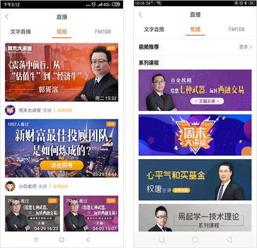

## 3.企业培训

### 3.1功能特性

## 1 娱乐秀场场景

### 1.1 功能特性

1)满足超大并发、低延时的直播要求。

2)支持移动端、PC端、Web端等方式发起直播，提供全平台直播SDK，让直播方式更加灵活、全面，适应不同的直播环境，无论是客户端的游戏直播、电竞赛事直播以及手机美女主播都能全面覆盖。

3)提供移动端和web端等灵活的播放器，支持下发hls/rtmp/flv多协议直播流，满足多种不同的播放需求。

4)多维护的统计数据帮助用户更好地分析主播热度、观众区域热度分布、高低峰时段等。

5)提供直播实时录制保存到云平台，并支持回看、下载、转码等功能。 此外，支持IM SDK（网易云信IM）集成在移动端和网页应用中，提供即时通信功能，极大地丰富了直播过程中主播与观众的交互方式。

### 1.2 系统架构

## 2 远程教育场景

### 2.1 功能特性

1)满足清晰、实时的远程直播授课要求。

2)支持移动端、PC端、Web端等方式发起授课，提供全平台直播SDK，让授课方式更加灵活、全面，适应不同的教学场景。此外，还支持符合RTMP标准的直播源接入，如相关的视频硬件编码器等专业录制设备，通过此类设备可支持如微格教室等传统录播系统的接入。

3)提供移动端和web端等灵活的播放器，支持下发hls/rtmp/flv多协议直播流，满足多种不同的观看需求。

4)详细的统计数据帮助更好地分析学生观看行为等。

5)提供直播实时录制保存到云平台，并支持回看、下载、转码等功能。

6)支持IM SDK（网易云信IM）无缝对接，提供即时通信功能，极大地丰富了授课过程中老师与学生的交互方式。

### 2.2 系统架构

## 3 电商直播场景

### 3.1 功能特性

1)丰富在售商品的功能介绍、实际效果展示。

2)拉近卖家与买家的距离，沟通方式更直观、便捷。

3)通过直播为电商平台导流，极大地增加每日PV和UV，打造粉丝经济。

4)支持移动端、PC端、Web端等方式发起直播，提供全平台直播SDK，快速发布各类直播方式。提供移动端和web端等灵活的播放器，支持下发hls/rtmp/flv多协议直播流，满足多种不同的观看需求。

5)详细的统计数据帮助卖家地分析买家购买行为等。

6)支持IM SDK（网易云信IM）无缝对接，提供即时通信功能，极大地丰富了直播过程中卖家与买家的交互方式。

### 3.2 系统架构

## 4 在线金融场景

### 4.1 功能特性

1)开设在线专家讲座，直播金融产品介绍、投资策略。

2)对股指、贵金属、外汇等实时操作性高的金融产品，专家在线直播技术分析、指导投资者。

3)支持移动端、PC端、Web端等方式发起直播，提供全平台直播SDK，快速发布各类直播方式。提供移动端和web端等灵活的播放器，支持下发hls/rtmp/flv多协议直播流，满足多种不同的观看需求。

4)详细的统计数据帮助金融平台更好地分析投资者投资行为等。

5)支持IM SDK（网易云信IM）无缝对接，提供即时通信功能，极大地丰富了直播过程中专家与投资者的交互方式

### 4.2 系统架构

