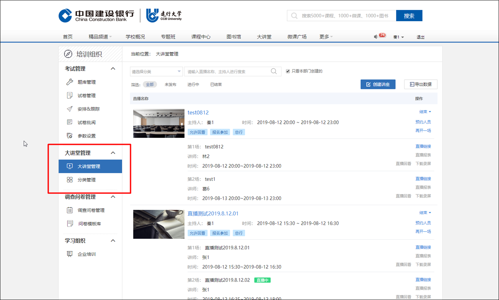
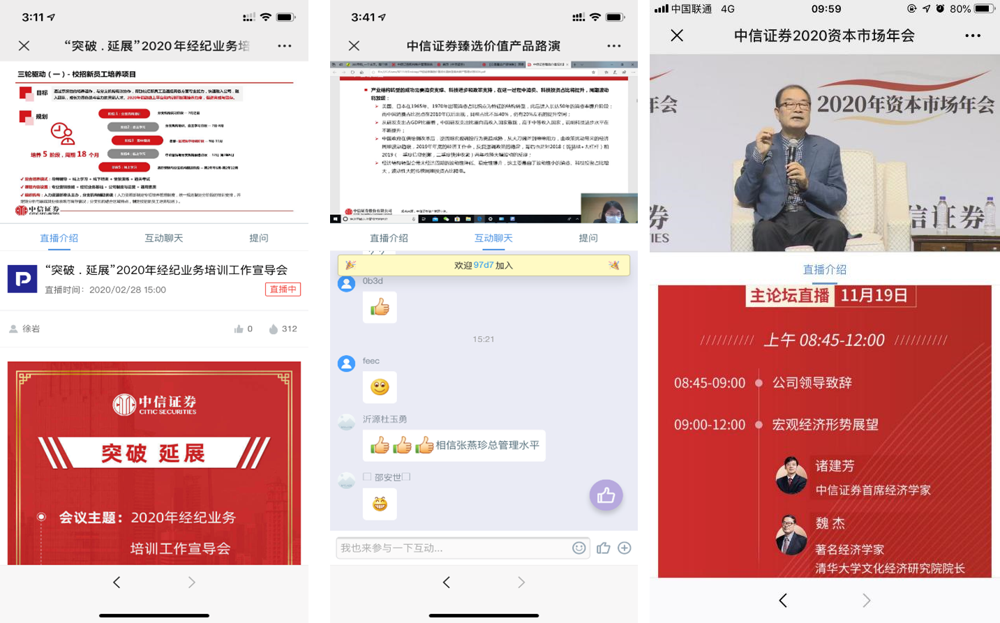
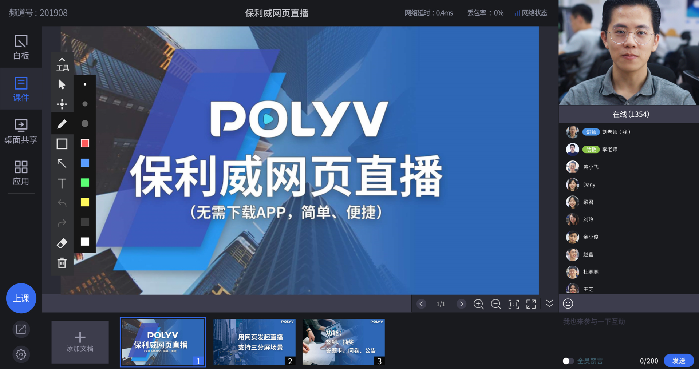
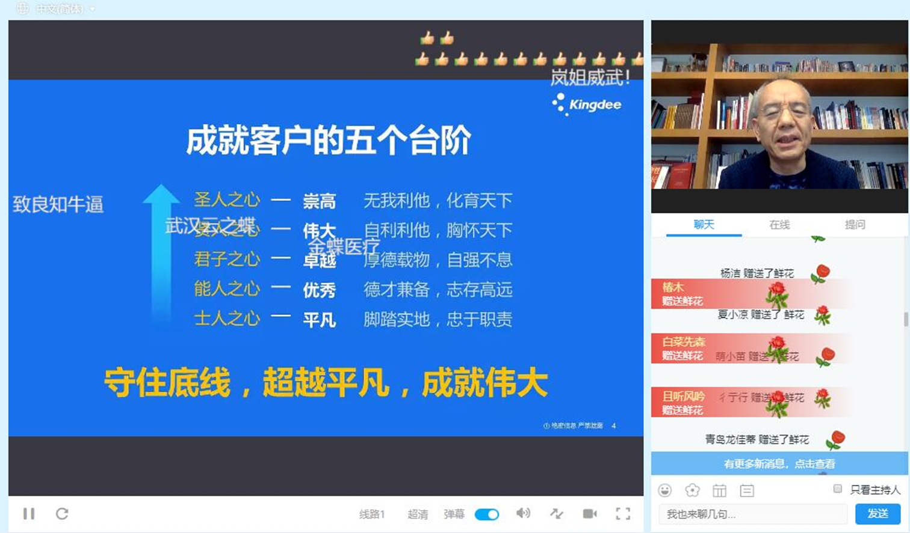
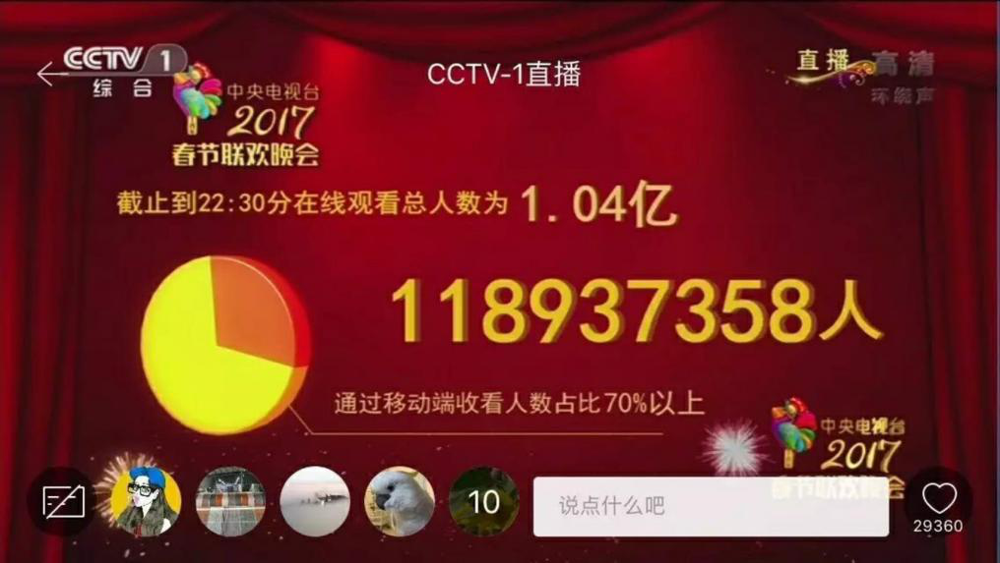
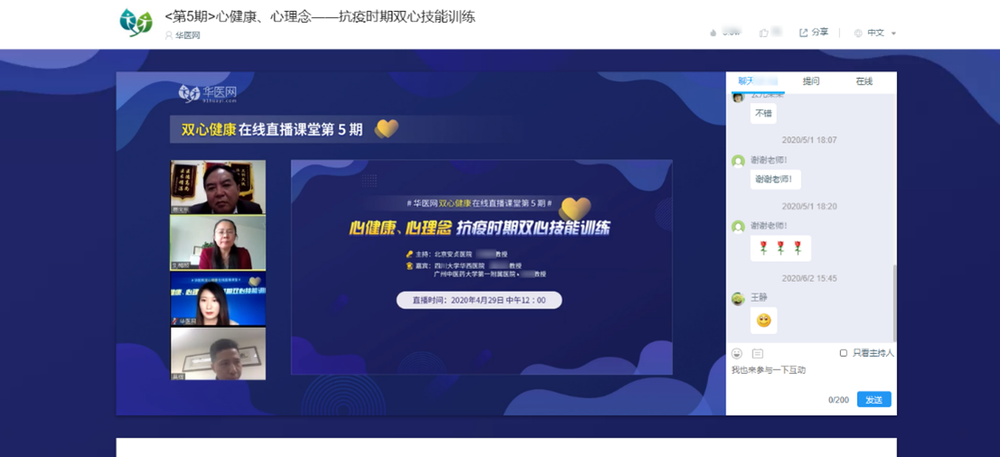
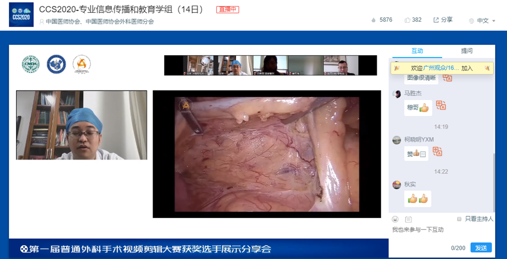
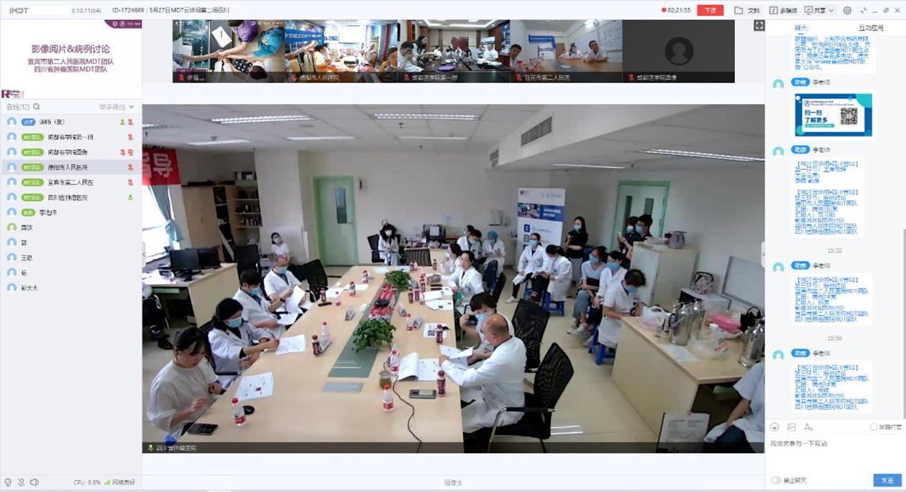
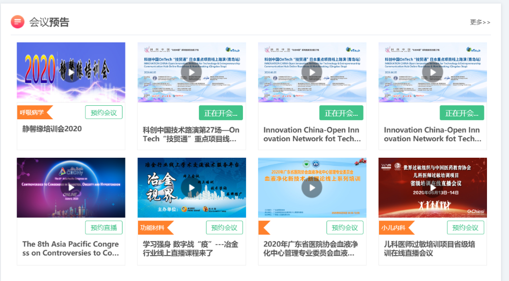

# 

POLYV保利威直播适用于各类音视频直播场景，比如教育行业的在线教育、网络课堂、双师课堂等；医疗行业的医学在线培训、手术直播、医学会议等； 娱乐行业的带货直播、游戏直播等；金融行业的企业在线培训、投资者教育、大会直播、一对一投资顾问等；另外还适用于展会直播、微信直播、年会直播、企业培训等其他视频相关行业。

# 1.在线教育

## 1.1服务架构

## 1.2功能特性

### 丰富课堂互动

- 举手提问、红包打赏、答题互动，让在线课堂更生动
- 支持17人实时连麦，兼容PC和小程序端,师生交流更高效助教管理课堂，解答学员疑问，提高教学效率

### 品牌个性化定制

- logo水印，倍速播放，音视频切换，播放器UI等丰富自定义设置
- 支持视频功能、播放界面、微信端及移动APP定制，打造企业品牌一体化

### 360°视频安全防护

- 自主研发核心加密算法VRM9.0，业内首创H5播放器加密，覆盖PC/Web/APP/小程序等多个平台终端
- 支持OVP防盗链，二次鉴权等，播放器域名限制，防止第三方网站盗取原创视频课程
- 支持ATS/HTTPS数据防劫持，网页防篡改，禁止网页广告插件
- 研发ID跑马灯、浏览器防录屏等多种视频防录技术，追溯录屏者
  信息，震慑录屏者

### 裂变营销招生

- 视频预览购买，访客信息收集，水印/文字提供超链等，精准引流目标学员
- 课程视频资源一键分享至微信、QQ、微博等各社交平台，提升品牌影响力
- 衔接微信，邀请榜，公众号吸粉邀约推广，一步到位

### 数据司南统计分析

- 直播间视频PV、UV
- 用户平均观看时长
- 用户登录平台统计分析

# 2.金融行业

## 2.1 功能特性

### 投资者教育

- **实时指导：**实时共享屏幕分享行情软件和名师实操，及时指导
- **嘉宾连麦：**一位老师授课&多会场同步观看、一个会场&多位老师授课、视频会议等
- **品牌个性化：**引导图、暖场图片视频、logo、广告、页面菜单自定义
- **多渠道传播：**丰富的API/SDK，无缝嵌入官网/APP/公众号/小程序

### 一对一投资顾问

- **方便快捷：**PC、小程序发起和接入，随时随地音视频通话
- **形式多样：**文档展示、屏幕共享、画笔等多种功能，提升沟通效率
- **稳定流畅：**高清画质，稳定流畅，极致用户体验
- **安全管控：**授权观看、视频加密，保障沟通的私密性与安全性

# 3.企业培训

## 3.1功能特性

### 企业在线培训

- **文档演示：**文档+讲师影像、屏幕共享、画笔、白板、发送本地图片、本地多媒体播放
- **身份验证：**支持授权观看/登记观看/自定义观看/验证码观看等，防止泄密
- **数据统计：**实时观看数据统计、观看行为分析、互动数据统计、数据报表、视频分类统计
- **录制回放：**自动录制，在线编辑，一键回放，方便学员随时回顾课程

### 

### 大会直播

- **稳定流畅：**超清画质，百万级并发，春晚、世界杯同级别稳定性
- **驻场支持：**与金牌合作拍摄方深度合作，支持单机位/多机位的拍摄方案
- **丰富互动：**聊天、问答、打赏、弹幕、直播答题、多人音视频通话、问卷投票
- **裂变营销：**微信分享、条件观看、公众号一键关注、邀请榜等

 

# 4.医疗行业

## 4.1 功能特性

### 医学在线培训 

- 文档演示：文档+讲师影像、屏幕共享、画笔、白板、发送本地图片、本地多媒体播放
- 丰富互动：聊天、问答、打赏、弹幕、直播答题、多人音视频通话、问卷投票
- 营销转化：全方位的学员观看行为分析，访客信息收集、邀请卡
- 安全防护：PC/web/小程序/APP/SDK视频加密，防录屏，ID跑马灯，防盗链

### 手术直播

- 极清画质：1080P、4K、8K毛孔级清晰画质
- 医疗设备接入：内窥镜等可视化医疗设备 + 单机位/多机位拍摄
- 多地互动：多地音视频通话、聊天、问答、鲜花等
- 录制回放：直播过程自动录制，一键回放，视频剪辑、合并、打点

### 医学会议

医疗峰会论坛、专家讲座、医学研讨会、科室会

- 稳定流畅：超清画质，百万级并发，春晚、世界杯同级别稳定性
- 驻场支持：与金牌合作拍摄方深度合作，支持单机位/多机位的拍摄方案
- 品牌个性化：引导图、暖场图片视频、logo、自定义广告
- 裂变营销：微信分享、条件观看、公众号一键关注、邀请榜等

