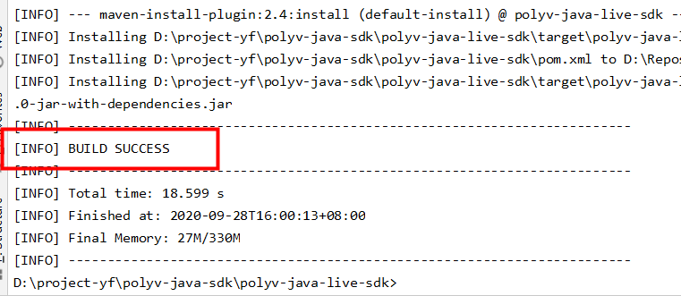

您可以通过直接添加Maven依赖或下载POLYV SDK for Java的jar包的方式安装POLYV SDK for Java。 

## 前提条件

在安装和使用POLYV SDK for Java前，确保您已经：

- 安装Java环境。

  POLYV SDK for Java要求使用JDK1.8或更高版本。

- 注册[保利威账号](https://www.polyv.net/)并获取[访问密钥信息](http://live.polyv.net/#/develop/appId)（UserId  、 AppId 、 AppSecret）。

  > 注意：<font color=#FF0000 >本系统默认演示账号的登录名为：sdk-demo\@polyv.net   ,   密码为：sdk2345</font>  
  >
  > ​             <font color=#FF0000 >本系统默认演示账号的UserId为  1b448be323 ，AppId为  frlr1zazn3  ， AppSecret为  5d5ade8f71f24bb9a2d1176cd607dd17  。   </font>
  
  
  
  
  
  

## 1.添加项目依赖

### 方法一：添加Maven依赖 （强烈推荐）

如果您使用Maven管理Java项目，可以通过在pom.xml文件中添加Maven依赖安装POLYV SDK for Java。SDK产品的Maven依赖信息如下： 

```xml
<dependency>
    <groupId>net.polyv</groupId>
    <artifactId>polyv-java-live-sdk</artifactId>
    <version>1.0.0</version>
</dependency>
```

> 注意：<font color=#FF0000 >为了消除Java的冗长代码  ,SDK使用了jdk1.8的最新特性lombok，请在IntelliJ或者Eclipse 中配置对lombok的支持 </font>

```xml
<dependency>
    <groupId>org.projectlombok</groupId>
    <artifactId>lombok</artifactId>
    <version>1.18.10</version>
</dependency>
```

### 方法二：在集成开发环境中导入JAR文件

无论您使用Eclipse还是IntelliJ作为集成开发环境，都可以通过导入JAR文件的方式安装POLYV SDK for Java。具体步骤如下：

1.下载GIT源码，git地址为[]
2.进入<font color=#FF0000 >polyv-java-live-sdk</font>项目，在命令行下执行 [  mvn clean install -Dmaven.test.skip=true  ] ，打印如下表示执行成功：



3. 进入<font color=#FF0000 >polyv-java-live-sdk</font>项目的target目录，获取<font color=#FF0000 >polyv-java-live-sdk-x.x.x.jar</font> 加入到自己工程；


## 2.执行测试代码

测试创建一个直播频道，单元测试代码如下：

```java
package net.polyv.channel;

import java.io.IOException;
import org.junit.Assert;
import org.junit.Test;
import com.alibaba.fastjson.JSON;
import lombok.extern.slf4j.Slf4j;
import net.polyv.live.config.LiveGlobalConfig;
import net.polyv.live.entity.channel.LiveChannelRequest;
import net.polyv.live.entity.channel.LiveChannelResponse;
import net.polyv.live.service.channel.impl.LiveChannelServiceImpl;

/**
 * @author: thomas
 * @date: 2020/9/18
 **/
@Slf4j
public class ChannelTest {
    /**
     * 系统账号密钥配置
     */
    public ChannelTest() {
        String appId = "frlr1zazn3";
        String appSecret = "5d5ade8f71f24bb9a2d1176cd607dd17";
        String userId = "1b448be323";
        LiveGlobalConfig.init(appId, userId, appSecret);
        System.out.println("--初始化完成--");
    }
    
    /**
     * 测试创建频道
     * @throws IOException
     */
    @Test
    public void testCreateChannel() throws IOException {
        LiveChannelRequest liveChannelRequest = new LiveChannelRequest();
        liveChannelRequest.setName("Spring 知识精讲")
                .setChannelPasswd("666888")
                .setRequestId("2860257a405447e1bbbe9161da2dee72");
        LiveChannelResponse liveChannelResponse = new LiveChannelServiceImpl().createChannel(liveChannelRequest);
        Assert.assertNotNull(liveChannelResponse);
        if (liveChannelResponse != null) {
            //todo something ......
            log.debug("频道创建成功" + JSON.toJSONString(liveChannelResponse));
        }
    }
    
    
}


```

执行单元测试后，官网登录验证创建是否成功；


至此，您已经完成SDK基本配置，可以使用SDK进行其他功能开发和测试，如您接入过程有任何问题，可以通过以下方式反馈：

1.发邮件反馈，wujie@polyv.net ；

2.问题反馈专区，反馈地址： [SDK问题反馈专区]();

请将问题的运行环境、操作步骤、错误反馈信息、联系方式同步反馈，便于问题的快速定位和解决； 


