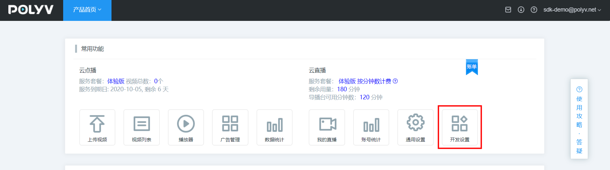
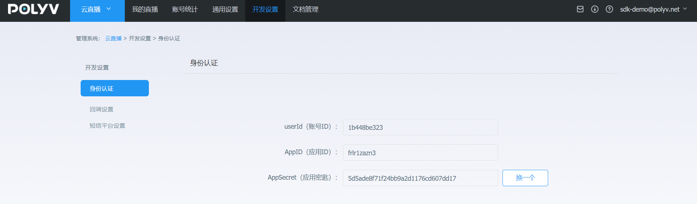
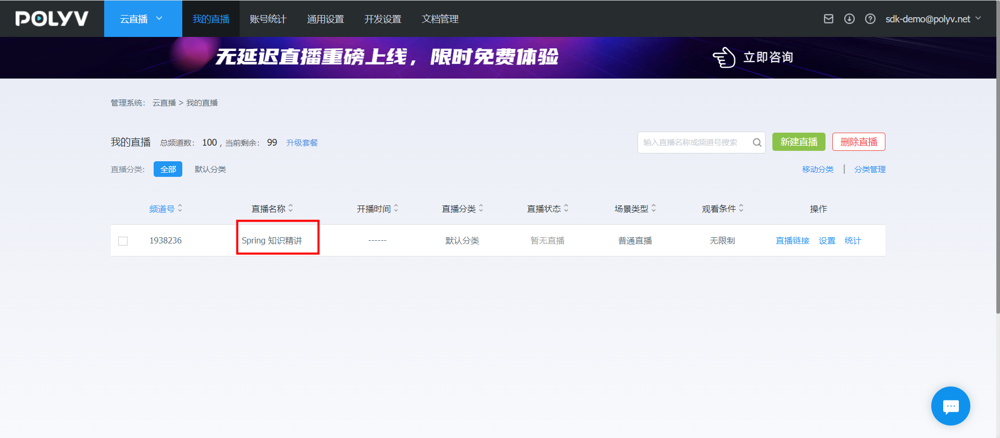

您可以通过直接添加Maven依赖的方式安装POLYV SDK for Java的直播功能。 

## 前提条件

在安装和使用POLYV SDK for Java 直播功能前，确保您已经：

- 安装Java环境。

  POLYV SDK for Java要求使用JDK1.8或更高版本。

- 注册[保利威账号](https://www.polyv.net/)并获取[访问密钥信息](http://live.polyv.net/#/develop/appId)（UserId  、 AppId 、 AppSecret）。

  > 注意：<font color=#FF0000 >本系统默认演示账号的登录名为：sdk-demo\@polyv.net   ,   密码为：sdk2345</font>  
  >
  > ​             <font color=#FF0000 >本系统默认演示账号：
  >
  > UserId=  1b448be323
  >
  > AppId=  frlr1zazn3
  >
  > AppSecret=  5d5ade8f71f24bb9a2d1176cd607dd17</font>
  
  
  
  
  
  

## 1.添加Maven依赖  

如果您使用Maven管理Java项目，可以通过在pom.xml文件中添加Maven依赖安装POLYV SDK for Java的直播模块。SDK产品的Maven依赖信息如下： 

```xml
<dependency>
    <groupId>net.polyv</groupId>
    <artifactId>polyv-java-live-sdk</artifactId>
    <version>1.0.0</version>
</dependency>
 <dependency>
     <groupId>junit</groupId>
     <artifactId>junit</artifactId>
     <version>4.12</version>
     <scope>test</scope>
</dependency>
```

> 注意：<font color=#FF0000 >为了消除Java的冗长代码  ,SDK使用了jdk1.8的最新特性lombok，请在IntelliJ或者Eclipse 中配置对lombok的支持 </font>

```xml
<dependency>
    <groupId>org.projectlombok</groupId>
    <artifactId>lombok</artifactId>
    <version>1.18.10</version>
</dependency>
```

## 2.初始化系统

在执行测试代码之前，需要您先配置自己的测试账号信息，包括UserId \ AppId \ AppSecret , 如没有以上信息，请参考本文[前提条件](/quick_start?id=前提条件)部分获取，下面用系统默认测试账号

````java
  public void init(){
        String appId = "fqs60f693j";
        String appSecret = "ed96a87e486c4c9a9591cf2a61d72a67";
        String userId = "152de5237d";
        LiveGlobalConfig.init(appId,userId,appSecret);
        System.out.println("--初始化完成--");
    }
````

以上代码一般配置于随系统启动执行一次的全局初始化中，如用spring框架，可以参考如下：

````java
package net.polyv.live.config;

import org.springframework.beans.BeansException;
import org.springframework.context.ApplicationContext;
import org.springframework.context.ApplicationContextAware;
import org.springframework.stereotype.Component;
import lombok.extern.slf4j.Slf4j;

/**
 * 默认启动配置类
 * @author: thomas
 
 **/
@Slf4j
@Component
public class StartupListener implements ApplicationContextAware   {
    
    @Override
    public void setApplicationContext(ApplicationContext applicationContext) throws BeansException {
        String appId = "frlr1zazn3";
        String appSecret = "5d5ade8f71f24bb9a2d1176cd607dd17";
        String userId = "1b448be323";
        LiveGlobalConfig.init(appId,userId,appSecret);
        log.info("--初始化完成--");
    }
    
    
}
````

## 3.执行测试代码

测试创建一个直播频道，单元测试代码如下：

```java
package net.polyv.live.service;

import java.io.IOException;
import org.junit.Assert;
import org.junit.Test;
import com.alibaba.fastjson.JSON;
import lombok.extern.slf4j.Slf4j;
import net.polyv.live.config.LiveGlobalConfig;
import net.polyv.live.entity.channel.operate.LiveChannelRequest;
import net.polyv.live.entity.channel.operate.LiveChannelResponse;
import net.polyv.live.service.channel.impl.LiveChannelServiceImpl;

/**
 * @author: thomas
 
 **/
@Slf4j
public class ChannelTest {
    /**
     * 系统账号密钥配置
     */
    public ChannelTest() {
        String appId = "frlr1zazn3";
        String appSecret = "5d5ade8f71f24bb9a2d1176cd607dd17";
        String userId = "1b448be323";
        LiveGlobalConfig.init(appId, userId, appSecret);
        System.out.println("--初始化完成--");
    }
    
    /**
     * 测试创建频道
     * @throws IOException
     */
    @Test
    public void testCreateChannel() throws IOException, NoSuchAlgorithmException {
        LiveChannelRequest liveChannelRequest = new LiveChannelRequest();
        liveChannelRequest.setName("Spring 知识精讲")
                .setChannelPasswd("666888")
                .setRequestId("2860257a405447e1bbbe9161da2dee72");
        LiveChannelResponse liveChannelResponse = new LiveChannelServiceImpl().createChannel(liveChannelRequest);
        Assert.assertNotNull(liveChannelResponse);
        if (liveChannelResponse != null) {
            //todo something ......
            log.debug("频道创建成功" + JSON.toJSONString(liveChannelResponse));
        }
    } 
} 
```

执行单元测试后，控制台应有如下关键输出，表示整合完成：

```json
[main] INFO net.polyv.common.base.HttpClientUtil - ---init HTTP POOL httpClient ----
--初始化完成--

[main] DEBUG net.polyv.live.util.LiveSignUtil - 参与签名参数：{"requestId":"2860257a405447e1bbbe9161da2dee72","appId":"frlr1zazn3","name":"Spring 知识精讲","channelPasswd":"666888","userId":"1b448be323","timestamp":"1602749899519"}
[main] DEBUG net.polyv.live.util.LiveSignUtil - 签名原始字符串：5d5ade8f71f24bb9a2d1176cd607dd17appIdfrlr1zazn3channelPasswd666888nameSpring 知识精讲requestId2860257a405447e1bbbe9161da2dee72timestamp1602749899519userId1b448be3235d5ade8f71f24bb9a2d1176cd607dd17
[main] DEBUG net.polyv.live.util.LiveSignUtil - 签名结果：3B062B164F62F73EAEA211BFBFF2DACA
十月 15, 2020 4:18:19 下午 org.hibernate.validator.internal.util.Version <clinit>
INFO: HV000001: Hibernate Validator 5.0.0.Final
[main] DEBUG net.polyv.common.base.HttpUtil - http 请求 url: https://api.polyv.net/live/v2/channels/ , 请求参数: {"requestId":"2860257a405447e1bbbe9161da2dee72","appId":"frlr1zazn3","name":"Spring 知识精讲","sign":"3B062B164F62F73EAEA211BFBFF2DACA","channelPasswd":"666888","userId":"1b448be323","timestamp":"1602749899519"}
[main] DEBUG net.polyv.common.base.HttpUtil - http 请求结果: {"code":200,"status":"success","message":"","data":{"channelId":1955969,"userId":"1b448be323","name":"Spring 知识精讲","publisher":"主持人","description":"","url":"rtmp://push-d1.videocc.net/recordf/1b448be3231602749952790f88a?auth_key=1602751753-0-0-21e4604b758b7845340a92f13b8c417a","stream":"1b448be3231602749952790f88a","logoImage":"","logoOpacity":1.0,"logoPosition":"tr","logoHref":"","coverImage":"","coverHref":"","waitImage":"","waitHref":"","cutoffImage":"","cutoffHref":"","advertType":"NONE","advertDuration":0,"advertWidth":0,"advertHeight":0,"advertImage":"","advertHref":"","advertFlvVid":"","advertFlvUrl":"","playerColor":"#666666","autoPlay":true,"warmUpFlv":"","passwdRestrict":false,"passwdEncrypted":"","isOnlyAudio":"N","isLowLatency":"N","m3u8Url":"http://pull-d1.videocc.net/recordf/1b448be3231602749952790f88a.m3u8?auth_key=1602749953-0-0-268203aa905b5843008d9dc1abf1b8c8","m3u8Url1":"","m3u8Url2":"","m3u8Url3":"","channelLogoImage":"http://liveimages.videocc.net/assets/wimages/pc_images/logo.png","scene":"alone","channelViewerPasswd":null,"channelPasswd":"666888","linkMicLimit":0,"streamType":"client","pureRtcEnabled":"N","type":"transmit","currentTimeMillis":1602749953113}}
[main] DEBUG net.polyv.live.service.ChannelTest - 频道创建成功{"advertDuration":0,"advertFlvUrl":"","advertFlvVid":"","advertHeight":0,"advertHref":"","advertImage":"","advertType":"NONE","advertWidth":0,"autoPlay":true,"channelId":1955969,"coverHref":"","coverImage":"","currentTimeMillis":1602749953113,"cutoffHref":"","cutoffImage":"","description":"","isLowLatency":"N","isOnlyAudio":"N","linkMicLimit":0,"logoHref":"","logoImage":"","logoOpacity":1,"logoPosition":"tr","m3u8Url":"http://pull-d1.videocc.net/recordf/1b448be3231602749952790f88a.m3u8?auth_key=1602749953-0-0-268203aa905b5843008d9dc1abf1b8c8","m3u8Url1":"","m3u8Url2":"","m3u8Url3":"","name":"Spring 知识精讲","passwdEncrypted":"","passwdRestrict":false,"playerColor":"#666666","stream":"1b448be3231602749952790f88a","url":"rtmp://push-d1.videocc.net/recordf/1b448be3231602749952790f88a?auth_key=1602751753-0-0-21e4604b758b7845340a92f13b8c417a","userId":"1b448be323","waitHref":"","waitImage":"","warmUpFlv":""}


[Thread-1] INFO net.polyv.common.base.HttpClientUtil - -----destroy HTTP POOL httpClient------
```

还可以官网登录验证创建是否成功；


至此，您已经完成直播SDK基本配置，可以使用直播SDK进行其他功能开发和测试，如您接入过程有任何问题，可以通过以下方式反馈：

1.发邮件反馈，wujie@polyv.net ；

2.[官网在线咨询反馈](https://www.polyv.net/)；

请将问题的运行环境、操作步骤、错误反馈信息、联系方式同步反馈，便于问题的快速定位和解决； 


