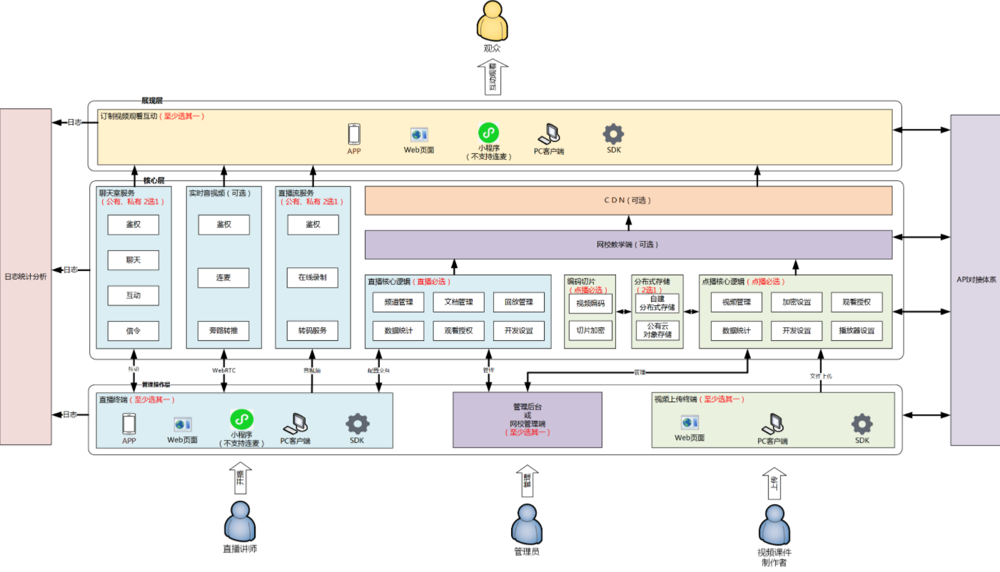
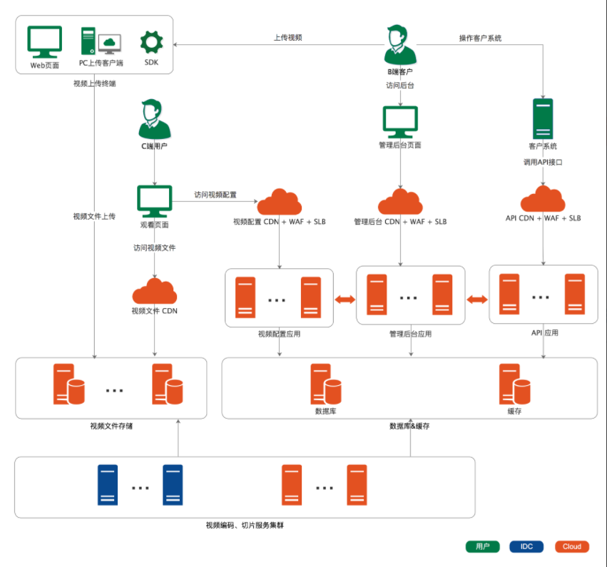
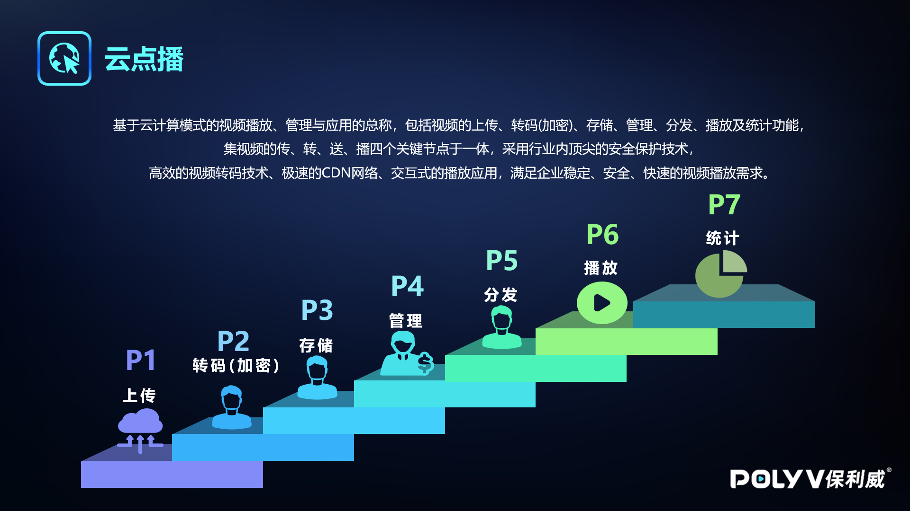
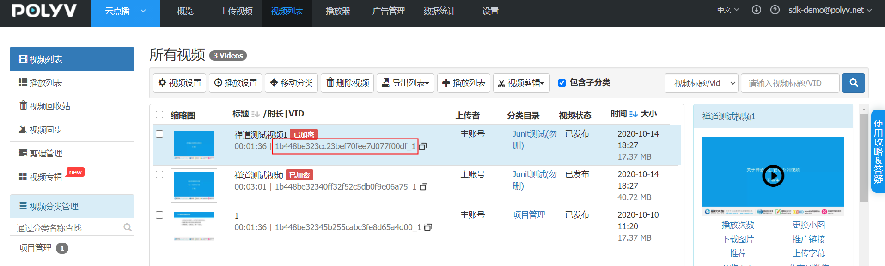

# 简介

欢迎使用POLYV保利威视频云开发工具套件（POLYV SDK for Java）。POLYV SDK for Java让您不用复杂编程即可轻松接入POLYV保利威视频云服务，实现云点播 、云直播和其它视频服务 。本教程介绍如何安装并开始使用POLYV SDK for Java。

如果您在使用SDK的过程中遇到任何问题，欢迎前往保利威视频云[官网在线咨询反馈](https://www.polyv.net/)提问。请将问题的运行环境、操作步骤、错误反馈信息、联系方式同步提交，便于问题的快速定位和解决； 

## 1.基本描述

POLYV保利威是广州易方信息科技股份有限公司旗下拥有自主知识产权的视频云计算服务平台，其中包含云点播 、云直播和其它视频服务，提供API、SDK技术支持，并拥有国家专利级别的PlaySafe®视频版权保护技术及三套CDN加速，致力为用户提供稳定、安全、快速的企业级视频云服务。 

POLYV保利威直播源自公司多年视频技术沉淀，基于专业的跨平台视频编解码技术和大规模视频内容分发网络，提供稳定流畅、低延时、高并发的实时音视频服务，有视频直播需求的用户可调用 的API或SDK即可将视频直播无缝对接到自身的业务应用系统。

本服务适用于各类音视频直播场景，比如教育行业的在线教育、网络课堂、双师课堂等；医疗行业的医学在线培训、手术直播、医学会议等； 娱乐行业的带货直播、游戏直播等；金融行业的企业在线培训、投资者教育、大会直播、一对一投资顾问等；另外还适用于展会直播、微信直播、年会直播、企业培训等其他视频相关行业。

## 2.产品架构

### 总体架构



### 点播架构 



### 基本操作流程

1.B端客户通过SDK上传视频文件以及视频的基本信息；

2.保利威服务器对视频文件进行切片、转码、加密等处理； 

3.C段观众登录B端系统，通过B端系统选择点播视频文件观看；

4.保利威播放器依据客户端环境选择合适的视频播放；

  


## 3.点播基础知识

### 视频VID

vid类似于身份证，每个视频有独立的数字+字母组成的32位字符，可以通过SDK获取或者官网后台查看：



### 视频VID有什么用

点播视频SDK对接过程的编码问题、播放问题等都需要vid作为排查的关键依据

### 视频VID是怎么组成的

vid的前10位是保利威账户的userid，后面的22位为md5值。以`68040382d0`21df73b6ca54fbc18906b7_1为例；

| 组成部分               | 说明       |
| ---------------------- | ---------- |
| 68040382d0             | userid     |
| 21df73b6ca54fbc18906b7 | md5的22位  |
| _1                     | 清晰度标记 |

### 视频id的md5如何生成的

一般来说由文件路径+文件大小+视频目录ID经过字符拼接再转md5取其中22位。

### 点播视频的多清晰度分辨

```
68040382d021df73b6ca54fbc18906b7_1，最后数字为1的时候为流畅；

68040382d021df73b6ca54fbc18906b7_2，最后数字为2的时候表示高清；
 
68040382d021df73b6ca54fbc18906b7_3，最后数字为3的时候表示高清；
```


