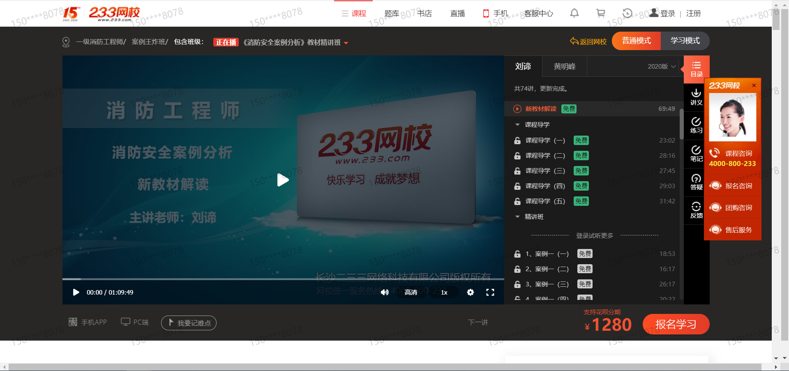

# 经典案例

POLYV保利威点播集视频上传、转码、加密、分发、播放、数据统计为一体，轻松实现企业视频云端存储、播放加速、点播互动、去广告、视频加密、二次开发等需求，适用于在线教育、企业培训、短视频、产品展示、视频学习网站等场景。 

# 功能特性

## 视频版权保护体系

- 业内首创H5播放器加密，自主研发VRM9.0核心加密算法，全终端覆盖
- 支持OVP防盗链、时间戳token、二次鉴权等多种防盗链技术
- 应用ATS/HTTPS安全协议，有效防止视频/网页被篡改
- 浏览器防录屏、ID跑马灯、视频水印等多维度视频防录
- 全网盗版监测，提供绿色通道，快速下架市面盗版视频

## 极致视频播放体验

- 视频播放无第三方广告干扰，企业可自设广告内容
- 多码率、多倍速，观众可据观看需求自定义
- 视频切片预加载，弱网环境也能实现首屏秒开
- 支持H5、FLASH播放器切换，兼容全终端视频观看

## 最大化降低企业成本

- 支持音频播放、视频分片加载，降低视频流量消耗
- 视频课件优化，轻松实现窄带高清效果
- H.265编码深度优化，相同画质和码率下，流量消耗减半

# 成功案例

## 中共党史专题讲座-视频门户

## 233网校 职业技能

## 成都市龙江路小学（南区）

