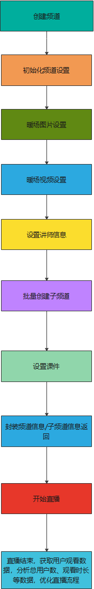
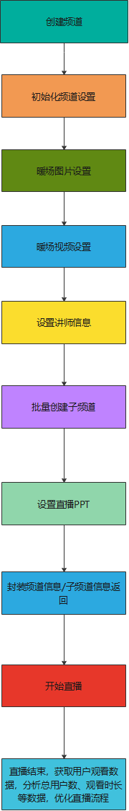

##  目标

&emsp;&emsp;前一篇文档 [10分钟玩转一场直播](/playLive) 比较适合通用的业务场景，假如要对直播业务进行深入的细节设置，您可以参考本篇文档，本篇文档实现的功能和 [10分钟玩转一场直播](/playLive) 完全相同，区别是本篇文档的参数设置更为丰富，控制更加细致。

## 带子频道直播教学场景

### 效果

参考 [10分钟玩转一场直播-带子频道的直播教学场景](/playLive?id=带子频道的直播教学场景)

### 流程



上述流程请求详细描述如下，具体需要配置的参数依据业务实际情况控制，下面的代码示例适用于普通一般情况:

创建频道-[详细描述请参考](/channelOperate?id=_1、创建频道)

初始化频道设置-[详细描述请参考](/channelOperate?id=_2、创建并初始化频道)

暖场图片设置-[详细描述请参考](/playerService?id=_2、设置播放器暖场图片)

暖场视频设置-[详细描述请参考](/playerService?id=_3、设置播放器暖场视频)

讲师信息设置-[详细描述请参考](/chatRoomService?id=_10、设置讲师信息)

子频道创建设置-[详细描述请参考](/channelOperate?id=_13、创建子频道-三分屏添加guest)

课件文档上传-[详细描述请参考](/channelDoc?id=_1、上传频道文档)

查询频道信息-[详细描述请参考](/channelOperate?id=_5、查询频道基本信息)

查询子频道信息-[详细描述请参考](/channelOperate?id=_15、查询子频道信息) 

### 代码示例

```java
 /**
     * 快速创建带子频道的纯视频直播场景或者直播教学场景
     * @return 频道基本信息
     * @throws IOException IO异常
     * @throws NoSuchAlgorithmException 系统异常
     */
    @Test
    public void testQuickCreateChannel( )
            throws IOException, NoSuchAlgorithmException {
        QuickCreateChannelResponse quickCreateChannelResponse = new QuickCreateChannelResponse();
        
        String password = getRandomString(6);
        Calendar instance = Calendar.getInstance();
        instance.set(Calendar.DAY_OF_MONTH, instance.get(Calendar.DAY_OF_MONTH) + 1);
        String name = "带子频道的直播教学场景";
        String path = LiveChannelQuickCreatorTest.class.getResource("/file/PPT.pptx").getPath();
        //1、创建频道
        LiveChannelRequest liveChannelRequest = new LiveChannelRequest();
        //频道名称
        liveChannelRequest.setName(name)
                //频道登录密码
                .setChannelPasswd(password)
                //是否无延迟开关
                .setPureRtcEnabled(LiveConstant.Flag.YES.getFlag() )
//                //纯视频直播场景
//                .setScene(LiveConstant.SceneType.ALONE.getDesc())
                //直播教学场景
                .setScene(LiveConstant.SceneType.PPT.getDesc());
        LiveChannelResponse liveChannelResponse = new LiveChannelOperateServiceImpl().createChannel(liveChannelRequest);
        if (liveChannelResponse == null) {
            throw new PloyvSdkException(Constant.ERROR_CODE, "创建频道失败");
        }
       
        String channelId = liveChannelResponse.getChannelId();
        
        //2、修改频道相关设置
        LiveChannelSettingRequest liveChannelSettingRequest = new LiveChannelSettingRequest();
        String splashImg = "https://wwwimg.polyv.net/assets/dist/images/v2020/news-info-md/product-dynamic-bg_v3.jpg";
        LiveChannelSettingRequest.BasicSetting basicSetting = new LiveChannelSettingRequest.BasicSetting().setName(
                name)
                //讲师登录密码
                .setChannelPasswd(password)
                //课程图标
                .setCoverImg("https://wwwimg.polyv.net/assets/dist/images/v2020/page-home/brand-advantage/row-2-3.svg")
                //引导封面图，必须开启引导封面图开关才能生效
                .setSplashImg(splashImg)
                //开启引导封面图
                .setSplashEnabled(StringUtils.isBlank(splashImg) ? LiveConstant.Flag.NO.getFlag() :
                        LiveConstant.Flag.YES.getFlag())
                //课程描述
                .setDesc("POLYV保利威是广州易方信息科技股份有限公司旗下拥有自主知识产权的视频云计算服务平台，其中包含 云点播 、云直播 " +
                        "和其它视频服务，提供API、SDK技术支持，并拥有国家专利级别的PlaySafe®视频版权保护技术及三套CDN加速，致力为用户提供稳定、安全、快速的企业级视频云服务。")
                //设置开播时间
                .setStartTime(instance.getTime().getTime())
                //主讲人
                .setPublisher("thomas教授")
                .setLinkMicLimit(6);
        liveChannelSettingRequest.setChannelId(channelId)
                .setBasicSetting(basicSetting);
        Boolean liveChannelSettingResponse = new LiveChannelOperateServiceImpl().updateChannelSetting(
                liveChannelSettingRequest);
        if (!liveChannelSettingResponse) {
            throw new PloyvSdkException(Constant.ERROR_CODE, "修改频道的相关设置失败");
        }
        log.info("修改频道相关设置成功");
        String converImage = "https://s1.videocc.net/live-watch/assets/img/default-splash-img.07657078.jpg";
        
        //3、修改暖场图片
        if (StringUtils.isNotBlank(converImage)) {
            LiveSetPlayerImgRequest liveSetChatAdminDataRequest = new LiveSetPlayerImgRequest();
            liveSetChatAdminDataRequest.setChannelId(channelId)
                    //暖场图片
                    .setCoverImage(converImage)
                    //点击暖场图片跳转的地址
                    .setCoverHref("http://www.baidu.com");
            Boolean result = new LivePlayerServiceImpl().setPlayerImg(liveSetChatAdminDataRequest);
            if (result == null || !result) {
                throw new PloyvSdkException(Constant.ERROR_CODE, "暖场图片设置失败");
            }
        }
        String warmUpFlv = null;//"http://www.w3school.com.cn/example/html5/mov_bbb.mp4";
        
        //4、修改暖场视频
        if (StringUtils.isNotBlank(warmUpFlv )) {
            LiveSetWarmupVedioRequest liveSetWarmupVedioRequest = new LiveSetWarmupVedioRequest();
            liveSetWarmupVedioRequest.setChannelId(channelId)
                    .setWarmUpFlv(warmUpFlv);
            Boolean result = new LivePlayerServiceImpl().setPlayerWarmUpVedio(liveSetWarmupVedioRequest);
            if (result == null || !result) {
                throw new PloyvSdkException(Constant.ERROR_CODE, "暖场视频设置失败");
            }
        }
        String nickName = "thomas-gogo";
        
        //5、设置讲师信息
        if (StringUtils.isNotBlank(nickName)) {
            LiveSetTeacherDataRequest liveSetTeacherDataRequest = new LiveSetTeacherDataRequest();
            Boolean result = null;
            liveSetTeacherDataRequest.setChannelId(channelId)
                    //聊天室讲师信息-昵称
                    .setNickname(nickName)
                    //聊天室讲师信息-讲师头衔
                    .setActor("刘老师")
                    //聊天室讲师信息-讲师头像
                    .setAvatar(
                            "https://ss3.bdstatic.com/70cFv8Sh_Q1YnxGkpoWK1HF6hhy/it/u=2069606413,3553249962&fm=26&gp=0" +
                                    ".jpg")
                    //讲师登录密码
                    .setPasswd(password);
            result = new LiveChatRoomServiceImpl().setChannelTeacherMsg(liveSetTeacherDataRequest);
            if (result == null || !result) {
                throw new PloyvSdkException(Constant.ERROR_CODE, "设置讲师信息失败");
            }
            log.info("设置讲师信息成功");
        }
        
        //6、批量创建子频道
        LiveCreateSonChannelListRequest liveCreateSonChannelListRequest = new LiveCreateSonChannelListRequest();
        List<LiveCreateSonChannelListRequest.SonChannel> sonChannels = new ArrayList<LiveCreateSonChannelListRequest.SonChannel>();
        sonChannels.add(setSonChannelsInfo1());
        sonChannels.add(setSonChannelsInfo2());
        liveCreateSonChannelListRequest.setSonChannels(sonChannels);
        
        liveCreateSonChannelListRequest.setChannelId(channelId);
        LiveCreateSonChannelListResponse liveCreateSonChannelListResponse =
                new LiveChannelOperateServiceImpl().createSonChannelList(
                        liveCreateSonChannelListRequest);
        if (liveCreateSonChannelListResponse == null) {
            throw new PloyvSdkException(Constant.ERROR_CODE, "批量创建子频道失败");
        }
        
        //7、上传直播文档
        if (StringUtils.isNotBlank(path) ) {
            LiveCreateChannelDocRequest liveCreateChannelDocRequest = new LiveCreateChannelDocRequest();
            LiveCreateChannelDocResponse liveCreateChannelDocResponse;
            liveCreateChannelDocRequest.setChannelId(channelId)
                    //转换类型（‘common’：转普通图片， ‘animate’：转动画效果）默认不传转普通，因为只有ppt，pptx可以转动画，其他类型文件会自动转成普通；文件转动画转失败会直接把类型转为普通
                    .setType("common")
                    //教学课件或者直播PPT
                    .setFile(new File(path))
//PPT需要转换处理，转换完成时间的回调通知地址
//                    .setCallbackUrl("http://www.baidu.com/callback")
                    //文档名称
                    .setDocName("直播教学课件");
            liveCreateChannelDocResponse = new LiveChannelDocServiceImpl().createChannelDoc(
                    liveCreateChannelDocRequest);
            if (liveCreateChannelDocResponse == null) {
                throw new PloyvSdkException(Constant.ERROR_CODE, "上传频道文档失败");
            }
        }
        
        //8、查询频道信息
        LiveChannelBasicInfoResponse liveChannelBasicInfoResponse = getLiveChannelBasicInfoResponse(channelId);
        quickCreateChannelResponse.setLiveChannelBasicInfoResponse(liveChannelBasicInfoResponse);
        
        //9、查询子频道信息
        List<LiveSonChannelInfoResponse> sonChannelInfoList = getSonChannelInfoList(channelId);
        quickCreateChannelResponse.setSonChannelInfos(sonChannelInfoList);
        log.debug("创建频道成功,频道和子频道信息：{}",quickCreateChannelResponse);
    
        /**
         * todo : B端客户的业务逻辑，将quickCreateChannelResponse的相关信息保持到自己的DB中组织业务逻辑
         */
    
        /**
         * todo : 采用网页开播或者客户端开播，直播结束后 ，可以拉取用户观看直播的观看数据，对观看效果做进一步的分析，改进直播流程和细节
         */
    
        //打印观看日志
        printViewLog(channelId);
        
    }
    /**
     * 设置子频道信息-嘉宾
     * @return 子频道列表
     */
    private LiveCreateSonChannelListRequest.SonChannel setSonChannelsInfo1() {
        LiveCreateSonChannelListRequest.SonChannel sonChannel1 = new LiveCreateSonChannelListRequest.SonChannel();
        //设置子频道信息，子频道代表助教、嘉宾信息
        sonChannel1
                //子频道角色-默认不传为助教，传Guest为嘉宾
                .setRole("Guest")
                //子频道昵称
                .setNickname("嘉宾-陈先生")
                //子频道登录密码
                .setPasswd(getRandomString(10))
                //子频道头衔
                .setActor("教授")
                //子频道头像
                .setAvatar(
                        "https://ss0.bdstatic.com/70cFuHSh_Q1YnxGkpoWK1HF6hhy/it/u=2480846186,1530344&fm=15&gp=0.jpg");
        return sonChannel1;
    }
    
    /**
     * 设置子频道信息-助教
     * @return 子频道列表
     */
    private LiveCreateSonChannelListRequest.SonChannel setSonChannelsInfo2() {
        LiveCreateSonChannelListRequest.SonChannel sonChannel2 = new LiveCreateSonChannelListRequest.SonChannel();
        sonChannel2.setRole(null)
                .setNickname("助教-王小姐")
                .setPasswd(getRandomString(10))
                .setActor("王老师")
                .setAvatar("https://ss3.bdstatic.com/70cFv8Sh_Q1YnxGkpoWK1HF6hhy/it/u=356414612,1103487565&fm=15&gp=0" +
                        ".jpg");
        return sonChannel2;
    }
    
    /**
     * 查询频道基本信息
     * @param channelId 频道号
     * @return  频道基本信息
     * @throws IOException io异常
     * @throws NoSuchAlgorithmException  签名异常
     */
    private LiveChannelBasicInfoResponse getLiveChannelBasicInfoResponse(String channelId)
            throws IOException, NoSuchAlgorithmException {
        LiveChannelBasicInfoResponse liveChannelBasicInfoResponse;
        LiveChannelBasicInfoRequest liveChannelBasicInfoRequest = new LiveChannelBasicInfoRequest();
        liveChannelBasicInfoRequest.setChannelId(channelId);
        liveChannelBasicInfoResponse = new LiveChannelOperateServiceImpl().getChannelBasicInfo(
                liveChannelBasicInfoRequest);
        if (liveChannelBasicInfoResponse == null) {
            throw new PloyvSdkException(Constant.ERROR_CODE, "查询频道基本信息失败");
        }
        return liveChannelBasicInfoResponse;
    }
    
    /**
     * 查询频道下子频道信息列表
     * @param channelId 频道号
     * @return 子频道信息列表
     * @throws IOException IO异常
     * @throws NoSuchAlgorithmException 系统异常
     */
    private List<LiveSonChannelInfoResponse> getSonChannelInfoList(String channelId)
            throws IOException, NoSuchAlgorithmException {
        LiveSonChannelInfoListRequest liveSonChannelInfoListRequest = new LiveSonChannelInfoListRequest();
        LiveSonChannelInfoListResponse liveSonChannelInfoResponse;
        liveSonChannelInfoListRequest.setChannelId(channelId);
        liveSonChannelInfoResponse = new LiveChannelOperateServiceImpl().getSonChannelInfoList(
                liveSonChannelInfoListRequest);
        if (liveSonChannelInfoResponse == null) {
            throw new PloyvSdkException(Constant.ERROR_CODE, "查询子频道信息失败");
        }
        return liveSonChannelInfoResponse.getSonChannelInfos();
    }
    
    /**
     * 批量创建子频道
     * @param channelId 频道号
     * @param liveCreateSonChannelListRequest 批量创建子频道请求实体
     * @throws IOException IO异常
     * @throws NoSuchAlgorithmException 系统异常
     */
    private void createSonChannelList(String channelId, LiveCreateSonChannelListRequest liveCreateSonChannelListRequest) throws IOException, NoSuchAlgorithmException {
        liveCreateSonChannelListRequest.setChannelId(channelId);
        LiveCreateSonChannelListResponse liveCreateSonChannelListResponse =
                new LiveChannelOperateServiceImpl().createSonChannelList(
                        liveCreateSonChannelListRequest);
        if (liveCreateSonChannelListResponse == null) {
            throw new PloyvSdkException(Constant.ERROR_CODE, "批量创建子频道失败");
        }
    }
    
    /**
     * 打印频道观看日志
     * @param channelId
     * @throws IOException
     * @throws NoSuchAlgorithmException
     */
    private void printViewLog(String channelId) throws IOException, NoSuchAlgorithmException {
        LiveListChannelViewlogRequest liveListChannelViewlogRequest = new LiveListChannelViewlogRequest();
        LiveListChannelViewlogResponse liveListChannelViewlogResponse;
        Calendar instance = Calendar.getInstance();
        instance.set(Calendar.DAY_OF_MONTH, instance.get(Calendar.DAY_OF_MONTH) + 2);
        //依据频道号和起止时间查询观看日志
        liveListChannelViewlogRequest.setChannelId(channelId)
                .setStartTime(new Date())
                .setEndTime(instance.getTime());
        liveListChannelViewlogResponse = new LiveChannelViewdataServiceImpl().listChannelViewlog(
                liveListChannelViewlogRequest);
        Assert.assertNotNull(liveListChannelViewlogResponse);
        if (liveListChannelViewlogResponse != null) {
            //to do something ......
            log.debug("测试分页查询频道观看日志成功，{}", JSON.toJSONString(liveListChannelViewlogResponse));
        }
    }
```


## 带子频道纯视频场景

### 效果

参考 [10分钟玩转一场直播-带子频道的纯视频直播场景](/playLive?id=带子频道的纯视频直播场景)

### 流程

和上面的 带子频道直播教学场景  流程一致，只要将频道创建参数配置里面的场景改为[alone 活动拍摄] 即可。



### 代码示例

和上面的 带子频道直播教学场景  代码示例一致，只要将频道创建参数配置里面的场景改为[alone 活动拍摄] 即可，具体如下：

```java
//直播教学场景
.setScene(LiveConstant.SceneType.PPT.getDesc())
    
将上面配置代码修改为下面配置代码即可
    
//纯视频直播场景
.setScene(LiveConstant.SceneType.ALONE.getDesc())
```

## 不带子频道场景

不带子频道场景只需要将上述流程和代码里面的子频道创建部分去掉即可