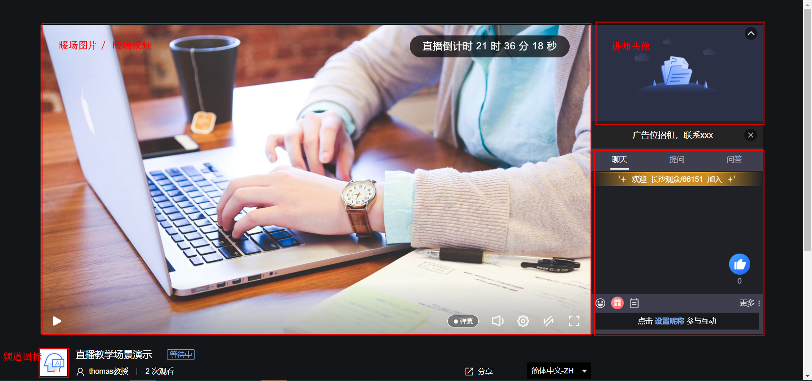
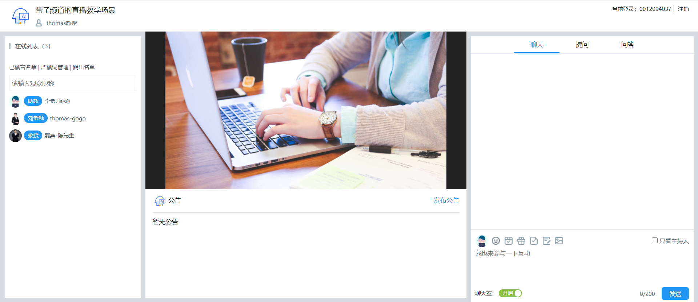
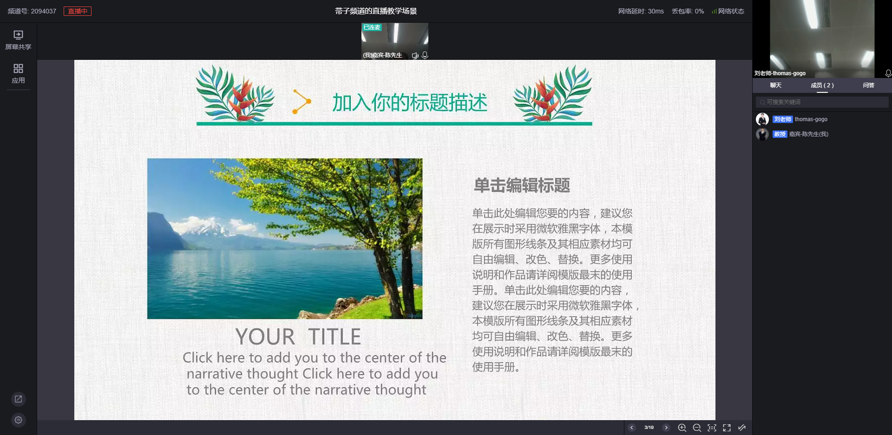
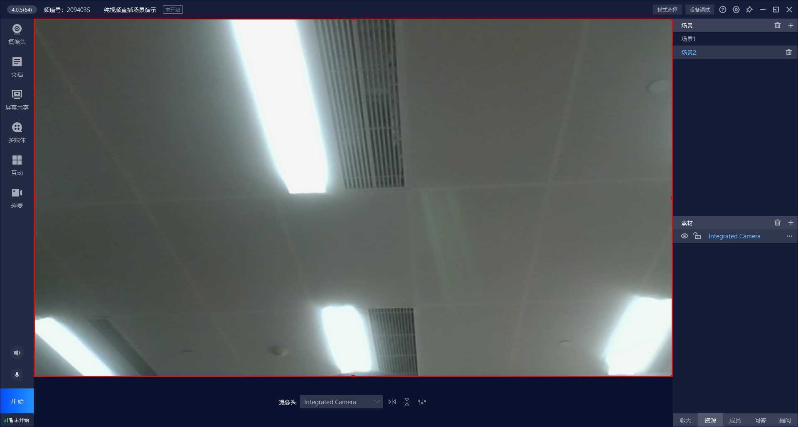
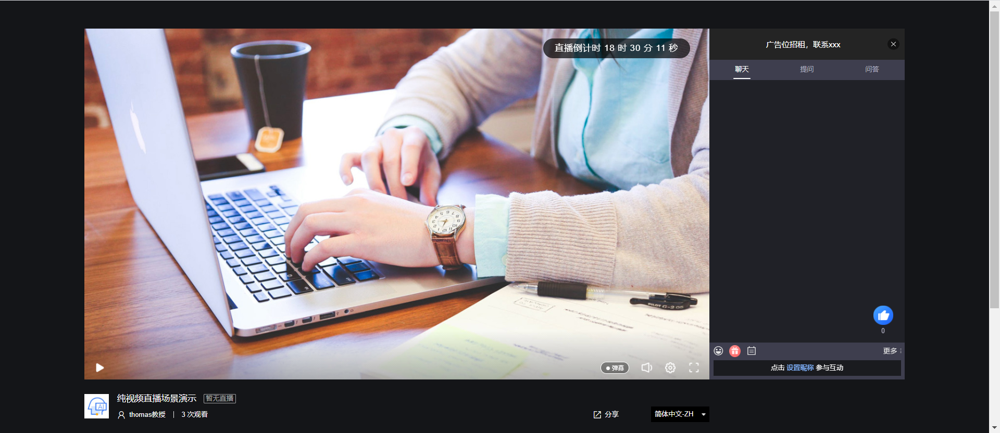

## 目标

&emsp;&emsp;本文档将一步一步带领在10分钟内快速完成一场直播的完整业务流程，前提是已经完成[系统的初始化过程](/quick_start?id=_2初始化系统)，本文档适合快速搭建一个直播间，设置相关信息后，完成直播，查看直播详细观看数据优化直播流程的业务场景。

## 直播教学场景

&emsp;&emsp;此场景适合于通用的线上教学场景，相当于一个虚拟的教室，包括频道创建、频道初始化、暖场图片/视频、引导图片、讲师信息、直播文档上传等设置，相关代码可以参考下面代码，直接拷贝后修改成为适合自己的课程信息就可以；

#### 效果展示

讲师端效果：


观看端效果：




#### 流程

&emsp;&emsp;如下流程除了 频道创建 和 碰到初始化 必须执行，其他都是可选，暖场图片/视频 、讲师信息 、 文档上传，不设相关参数，这些接口将不会被调用；


####  代码 示例

```java
  /**
     * 快速创建三分屏频道，适用于直播教学场景
     * @throws IOException IO异常
     * @throws NoSuchAlgorithmException 系统异常
     */
    @Test
    public void testCreateEasyPPT() throws IOException, NoSuchAlgorithmException {
        QuickCreatePPTChannelRequest quickCreatePPTChannelRequest = new QuickCreatePPTChannelRequest();
        QuickCreateChannelInfoResponse quickCreateChannelInfoResponse;
        String path = LiveChannelManagerTest.class.getResource("/file/PPT.pptx").getPath();
        Calendar instance = Calendar.getInstance();
        instance.set(Calendar.DAY_OF_MONTH, instance.get(Calendar.DAY_OF_MONTH) + 1);
        //创建频道
        String requestId = LiveSignUtil.generateUUID();
        //频道相关基础设置-频道名
        quickCreatePPTChannelRequest.setName("直播教学场景演示")
                //频道相关基础设置-频道密码
                .setChannelPasswd(getRandomString(6))
                //频道相关基础设置-连麦人数
                .setLinkMicLimit(5)
                //频道相关基础设置-主持人名称
                .setPublisher("thomas教授")
                //频道相关基础设置-是否无延迟
                .setPureRtcEnabled(LiveConstant.Flag.YES.getFlag())
                //频道相关基础设置-开播时间
                .setStartTime(instance.getTime().getTime())
                //==========================================
                //频道初始化设置-频道图标地址
                .setCoverImg("https://wwwimg.polyv.net/assets/dist/images/v2020/page-home/brand-advantage/row-2-3.svg")
                //频道初始化设置-引导图地址
                .setSplashImg(
                        "https://wwwimg.polyv.net/assets/dist/images/v2020/news-info-md/product-dynamic-bg_v3.jpg")
                //频道初始化设置-频道描述
                .setDesc("POLYV保利威是广州易方信息科技股份有限公司旗下拥有自主知识产权的视频云计算服务平台，其中包含 云点播 、云直播 " +
                        "和其它视频服务，提供API、SDK技术支持，并拥有国家专利级别的PlaySafe®视频版权保护技术及三套CDN加速，致力为用户提供稳定、安全、快速的企业级视频云服务。")
                //频道初始化设置-设置引导图
                .setCoverImage("https://s1.videocc.net/live-watch/assets/img/default-splash-img.07657078.jpg")
                //频道初始化设置-点击引导图跳转的地址
                .setCoverHref("http://www.baidu.com")
                //频道初始化设置-引导视频
//              .setWarmUpFlv("http://www.w3school.com.cn/example/html5/mov_bbb.mp4");
                //==========================================
                //聊天室讲师信息-昵称
                .setNickname("thomas-gogo")
                //聊天室讲师信息-讲师头衔
                .setActor("刘老师")
                //聊天室讲师信息-讲师头像
                .setAvatar(
                        "https://ss3.bdstatic.com/70cFv8Sh_Q1YnxGkpoWK1HF6hhy/it/u=2069606413,3553249962&fm=26&gp=0" +
                                ".jpg")
                //==========================================
                // 讲课文档设置-讲课文档，当前支持DOC、PPT、PDF
                .setFile(new File(path))
                //讲课PPT设置-转换类型（‘common’：转普通图片， ‘animate’：转动画效果）
                .setType("common")
                //讲课PPT设置-文档名称
                .setDocName("直播教学课件")
//                //讲课PPT设置-文档转换完成后的回调地址，不需要不传
//                .setCallbackUrl("http://www.baidu.com/callback")
            
                .setRequestId(requestId);
   
        quickCreateChannelInfoResponse = new LiveChannelManager().createEasyPPT(quickCreatePPTChannelRequest);
        Assert.assertNotNull(quickCreateChannelInfoResponse);
        log.debug("快速创建三分屏频道成功，{}", JSON.toJSONString(quickCreateChannelInfoResponse));
        log.debug("网页开播地址：https://live.polyv.net/web-start/login?channelId={}  , 登录密码： {}",quickCreateChannelInfoResponse.getLiveChannelBasicInfoResponse().getChannelId(),quickCreatePPTChannelRequest.getChannelPasswd());
        log.debug("网页观看地址：https://live.polyv.cn/watch/{} ",quickCreateChannelInfoResponse.getLiveChannelBasicInfoResponse().getChannelId());
        
        
        /**
         * 采用网页开播或者客户端开播，直播结束后 ，可以拉取用户观看直播的观看数据，对观看效果做进一步的分析，改进直播流程和细节
         */
        //打印观看日志
        printViewLog(quickCreateChannelInfoResponse.getLiveChannelBasicInfoResponse().getChannelId(),requestId);
    }

```

### 请求描述


### 返回描述


## 带子频道的直播教学场景

&emsp;&emsp;此场景和上面 直播教学场景 基本相同，只是在上面的基础上，可以创建子频道，子频道用于创建代表助教、嘉宾、客服等辅助讲师进行教学的个体信息，可以通过单独的登录通道进入直播间和讲师、观众互动，增加课堂教学效果；

#### 效果展示

讲师端 和 观看端 效果和 上面的 直播教学场景 直播教学场景 一致

助教端：

- 助教可以查看直播状态；
- 助教可以查看聊天室成员信息；
- 助教可以对聊天室严禁词、禁言人员、踢人等进行管理；
- 助教可以协助讲师对提问、问答和用户进行沟通；
- 助教可以参与聊天，活跃课堂气氛；



嘉宾端：

嘉宾默认以连麦的方式进入直播间，和讲师互动；



#### 流程

&emsp;&emsp;如下流程除了 频道创建 和 碰到初始化 必须执行，其他都是可选，暖场图片/视频 、讲师信息 、批量创建子频道、 文档上传，不设相关参数，这些接口将不会被调用；


####  代码 示例

```java
    /**
     * 快速创建带子频道的三分屏频道，适用于直播教学场景
     * @throws IOException IO异常
     * @throws NoSuchAlgorithmException 系统异常
     */
    @Test
    public void testCreateEasyPPTAndSonChannel() throws IOException, NoSuchAlgorithmException {
        QuickCreatePPTChannelRequest quickCreatePPTChannelRequest = new QuickCreatePPTChannelRequest();
        QuickCreateChannelInfoResponse quickCreateChannelInfoResponse;
        String path = LiveChannelManagerTest.class.getResource("/file/PPT.pptx").getPath();
        Calendar instance = Calendar.getInstance();
        instance.set(Calendar.DAY_OF_MONTH, instance.get(Calendar.DAY_OF_MONTH) + 1);
        //创建频道
        String requestId = LiveSignUtil.generateUUID();
                 //频道相关基础设置-频道名
        quickCreatePPTChannelRequest.setName("带子频道的直播教学场景")
                //频道相关基础设置-频道密码
                .setChannelPasswd(getRandomString(6))
                //频道相关基础设置-连麦人数
                .setLinkMicLimit(5)
                //频道相关基础设置-主持人名称
                .setPublisher("thomas教授")
                //频道相关基础设置-是否无延迟
                .setPureRtcEnabled(LiveConstant.Flag.YES.getFlag())
                //频道相关基础设置-开播时间
                .setStartTime(instance.getTime().getTime())
               //==========================================
                //频道初始化设置-频道图标地址
                .setCoverImg("https://wwwimg.polyv.net/assets/dist/images/v2020/page-home/brand-advantage/row-2-3.svg")
                //频道初始化设置-引导图地址
                .setSplashImg(
                        "https://wwwimg.polyv.net/assets/dist/images/v2020/news-info-md/product-dynamic-bg_v3.jpg")
                //频道初始化设置-频道描述
                .setDesc("POLYV保利威是广州易方信息科技股份有限公司旗下拥有自主知识产权的视频云计算服务平台，其中包含 云点播 、云直播 " +
                        "和其它视频服务，提供API、SDK技术支持，并拥有国家专利级别的PlaySafe®视频版权保护技术及三套CDN加速，致力为用户提供稳定、安全、快速的企业级视频云服务。")
                //频道初始化设置-设置引导图
                .setCoverImage("https://s1.videocc.net/live-watch/assets/img/default-splash-img.07657078.jpg")
                //频道初始化设置-点击引导图跳转的地址
                .setCoverHref("http://www.baidu.com")
                //频道初始化设置-引导视频
//              .setWarmUpFlv("http://www.w3school.com.cn/example/html5/mov_bbb.mp4");
                //==========================================
                 //聊天室讲师信息-昵称
                .setNickname("thomas-gogo")
                //聊天室讲师信息-讲师头衔
                 .setActor("刘老师")
                //聊天室讲师信息-讲师头像
                .setAvatar(
                        "https://ss3.bdstatic.com/70cFv8Sh_Q1YnxGkpoWK1HF6hhy/it/u=2069606413,3553249962&fm=26&gp=0" +
                                ".jpg")
                //==========================================
                // 讲课文档设置-讲课文档，当前支持DOC、PPT、PDF
                .setFile(new File(path))
                //讲课PPT设置-转换类型（‘common’：转普通图片， ‘animate’：转动画效果）
                .setType("common")
                //讲课PPT设置-文档名称
                .setDocName("直播教学课件")
//                //讲课PPT设置-文档转换完成后的回调地址，不需要不传
//                .setCallbackUrl("http://www.baidu.com/callback")
                
                .setRequestId(requestId);
        
        LiveCreateSonChannelListRequest liveCreateSonChannelListRequest = new LiveCreateSonChannelListRequest();
        List<LiveCreateSonChannelListRequest.SonChannel> sonChannels =
                new ArrayList<LiveCreateSonChannelListRequest.SonChannel>();
        LiveCreateSonChannelListRequest.SonChannel sonChannel1 = new LiveCreateSonChannelListRequest.SonChannel();
        //设置子频道信息，子频道代表助教、嘉宾信息
        
        sonChannel1
                //子频道角色-默认不传为助教，传Guest为嘉宾
                .setRole("Guest")
                //子频道昵称
                .setNickname("嘉宾-陈先生")
                //子频道登录密码
                .setPasswd(getRandomString(10))
                //子频道头衔
                .setActor("教授")
                //子频道头像
                .setAvatar("https://ss0.bdstatic.com/70cFuHSh_Q1YnxGkpoWK1HF6hhy/it/u=2480846186,1530344&fm=15&gp=0.jpg");
        sonChannels.add(sonChannel1);
    
        LiveCreateSonChannelListRequest.SonChannel sonChannel2 = new LiveCreateSonChannelListRequest.SonChannel();
        sonChannel2.setRole(null)
                .setNickname("助教-王小姐")
                .setPasswd(getRandomString(10))
                .setActor("王老师")
                .setAvatar("https://ss3.bdstatic.com/70cFv8Sh_Q1YnxGkpoWK1HF6hhy/it/u=356414612,1103487565&fm=15&gp=0.jpg");
        sonChannels.add(sonChannel2);
        
        liveCreateSonChannelListRequest.setSonChannels(sonChannels);
        
        quickCreateChannelInfoResponse = new LiveChannelManager().createEasyPPT(quickCreatePPTChannelRequest,
                liveCreateSonChannelListRequest);
        Assert.assertNotNull(quickCreateChannelInfoResponse);
        log.debug("快速创建三分屏频道成功，{}", JSON.toJSONString(quickCreateChannelInfoResponse));
        log.debug("网页开播地址：https://live.polyv.net/web-start/login?channelId={}  , 登录密码： {}",quickCreateChannelInfoResponse.getLiveChannelBasicInfoResponse().getChannelId(),quickCreatePPTChannelRequest.getChannelPasswd());
        log.debug("网页观看地址：https://live.polyv.cn/watch/{} ",quickCreateChannelInfoResponse.getLiveChannelBasicInfoResponse().getChannelId());
        log.debug("嘉宾进入直播间地址：http://live.polyv.net/web-start/guest?channelId={} ,登录密码： {} ",quickCreateChannelInfoResponse.getSonChannelInfos().get(0).getAccount(),sonChannel1.getPasswd());
        log.debug("助教进入直播间地址：https://live.polyv.net/teacher.html , 登录频道: {}, 登录密码： {}",quickCreateChannelInfoResponse.getSonChannelInfos().get(1).getAccount(),sonChannel2.getPasswd());
    
        /**
         * 现在可以采用网页开播或者客户端开播，直播结束后 ，可以拉取用户观看直播的观看数据，对观看效果做进一步的分析，改进直播流程和细节
         */
        //打印观看日志
        printViewLog(quickCreateChannelInfoResponse.getLiveChannelBasicInfoResponse().getChannelId(),requestId);
    } 
   /**
     * 打印频道观看日志
     * @param channelId
     * @param requestId
     * @throws IOException
     * @throws NoSuchAlgorithmException
     */
    private void printViewLog(String channelId,String requestId) throws IOException, NoSuchAlgorithmException {
        LiveListChannelViewlogRequest liveListChannelViewlogRequest = new LiveListChannelViewlogRequest();
        LiveListChannelViewlogResponse liveListChannelViewlogResponse;
        Calendar instance = Calendar.getInstance();
        instance.set(Calendar.DAY_OF_MONTH, instance.get(Calendar.DAY_OF_MONTH) + 2);
        //依据频道号和起止时间查询观看日志
        liveListChannelViewlogRequest.setChannelId(channelId)
                    .setStartTime(new Date())
                    .setEndTime(instance.getTime())
                    .setRequestId(requestId);
        liveListChannelViewlogResponse = new LiveChannelViewdataServiceImpl().listChannelViewlog(
                liveListChannelViewlogRequest);
        Assert.assertNotNull(liveListChannelViewlogResponse);
        if (liveListChannelViewlogResponse != null) {
            //to do something ......
            log.debug("测试分页查询频道观看日志成功，{}", JSON.toJSONString(liveListChannelViewlogResponse));
        }
    }
```

### 请求描述


### 返回描述


## 普通视频场景

&emsp;&emsp;此场景适合非教学情况下的其他场景，比如直播带货、会议直播、年会直播的场景，和直播教学场景的区别是主播端和观看端的页面排版不同，直播教学场景以三分屏的方式将讲师头像、课件、白板、聊天室集成到一个页面呈现给终端用户，而普通视频场景同时只能呈现讲师摄像头、文档、电脑屏幕的一种，一般情况直接重现讲师摄像头采集的画面；

#### 效果展示

讲师端效果（呈现文档给终端用户）：


讲师端效果（呈现讲师摄像头采集信息给终端用户）：



观看端效果：




#### 流程

&emsp;&emsp;如下流程除了 频道创建 和 碰到初始化 必须执行，其他都是可选，暖场图片/视频 、讲师信息 、 文档上传，不设相关参数，这些接口将不会被调用；


####  代码 

```java
   /**
     * 快速创建纯视频频道，适合直播带货、会议、年会等直播业务场景
     * 约束：2、同时设置暖场图片和暖场视频只生效暖场视频。
     * @throws IOException IO异常
     * @throws NoSuchAlgorithmException 系统异常
     */
    @Test
    public void testCreateEasyVideo() throws IOException, NoSuchAlgorithmException {
        QuickCreateVideoChannelRequest quickCreateVideoChannelRequest = new QuickCreateVideoChannelRequest();
        QuickCreateChannelInfoResponse quickCreateChannelInfoResponse;
        Calendar instance = Calendar.getInstance();
        instance.set(Calendar.DAY_OF_MONTH, instance.get(Calendar.DAY_OF_MONTH) + 1);
        //创建频道
        String requestId = LiveSignUtil.generateUUID();
    
        //频道相关基础设置-频道名
        quickCreateVideoChannelRequest.setName("纯视频直播场景演示")
                //频道相关基础设置-频道密码
                .setChannelPasswd(getRandomString(6))
                //频道相关基础设置-连麦人数
                .setLinkMicLimit(5)
                //频道相关基础设置-主持人名称
                .setPublisher("thomas教授")
                //频道相关基础设置-是否无延迟
                .setPureRtcEnabled(LiveConstant.Flag.YES.getFlag())
                //频道相关基础设置-开播时间
                .setStartTime(instance.getTime().getTime())
                //==========================================
                //频道初始化设置-频道图标地址
                .setCoverImg("https://wwwimg.polyv.net/assets/dist/images/v2020/page-home/brand-advantage/row-2-3.svg")
                //频道初始化设置-引导图地址
                .setSplashImg(
                        "https://wwwimg.polyv.net/assets/dist/images/v2020/news-info-md/product-dynamic-bg_v3.jpg")
                //频道初始化设置-频道描述
                .setDesc("POLYV保利威是广州易方信息科技股份有限公司旗下拥有自主知识产权的视频云计算服务平台，其中包含 云点播 、云直播 " +
                        "和其它视频服务，提供API、SDK技术支持，并拥有国家专利级别的PlaySafe®视频版权保护技术及三套CDN加速，致力为用户提供稳定、安全、快速的企业级视频云服务。")
                //频道初始化设置-设置引导图
                .setCoverImage("https://s1.videocc.net/live-watch/assets/img/default-splash-img.07657078.jpg")
                //频道初始化设置-点击引导图跳转的地址
                .setCoverHref("http://www.baidu.com")
                //频道初始化设置-引导视频
//              .setWarmUpFlv("http://www.w3school.com.cn/example/html5/mov_bbb.mp4");
                //==========================================
                //聊天室讲师信息-昵称
                .setNickname("thomas-gogo")
                //聊天室讲师信息-讲师头衔
                .setActor("刘老师")
                //聊天室讲师信息-讲师头像
                .setAvatar(
                        "https://ss3.bdstatic.com/70cFv8Sh_Q1YnxGkpoWK1HF6hhy/it/u=2069606413,3553249962&fm=26&gp=0" +
                                ".jpg")
                .setRequestId(requestId);
        
        quickCreateChannelInfoResponse = new LiveChannelManager().createEasyVideo(quickCreateVideoChannelRequest);
        Assert.assertNotNull(quickCreateChannelInfoResponse);
        log.debug("快速创建纯视频频道成功，{}", JSON.toJSONString(quickCreateChannelInfoResponse));
        log.debug("网页开播地址：https://live.polyv.net/web-start/login?channelId={}  , 登录密码： {}",quickCreateChannelInfoResponse.getLiveChannelBasicInfoResponse().getChannelId(),quickCreateVideoChannelRequest.getChannelPasswd());
        log.debug("网页观看地址：https://live.polyv.cn/watch/{} ",quickCreateChannelInfoResponse.getLiveChannelBasicInfoResponse().getChannelId());
        /**
         * 采用网页开播或者客户端开播，直播结束后 ，可以拉取用户观看直播的观看数据，对观看效果做进一步的分析，改进直播流程和细节
         */
        //打印观看日志
        printViewLog(quickCreateChannelInfoResponse.getLiveChannelBasicInfoResponse().getChannelId(),requestId);
    }
    
    /**
     * 打印频道观看日志
     * @param channelId
     * @param requestId
     * @throws IOException
     * @throws NoSuchAlgorithmException
     */
    private void printViewLog(String channelId,String requestId) throws IOException, NoSuchAlgorithmException {
        LiveListChannelViewlogRequest liveListChannelViewlogRequest = new LiveListChannelViewlogRequest();
        LiveListChannelViewlogResponse liveListChannelViewlogResponse;
        Calendar instance = Calendar.getInstance();
        instance.set(Calendar.DAY_OF_MONTH, instance.get(Calendar.DAY_OF_MONTH) + 2);
        //依据频道号和起止时间查询观看日志
        liveListChannelViewlogRequest.setChannelId(channelId)
                    .setStartTime(new Date())
                    .setEndTime(instance.getTime())
                    .setRequestId(requestId);
        liveListChannelViewlogResponse = new LiveChannelViewdataServiceImpl().listChannelViewlog(
                liveListChannelViewlogRequest);
        Assert.assertNotNull(liveListChannelViewlogResponse);
        if (liveListChannelViewlogResponse != null) {
            //to do something ......
            log.debug("测试分页查询频道观看日志成功，{}", JSON.toJSONString(liveListChannelViewlogResponse));
        }
    }
```

####   请求描述


### 返回描述


