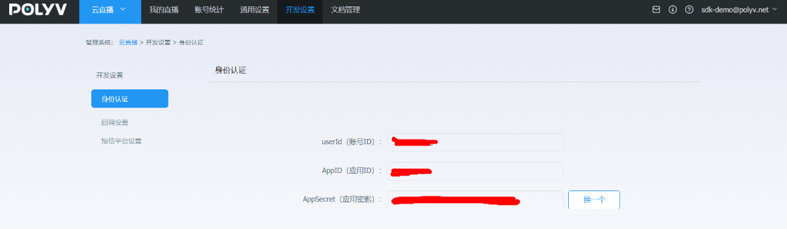

## 前提条件

在安装和使用**保利威直播Java SDK**功能前，确保B端已经具备如下环境：

- 安装Java环境。

  **保利威直播Java SDK**支持1.8或更高版本。

- 注册[保利威账号](https://www.polyv.net/)并获取[访问密钥信息](http://live.polyv.net/#/develop/appId)（UserId  、 AppId 、 AppSecret）。            

  
  
  
  
  

## 1.添加Maven依赖  

&emsp;&emsp;将如下依赖加入到项目的POM文件中： 

```xml
<dependency>
    <groupId>net.polyv</groupId>
    <artifactId>polyv-java-live-sdk</artifactId>
    <version>1.0.25</version>
</dependency> 
```

> 注意：<font color=#FF0000 >为了消除Java的冗长代码  ,SDK使用了jdk1.8的最新特性lombok，请在IntelliJ或者Eclipse 中配置对lombok的支持 </font>

```xml
<dependency>
    <groupId>org.projectlombok</groupId>
    <artifactId>lombok</artifactId>
    <version>1.18.10</version>
</dependency>
```

## 2.初始化系统

&emsp;&emsp;在执行测试代码之前，需要B端先初始化系统配置，包括UserId \ AppId \ AppSecret , 如没有以上信息，请参考本文[前提条件](/quick_start?id=前提条件)部分获取，初始化示例代码如下，任选一种：

````java
   /**
     * 初始化配置,请配置自己的账号信息
     */
    public static void initPolyvLive(){
        String userId = "xxx";
        String appId = "xxx";
        String appSecret = "xxx";
        LiveGlobalConfig.init(appId, userId, appSecret);
        log.debug("--初始化完成--");
    }
````
````java
 	/**
     * 初始化配置并初始化 HTTP CLIENT 连接池超时时间和最大连接数配置,请配置自己的账号信息
     */
    public static void initPolyvLive(){
        String userId = "xxx";
        String appId = "xxx";
        String appSecret = "xxx";        
        Integer timeOut = 20000;  //HTTP CLIENT 连接池超时时间
        Integer maxClientNum = 100;  //HTTP CLIENT 最大连接数      
        LiveGlobalConfig.init(  appId,  userId,  appSecret,  timeOut ,  maxClientNum);
        log.debug("--初始化完成--");
    }
````

&emsp;&emsp;以上代码一般配置于随系统启动执行一次的全局初始化中，如用spring框架，可以参考如下：

````java
package net.polyv.live.config;

import org.springframework.beans.BeansException;
import org.springframework.context.ApplicationContext;
import org.springframework.context.ApplicationContextAware;
import org.springframework.stereotype.Component;

import lombok.extern.slf4j.Slf4j;

/**
 * 默认启动配置类
 * @author: thomas
 **/
@Slf4j
@Component
public class StartupListener implements ApplicationContextAware {
    
    @Override
    public void setApplicationContext(ApplicationContext applicationContext) throws BeansException {
        String userId = "xxx";
        String appId = "xxx";
        String appSecret = "xxx"; 
        LiveGlobalConfig.init(appId,userId,appSecret);
        log.debug("--初始化完成--");
    }
    
    
}
````

## 3.执行测试代码

&emsp;&emsp;测试创建一个直播频道，单元测试代码如下：

```java
package net.polyv.live.service.channel;
import org.junit.Assert;
import com.alibaba.fastjson.JSON;
import lombok.extern.slf4j.Slf4j;
import net.polyv.common.exception.BusinessException;
import InitConfig;
import LiveChannelRequest;
import LiveChannelResponse;
import LiveChannelOperateServiceImpl;

/**
 * @author: thomas
 **/
@Slf4j
public class LiveChannelDemo {
   /**
     * 调用demo，必须处理PloyvSdkException。
     *
     * 参数合法性校验：SDK采用自定义验证框架对输入参数进行校验，如有参数不合格，将抛出PloyvSdkException异常，exception的message
     * 包括具体校验不通过的字段信息，此异常是运行时异常，必须捕获处理相关业务逻辑；
     *
     * 解析返回数据：解析返回数据，如SDK调用正常成功，将封装响应对象，正常返回，如服务器返回错误信息，SDK将将抛出PloyvSdkException异常，exception的message
     * 包括具体服务器执行错误信息，此异常是运行时异常，必须捕获处理相关业务逻辑；
     * @param args
     */
    public static void main(String[] args) {
        //全局初始化，此处应该全局执行一次
        String userId = "xxx";        
        String appId = "xxx";
        String appSecret = "xxx";
        LiveGlobalConfig.init(appId,userId,appSecret);
        log.debug("--初始化完成--");
        try {
            //封装API请求对象
            LiveChannelRequest liveChannelRequest = new LiveChannelRequest();
            liveChannelRequest.setName("Spring 知识精讲") //设置频道主题信息
                    .setChannelPasswd("666888")   //设置频道密码
                    .setRequestId("2860257a405447e1bbbe9161da2dee72"); // 设置请求流水号
            //调用SDK请求保利威服务器
            LiveChannelResponse liveChannelResponse = new LiveChannelOperateServiceImpl().createChannel(
                    liveChannelRequest);
            Assert.assertNotNull(liveChannelResponse);
            //正常返回做B端正常的业务逻辑
            if (liveChannelResponse != null) {
                //to do something ......
                log.debug("频道创建成功{}", JSON.toJSONString(liveChannelResponse));
                log.debug("网页开播地址：https://live.polyv.net/web-start/login?channelId={}  , 登录密码： {}",liveChannelResponse.getChannelId(),liveChannelRequest.getChannelPasswd());
                log.debug("网页观看地址：https://live.polyv.cn/watch/{} ",liveChannelResponse.getChannelId());
            }
        } catch (PloyvSdkException e) {
            //参数校验不合格 或者 请求服务器端500错误，错误信息见PloyvSdkException.getMessage()
            log.error(e.getMessage(), e);
            // 异常返回做B端异常的业务逻辑，记录log 或者 上报到ETL 或者回滚事务
        } catch (Exception e) {
            log.error("SDK调用异常", e);
        }
    } 
}
```

&emsp;&emsp;执行代码后，控制台应有如下关键输出，表示整合完成：

```json
[main] DEBUG HttpUtil - http 请求 url: https://api.polyv.net/live/v2/channels/ , 请求参数: {"requestId":"2860257a405447e1bbbe9161da2dee72","appId":"frlr1zazn3","name":"Spring 知识精讲","sign":"EC98FB94BF6DADA722F1C9A7AA0E9C0E","channelPasswd":"666888","userId":"1b448be323","timestamp":"1603435147307"}
[main] DEBUG HttpUtil - http 请求结果: {"code":200,"status":"success","message":"","data":{"channelId":1972796,"userId":"1b448be323","name":"Spring 知识精讲","publisher":"主持人","description":"","url":"rtmp://push-d1.videocc.net/recordf/1b448be3231603435207373ea0f?auth_key=1603437007-0-0-bdbbb7f070573d80424a69c99c52ed0a","stream":"1b448be3231603435207373ea0f","logoImage":"","logoOpacity":1.0,"logoPosition":"tr","logoHref":"","coverImage":"","coverHref":"","waitImage":"","waitHref":"","cutoffImage":"","cutoffHref":"","advertType":"NONE","advertDuration":0,"advertWidth":0,"advertHeight":0,"advertImage":"","advertHref":"","advertFlvVid":"","advertFlvUrl":"","playerColor":"#666666","autoPlay":false,"warmUpFlv":"","passwdRestrict":false,"passwdEncrypted":"","isOnlyAudio":"N","isLowLatency":"N","m3u8Url":"http://pull-d1.videocc.net/recordf/1b448be3231603435207373ea0f.m3u8?auth_key=1603435207-0-0-56b60df63374403e22821f79a681989f","m3u8Url1":"","m3u8Url2":"","m3u8Url3":"","channelLogoImage":"http://liveimages.videocc.net/assets/wimages/pc_images/logo.png","scene":"alone","channelViewerPasswd":null,"channelPasswd":"666888","linkMicLimit":0,"streamType":"client","pureRtcEnabled":"N","type":"transmit","currentTimeMillis":1603435207694}}
[main] DEBUG LiveChannelDemo - 频道创建成功{"advertDuration":0,"advertFlvUrl":"","advertFlvVid":"","advertHeight":0,"advertHref":"","advertImage":"","advertType":"NONE","advertWidth":0,"autoPlay":false,"channelId":1972796,"coverHref":"","coverImage":"","currentTimeMillis":1603435207694,"cutoffHref":"","cutoffImage":"","description":"","isLowLatency":"N","isOnlyAudio":"N","linkMicLimit":0,"logoHref":"","logoImage":"","logoOpacity":1,"logoPosition":"tr","m3u8Url":"http://pull-d1.videocc.net/recordf/1b448be3231603435207373ea0f.m3u8?auth_key=1603435207-0-0-56b60df63374403e22821f79a681989f","m3u8Url1":"","m3u8Url2":"","m3u8Url3":"","name":"Spring 知识精讲","passwdEncrypted":"","passwdRestrict":false,"playerColor":"#666666","stream":"1b448be3231603435207373ea0f","url":"rtmp://push-d1.videocc.net/recordf/1b448be3231603435207373ea0f?auth_key=1603437007-0-0-bdbbb7f070573d80424a69c99c52ed0a","userId":"1b448be323","waitHref":"","waitImage":"","warmUpFlv":""}
```

&emsp;&emsp;还可以官网登录验证创建是否成功；


&emsp;&emsp;至此，B端已经完成**保利威直播Java SDK**安装配置，可以使用直播SDK进行其他功能开发和测试，如B端接入过程有任何问题，直接使用右下角**在线客服**找到售后技术支持提问 ，请将问题的运行环境、操作步骤、错误反馈信息、联系方式同步反馈，便于问题的快速定位和解决。


