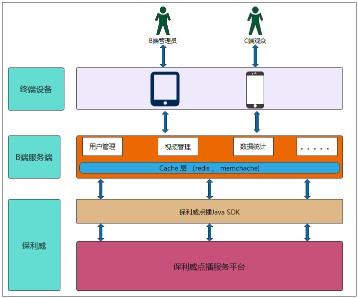
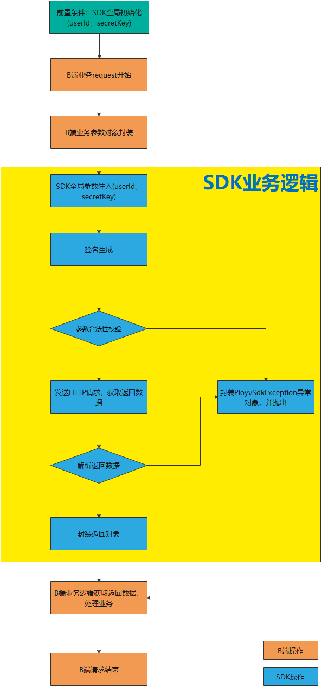
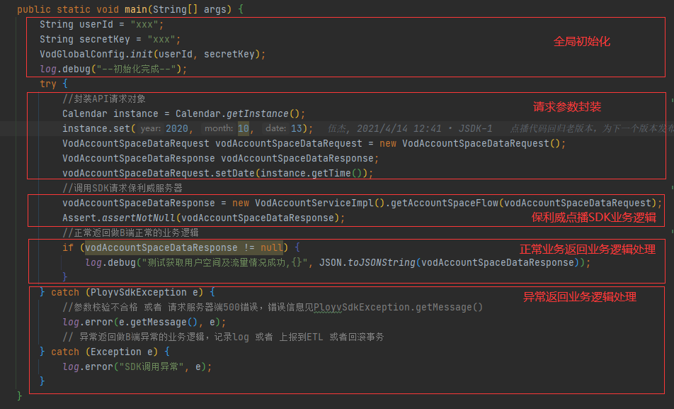

## 1.基本描述

&emsp;&emsp;保利威点播源自公司多年视频技术沉淀，基于专业的视频加密技术、跨平台视频编解码技术和大规模视频内容分发网络，提供稳定流畅、安全、高并发的音视频服务。

&emsp;&emsp;**保利威点播Java SDK**让您不用复杂编程即可轻松接入保利威点播视频云服务，实现云点播相关视频服务。

&emsp;&emsp;**保利威点播Java SDK**依托保利威点播API实现，对其进行包装和优化，解放B端用户的共性工作。将API调用逻辑和异常处理进行了封装优化，B端用户只需将请求参数封装后，交给**保利威点播Java SDK**处理即可，**保利威点播Java SDK**处理完成后返回结果，B端依据返回数据继续完成B端业务逻辑。现阶段**保利威点播Java SDK**涵盖了视频上传、视频编辑、视频打点、字幕管理、弹幕管理、课件管理 等 绝大部分经常使用的API操作。

&emsp;&emsp;如果您在使用**保利威点播Java SDK**的过程中遇到任何问题，直接使用<a href="javascript:void(0);" onclick="$('#zhichiBtnBox').click()">在线客服</a>找到售后技术支持提问。请将问题的运行环境、操作步骤、错误反馈信息、联系方式同步提交，便于问题的快速定位和解决；

## 2.SDK整体设计

1.B端管理员通过SDK上传视频信息，比如视频、视频名称、视频水印、水印位置等基本属性；

2.B端管理员通过SDK对视频进行分类、打点等处理，比如上传字幕、弹幕管理、加密设置等设置；

3.B端管理员把视频地址分发给C端观众，或者把嵌入播放器的观看页面地址分发给观众；

4.C端观众通过打开观看地址的链接或者二维码扫码观看B端管理员上传的视频；

5.B端管理员可查看C端观众的观看情况和统计分析数据，完成点播业务闭环； 

## 3.SDK详细设计

## 4.SDK业务逻辑分析

&emsp;* 前置条件：SDK全局初始化：在调用SDK前必须配置全局参数，可配置参数包括账户信息（userId、secretKey) 和HTTP链接池参数（timeout、maxClientNum)，具体请见 [初始化](/quick_start?id=_2初始化系统)

&emsp;* SDK全局参数注入：SDK将全局配置的参数，注入到请求对象中；

&emsp;* 签名生成：SDK采用点播签名规则，生成签名；

&emsp;* 参数合法性校验：SDK采用自定义参数校验工具对输入参数进行校验，如有参数不合格，将抛出PloyvSdkException异常，exception的message包括具体校验不通过的字段信息，此异常是运行时异常，必须捕获处理相关业务逻辑；

&emsp;* 发送HTTP请求，获取返回数据：SDK在初始化阶段初始化了一个HTTP链接池，所有SDK请求都是通过该链接池来发送请求；

&emsp;* 解析返回数据：解析返回数据，如SDK调用正常成功，将封装响应对象，正常返回，如服务器返回错误信息，SDK将将抛出PloyvSdkException异常，exception的message包括具体服务器执行错误信息，此异常是运行时异常，必须捕获处理相关业务逻辑；

## 5.调用流程模板

&emsp;&emsp;上述业务流程图解析到代码层次如下，所有对**保利威点播Java SDK**的调用都可以参考如下调用模板（**全局初始化只需要全局调用一次**）。

