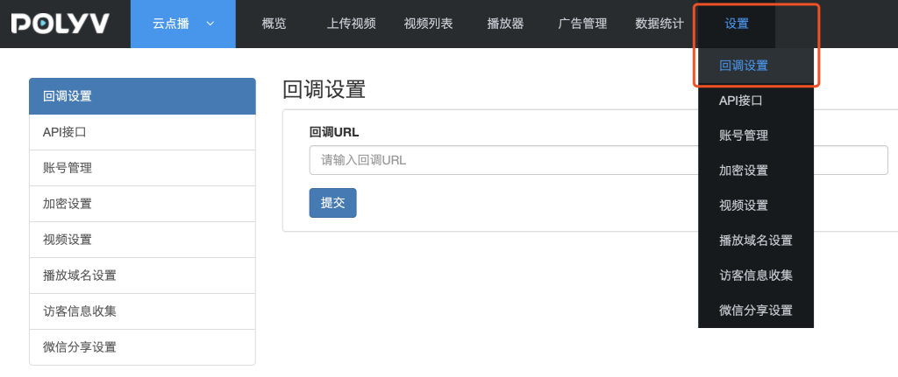

## 回调通知使用说明

### 功能说明

在视频相关处理环节（如上传、转码、审核）完成后，系统会将处理结果提交到配置的回调地址，通知用户处理进展和状态，以便进行其他业务操作。

### 回调配置

登录云点播管理后台，在 **设置** --> **回调设置** 配置回调URL。


### 事件类型

目前支持的事件通知类型参考如下：
####  一、视频上传完成
点播服务端接收完上传的视频文件后，会产生视频上传完成事件。
HTTP请求方式为：GET。
##### 事件内容
|  名称 |  描述 |
| ---- | ---- |
| sign | 系统签名，由“upload”字符串拼接vid、secretkey并做MD5运算生成。例如，vid的值为e2e84a738302f20a4f6eb202976f5c63_e，secretkey的值为7UagtQOq2A,将字符串uploade2e84a738302f20a4f6eb202976f5c63_e7UagtQOq2A进行MD5计算，得到sign的值为：b245e3e65aa45b60dc02337b5cd914a7 |
| type | 回调类型：upload 已上传，invalidVideo 不合规格视频（当上传的视频的信息无法被系统分析时，判断为不合规格视频）。 |
| vid | 视频ID |
| state | 用户自定义数据，在[上传视频接口](http://dev.polyv.net/2014/videoproduct/v-api/v-api-upload/uploadfile/)或[上传SDK](http://dev.polyv.net/2019/videoproduct/v-sdk/web_upload-sdk/)中，如果提交了该字段，会在事件完成回调时透传返回。 |

##### 回调示例
```
http://demo.polyv.net/callback?sign=b245e3e65aa45b60dc02337b5cd914a7&type=upload&vid=e2e84a738302f20a4f6eb202976f5c63_e
```
#### 二、异步上传处理失败
当使用管理后台的视频同步功能或者使用异步方式上传视频，处理失败时会产生此事件。

当收到此回调时，说明远程上传视频失败，需检查源视频的URL地址。

HTTP请求方式为：GET。

##### 事件内容
| 名称 | 描述 |
| ---- | ---- |
| sign | 系统签名，由type、fileUrl、secretkey按顺序拼接并做MD5运算生成。例如：fileUrl 的值为 "http://a.mp4" , secretkey 的值为 kXmHMLeX6M ,将字符串 async_uploadhttp://a.mp4kXmHMLeX6M 进行MD5计算，得到 c2f168b96d882c1a03f1021c29208916 |
| type | 回调类型，返回固定值：async_upload。 |
| fileUrl | 用户提交的需要远程上传的视频URL地址 |
| title | 用户提交的需要远程上传的视频标题 |
| state | 用户自定义数据，在[上传远程视频接口](uploadService?id=_4、远程批量上传视频)中，如果提交了该字段，会在事件完成回调时透传返回。 |

##### 回调示例
```html
http://demo.polyv.net/callback?sign=c2f168b96d882c1a03f1021c29208916&fileUrl=http://a.mp4&type=async_upload&title=test
```
#### 三、视频同步失败

当视频上传成功后，系统需要把上传至边缘节点的视频源文件同步回中心节点，同步失败时会产生此事件。

HTTP请求方式为：GET。
##### 事件内容
| 名称 | 描述 |
| ---- | ---- |
| sign | 系统签名，由type、vid、secretkey按顺序拼接并做MD5运算生成。 |
| type | 回调类型，返回固定值：videoSyncedFail。 |
| vid | 视频ID |

##### 回调示例
```html
http://demo.polyv.net/callback?sign=b245e3e65aa45b60dc02337b5cd914a7&type=videoSyncedFail&vid=e2e84a738302f20a4f6eb202976f5c63_e
```
#### 四、视频单个清晰度转码完成

视频的某种格式的某个清晰度（如：高清的mp4格式）转码完成时会产生此事件。

视频任一清晰度转码完成并审核通过后即可播放（视频状态会更新为“已发布”，如果其它清晰度的转码还未完成，播放器会自动选择已完成转码的清晰度）。

HTTP请求方式为：GET。
##### 事件内容
| 名称 | 描述 |
| ---- | ---- |
| sign | 系统签名，由type、format、vid、df、secretkey按顺序拼接并做MD5运算生成，例如type的值为encode，format的值为flv，vid的值为e2e84a738302f20a4f6eb202976f5c63_e，df的值为1，secretkey的值为7UagtQOq2A,将字符串encodeflve2e84a738302f20a4f6eb202976f5c63_e17UagtQOq2A进行MD5计算，得到3c3eab358901ad19bc59b5df7704ed48 |
| type | 回调类型：encode 转码完成，encode_failed 转码失败 |
| format | 转码后的视频格式，非加密视频默认转码出flv、mp4格式；加密视频默认转码出pdx、m3u8格式。 |
| vid | 视频ID |
| df | 视频清晰度：1 流畅，2 高清，3 超清 |

##### 回调示例
```html
http://demo.polyv.net/callback?sign=3c3eab358901ad19bc59b5df7704ed48&type=encode&format=mp4&vid=e2e84a738302f20a4f6eb202976f5c63_e&df=1
```

#### 五、视频全部清晰度转码完成

视频所有清晰度转码完成会产生此事件。

**由于返回内容较多，该回调的请求方式为POST。**

##### 事件内容
| 名称 | 描述 |
| ---- | ---- |
| sign | 系统签名，由eventType、vid、secretkey按顺序拼接并做MD5运算生成。注：sign不在POST Body中，而是作为回调URL中的一个参数返回 |
| eventType | 事件类型，取固定值：TranscodeComplete |
| status | 视频转码状态，取值：success 成功，fail 失败 。只要有一个清晰度转码成功即返回success。 |
| vid | 视频ID |
| videoInfos | 视频转码详情 |

**videoInfos为数组，每个视频流的信息字段如下**

| 名称 | 描述 |
| ---- | ---- |
| status | 单个清晰度视频转码状态，取值：success 成功，fail 失败 |
| format | 视频格式，如：mp4 |
| df | 视频清晰度：1 流畅，2 高清，3 超清 |
| bitrate | 视频码率 |
| duration | 视频时长，单位：秒 |
| size | 视频大小，单位：Byte |
| resolution | 视频分辨率 |

##### 回调示例
```html
Content-Type：application/json
Request URL：http://demo.polyv.net/callback?sign=3c3eab358901ad19bc59b5df7704ed48
HTTP POST Body：
{
  "eventType": "TranscodeComplete",
  "status": "success"
  "vid": "812a792458101ebf5ff6a1e5e76e1c58_8",
  "videoInfos": [
    {
      "duration": 883,
      "df": 1,
      "size": 15499011,
      "format": "mp4",
      "bitrate": 256,
      "resolution": "480x360",
      "status": "success"
    },
    {
      "duration": 883,
      "df": 2,
      "size": 27574109,
      "format": "mp4",
      "bitrate": 512,
      "resolution": "848x636",
      "status": "success"
    }
  ]
}
```
#### 六、视频审核完成

视频任一清晰度转码完成后需经过智能审核或人工审核，只有审核通过的视频才可播放。审核完成后会产生此事件。

HTTP请求方式为：GET。
##### 事件内容
| 名称 | 描述 |
| ---- | ---- |
| sign | 系统签名，由“manage”字符串拼接type、vid、secretkey并做MD5运算生成。例如，type的值为pass，vid的值为e2e84a738302f20a4f6eb202976f5c63_e，secretkey的值为7UagtQOq2A,将字符串managepasse2e84a738302f20a4f6eb202976f5c63_e7UagtQOq2A进行MD5计算，得到8ebb91d444ce53fafa3256670fb65d84 |
| type | 回调类型：pass 审核通过 nopass 审核不通过 |
| vid |  	视频ID |

##### 回调示例

```html
http://demo.polyv.net/callback?type=pass&vid=e2e84a738302f20a4f6eb202976f5c63_e&sign=8ebb91d444ce53fafa3256670fb65d84
```
#### 七、视频删除完成

当视频文件被删除至回收站或者从回收站彻底删除时，会产生此事件。

HTTP请求方式为：POST。
##### 事件内容
| 名称 | 描述 |
| ---- | ---- |
| sign | 系统签名，由eventType、secretkey按顺序拼接并做MD5运算生成：md5("DeleteMediaComplete"+secretKey) 。注：sign不在POST Body中，而是作为回调URL中的一个参数返回。 |
| eventType | 回调类型，取固定值：DeleteMediaComplete |
| operateTime | 操作时间，例如：2020-01-20 07:49:17 |
| operator |  	操作者账号 |
| status | 操作状态，success 成功 |
| deleteType | 删除方式：MoveToTrash 删除到回收站 DeletePermanently 永久删除 |
| vids | 被删除视频的vid，批量删除时返回多个vid |

##### 回调示例
```html
Content-Type：application/json
Request URL：http://demo.polyv.net/callback?sign=3c3eab358901ad19bc59b5df7704ed48
HTTP POST Body：
{
  "eventType": "DeleteMediaComplete",
  "operateTime": "2020-01-20 07:49:17",
  "operator": "aaa@polyv.net",
  "status": "success",
  "deleteType": "MoveToTrash",
  "vids": "e2e84a738302f20a4f6eb202976f5c63_e,e2e84a738302f20a4f6eb202976f5c63_f"
}
```
#### 八、视频内容安全审核不通过

当视频经过AI智能扫描，发现有确认或疑似违规内容时，会产生此事件。

HTTP请求方式为：POST。
##### 事件内容
| 名称 | 描述 |
| ---- | ---- |
| sign | 系统签名，由eventType、secretkey按顺序拼接并做MD5运算生成，md5("AIContentScanNotPassed"+secretKey)。<br/>注：sign不在POST Body中，而是作为回调URL中的一个参数返回 |
| eventType | 回调类型，取固定值：AIContentScanNotPassed |
| scanSource | 扫描来源，video 视频 ppt 三分屏课件 |
| vid | 视频ID |
| scanResults | 扫描结果数组，包含一个或多个扫描结果，详见下表： |

**扫描结果信息如下：**

| 名称 | 描述 |
| ---- | ---- |
| imageUrl | 检测图片的URL |
| scene | 检测场景：porn 鉴黄 terrorism 暴恐涉政识别 |
| label | 检测结果分类，当scene=porn时，label取值为： <br/>normal:正常图片<br/>sexy:性感图片<br/>porn:色情图片<br/>当scene为terrorism时，label取值为：<br/>normal:正常图片<br/>politics:涉政图片<br/>bloody:血腥图片<br/>weapon:武器<br/>others:其它 |
| suggestion | 检测建议：review 需人工复审；block 确认违规 |
| rate | 检测结果为该分类的概率，取值范围[0.00-100.00] |

回调示例
```html
Content-Type：application/json
Request URL：http://demo.polyv.net/callback?sign=6c5b14548fb9c06ee1b987debf88f639
HTTP POST Body：
{
  "eventType": "AIContentScanNotPassed",
  "scanSource": "video",
  "vid": "8205ac89d3699e1fc08cd8f9b8486748",
  "scanResults": [
    {
      "imageUrl": "http://img.videocc.net/uimage/8/8205ac89d3/8/8205ac89d3699e1fc08cd8f9b8486748_0_b.jpg",
      "scene": "porn",
      "label": "sexy",
      "suggestion": "block",
      "rate": 93.26
    }
  ]
}
```
#### 九、课件转换完成

当上传的课件（PPT、PDF文件）转换图片完成时，会产生此事件。

HTTP请求方式为：POST。
##### 事件内容
| 名称 | 描述 |
| ---- | ---- |
| sign | 系统签名，由eventType、secretkey按顺序拼接并做MD5运算生成，md5("CoursewareConvertComplete"+secretKey)。<br/>注：sign不在POST Body中，而是作为回调URL中的一个参数返回 |
| eventType | 回调类型，取固定值：CoursewareConvertComplete |
| status | success 转换成功， convertFailed 转换失败，auditNotPassed 内容审核不通过 |
| vid | 视频ID |
| convertedImages | 转换后的图片，包含一个或多个图片信息，当转换失败时不返回。详见下表： |

**转换后的图片信息如下：**

| 名称 | 描述 |
| ---- | ---- |
| pageNo | 课件页码，从1开始 |
| pageTitle | 课件页标题，若PPT文件中未设置页标题，则值为空 |
| pageImage | 转换后的图片地址 |
| pageThumbnail | 缩略图地址 |

回调示例
```html
Content-Type：application/json
Request URL：http://demo.polyv.net/callback?sign=de9d5652a5682718c5662499c5e4e5bb
HTTP POST Body：
{
  "eventType": "CoursewareConvertComplete",
  "status": "success",
  "vid": "f13e995735d99df23a7728be335e7a41_f",
  "convertedImages": [
    {
      "pageNo": 1,
      "pageTitle": "第一页的标题",
      "pageImage": "https://doc-oss.polyv.net/images/2020/04/b0a8a0ed3425c117e6552cd027b6eb4b31243c9/b0a8a0e6d3425c117e6552cd027b6eb4b31243c9_0000.jpeg",
      "pageThumbnail": "https://doc-oss.polyv.net/images/2020/04/b0a8a0ed3425c117e6552cd027b6eb4b31243c9/b0a8a0e6d3425c117e6552cd027b6eb4b31243c9_0000_s.jpeg"
    },
    {
      "pageNo": 2,
      "pageTitle": "第二页的标题",
      "pageImage": "https://doc-oss.polyv.net/images/2020/04/b0a8a0ed3425c117e6552cd027b6eb4b31243c9/b0a8a0e6d3425c117e6552cd027b6eb4b31243c9_0001.jpeg",
      "pageThumbnail": "https://doc-oss.polyv.net/images/2020/04/b0a8a0ed3425c117e6552cd027b6eb4b31243c9/b0a8a0e6d3425c117e6552cd027b6eb4b31243c9_0001_s.jpeg"
    }
  ]
}
```