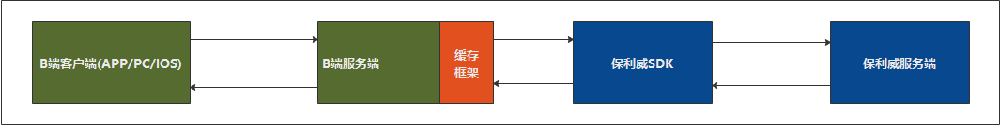

##  SDK调用频次限制

&emsp;&emsp;为了保证保利威服务可用性和安全性，防止保利威服务器受到恶意攻击，保利威服务端对调用频率做了限制，具体为整个保利威服务器域名api.polyv.net都对单个B端IP在10s内不能超过1500次的限制。 如超出限制频率，B端的服务访问会被阻断5分钟。因此，在SDK集成调用时，避免频繁调用超过1500次/10s的限制而影响到B端的正常服务。

&emsp;&emsp;强烈建议B端使用如下集成策略：

&emsp;&emsp;所有请求都通过B端的服务器端转发到保利威服务器，而不能直接通过B端客户端访问保利威服务器，B端的服务器端应该集成Redis 、 Memcache 等缓存框架，请求结果应尽量从缓存中获取，降低调用频次，对于调用频率的统计逻辑也可以封装到Redis缓存框架中，便于业务逻辑处理；

 
