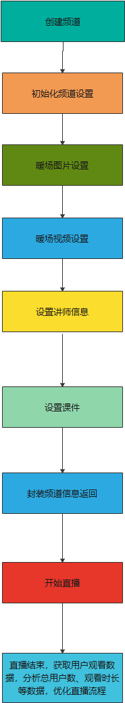
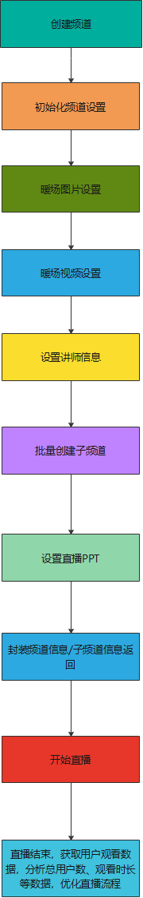

## 目标

&emsp;&emsp;本文档将一步一步带领在10分钟内快速完成一场简单的点播流程，前提是已经完成[系统的初始化过程](/quick_start?id=_2初始化系统)，本文档适合快速上传一个或多个视频，设置相关分类信息后，将视频id嵌入html页面给观众观看，然后查看直播详细观看数据优化视频内容的业务场景。

## html嵌入场景

&emsp;&emsp;此场景适合于通用的点播场景，包括视频上传，设置视频信息、视频封面、视频logo、视频密码等，相关代码可以参考下面代码，直接拷贝后修改成为适合自己的课程信息就可以。

#### 效果展示

观看端效果：


#### 流程

&emsp;&emsp;如下流程除了 频道创建 和 碰到初始化 必须执行，其他都是可选，暖场图片/视频 、讲师信息 、 文档上传，不设相关参数，这些接口将不会被调用，暖场视频和暖场图片只有一个有效，如果同时设置了暖场视频和暖场图片，暖场视频会覆盖暖场图片；




####  代码示例

```java
   /**
     * 快速创建三分屏频道，适用于直播教学场景
     * @throws IOException IO异常
     * @throws NoSuchAlgorithmException 系统异常
     */
//    @Test
    public void testQuickCreatePPT() throws IOException, NoSuchAlgorithmException {
        QuickCreatePPTChannelRequest quickCreatePPTChannelRequest = new QuickCreatePPTChannelRequest();
        QuickCreateChannelResponse quickCreateChannelResponse;
        String path = LiveChannelQuickCreatorTest.class.getResource("/file/PPT.pptx").getPath();
        Calendar instance = Calendar.getInstance();
        instance.set(Calendar.DAY_OF_MONTH, instance.get(Calendar.DAY_OF_MONTH) + 1);
        //创建频道
        String requestId = LiveSignUtil.generateUUID();
        //频道相关基础设置-频道名
        quickCreatePPTChannelRequest.setName("直播教学场景演示")
                //频道相关基础设置-频道密码
                .setChannelPasswd(getRandomString(6))
                //频道相关基础设置-连麦人数
                .setLinkMicLimit(5)
                //频道相关基础设置-主持人名称
                .setPublisher("thomas教授")
                //频道相关基础设置-是否无延迟
                .setPureRtcEnabled(LiveConstant.Flag.YES.getFlag())
                //频道相关基础设置-开播时间
                .setStartTime(instance.getTime().getTime())
                //==========================================
                //频道初始化设置-频道图标地址
                .setCoverImg("https://wwwimg.polyv.net/assets/dist/images/v2020/page-home/brand-advantage/row-2-3.svg")
                //频道初始化设置-引导图地址
                .setSplashImg(
                        "https://wwwimg.polyv.net/assets/dist/images/v2020/news-info-md/product-dynamic-bg_v3.jpg")
                //频道初始化设置-频道描述
                .setDesc("POLYV保利威是广州易方信息科技股份有限公司旗下拥有自主知识产权的视频云计算服务平台，其中包含 云点播 、云直播 " +
                        "和其它视频服务，提供API、SDK技术支持，并拥有国家专利级别的PlaySafe®视频版权保护技术及三套CDN加速，致力为用户提供稳定、安全、快速的企业级视频云服务。")
                //频道初始化设置-设置暖场图
                .setCoverImage("https://s1.videocc.net/live-watch/assets/img/default-splash-img.07657078.jpg")
                //频道初始化设置-点击暖场图跳转的地址
                .setCoverHref("http://www.baidu.com")
                //频道初始化设置-设置暖场视频
//              .setWarmUpFlv("http://www.w3school.com.cn/example/html5/mov_bbb.mp4")
                //==========================================
                //聊天室讲师信息-昵称
                .setNickname("thomas-gogo")
                //聊天室讲师信息-讲师头衔
                .setActor("刘老师")
                //聊天室讲师信息-讲师头像
                .setAvatar(
                        "https://ss3.bdstatic.com/70cFv8Sh_Q1YnxGkpoWK1HF6hhy/it/u=2069606413,3553249962&fm=26&gp=0" +
                                ".jpg")
                //==========================================
                // 讲课文档设置-讲课文档，当前支持DOC、PPT、PDF
                .setFile(new File(path))
                //讲课PPT设置-转换类型（‘common’：转普通图片， ‘animate’：转动画效果）
                .setType("common")
                //讲课PPT设置-文档名称
                .setDocName("直播教学课件")
//                //讲课PPT设置-文档转换完成后的回调地址，不需要不传
//                .setCallbackUrl("http://www.baidu.com/callback")
                
                .setRequestId(requestId);
        
        quickCreateChannelResponse = new LiveChannelQuickCreatorServiceImpl().quickCreatePPTSence(quickCreatePPTChannelRequest);
        Assert.assertNotNull(quickCreateChannelResponse);
        log.debug("快速创建三分屏频道成功，{}", JSON.toJSONString(quickCreateChannelResponse));
        log.debug("网页开播地址：https://live.polyv.net/web-start/login?channelId={}  , 登录密码： {}",
                quickCreateChannelResponse.getLiveChannelBasicInfoResponse().getChannelId(),
                quickCreatePPTChannelRequest.getChannelPasswd());
        log.debug("网页观看地址：https://live.polyv.cn/watch/{} ",
                quickCreateChannelResponse.getLiveChannelBasicInfoResponse().getChannelId());
    
    
        /**
         * todo : B端客户的业务逻辑，将quickCreateChannelResponse的相关信息保持到自己的DB中组织业务逻辑
         */
    
        /**
         * todo : 采用网页开播或者客户端开播，直播结束后 ，可以拉取用户观看直播的观看数据，对观看效果做进一步的分析，改进直播流程和细节
         */
        //打印观看日志
        printViewLog(quickCreateChannelResponse.getLiveChannelBasicInfoResponse().getChannelId(), requestId);
    }

  
    
    /**
     * 打印频道观看日志
     * @param channelId
     * @param requestId
     * @throws IOException
     * @throws NoSuchAlgorithmException
     */
    private void printViewLog(String channelId, String requestId) throws IOException, NoSuchAlgorithmException {
        LiveListChannelViewlogRequest liveListChannelViewlogRequest = new LiveListChannelViewlogRequest();
        LiveListChannelViewlogResponse liveListChannelViewlogResponse;
        Calendar instance = Calendar.getInstance();
        instance.set(Calendar.DAY_OF_MONTH, instance.get(Calendar.DAY_OF_MONTH) + 2);
        //依据频道号和起止时间查询观看日志
        liveListChannelViewlogRequest.setChannelId(channelId)
                .setStartTime(new Date())
                .setEndTime(instance.getTime())
                .setRequestId(requestId);
        liveListChannelViewlogResponse = new LiveChannelViewdataServiceImpl().listChannelViewlog(
                liveListChannelViewlogRequest);
        Assert.assertNotNull(liveListChannelViewlogResponse);
        if (liveListChannelViewlogResponse != null) {
            //to do something ......
            log.debug("测试分页查询频道观看日志成功，{}", JSON.toJSONString(liveListChannelViewlogResponse));
        }
    }

```

#### 请求描述


| 参数名 | 必选 | 类型 | 说明 | 
| -- | -- | -- | -- | 
| name | true | String | 自定义频道名称，一般是课程主题、会议主题、培训主题等，例如 财务制度培训、乌镇峰会 | 
| channelPasswd | true | String | 自定义频道密码，B端讲师通过该密码进入直播间开播，长度不能超过16位,必须同时包含字母和数字 | 
| linkMicLimit | false | Integer | 连麦人数，-1=<取值范围<=账号级的连麦人数，-1：表示使用账号默认的连麦人数，最大16人（注：账号级连麦人数需通知平台管理员设置才生效） | 
| publisher | false | String | 主持人名称 | 
| pureRtcEnabled | false | String | 是否为无延时直播，Y 表示开启，默认为N | 
| coverImg | false | String | 频道图标地址 | 
| splashImg | false | String | 引导图地址 | 
| startTime | false | Long | 直播开始时间，13位时间戳，设置为0 表示关闭直播开始时间显示 | 
| desc | false | String | 直播介绍 | 
| nickname | true | String | 讲师昵称 | 
| actor | true | String | 讲师头衔 | 
| avatar | false | String | 头像图片地址 | 
| coverImage | false | String | 暖场图片地址，图片大小建议：800x450，支持PNG、JPEG、GIF格式 | 
| coverHref | false | String | 点击暖场图片后浏览器跳转地址 | 
| warmUpFlv | false | String | 暖场视频地址(http地址)，移动端不支持FLV视频文件，建议使用MP4视频文件 | 
| file | true | File | 上传的文件不超过50M，格式限制为（ppt， pdf，pptx，doc，docx，wps, xls，xlsx） | 
| type | false | String | 转换类型（‘common’：转普通图片， ‘animate’：转动画效果）默认不传转普通，因为只有ppt，pptx可以转动画，其他类型文件会自动转成普通；文件转动画转失败会直接把类型转为普通 | 
| docName | false | String | 文档名称（不传默认使用ppt上传的文件获取到的文件名作为文档名称，文档名称不得超过100个字符） | 
| callbackUrl | false | String | 文档上传转换成功回调地址 | 
| requestId | true | String | 每次请求的业务流水号，便于客户端/服务器端排查问题 | 


#### 返回描述


| 参数名 | 必选 | 类型 | 说明 | 
| -- | -- | -- | -- | 
| liveChannelBasicInfoResponse | false | LiveChannelBasicInfoResponse | 频道信息【详见[LiveChannelBasicInfoResponse参数描述](playLive.md?id=polyv42)】 | 
| sonChannelInfos | false | Array | 子频道信息【详见[LiveSonChannelInfoResponse参数描述](playLive.md?id=polyv43)】 | 

<h6 id="polyv42"><a href="#/playLive.md?id=polyv42"data-id="LiveChannelBasicInfoResponse参数描述"class="anchor"><span>LiveChannelBasicInfoResponse参数描述</span></a></h6> <!-- {docsify-ignore} -->

| 参数名 | 必选 | 类型 | 说明 | 
| -- | -- | -- | -- | 
| channelId | false | String | 频道号 | 
| name | false | String | 频道名称 | 
| channelPasswd | false | String | 频道密码 | 
| publisher | false | String | 主持人名称 | 
| startTime | false | Date | 直播开始时间，关闭时为null | 
| pageView | false | Integer | 页面累计观看数 | 
| likes | false | Integer | 观看页点赞数 | 
| coverImg | false | String | 频道图标url | 
| splashImg | false | String | 频道引导图url | 
| splashEnabled | false | String | 引导页开关（取值为Y/N） | 
| desc | false | String | 直播介绍 | 
| consultingMenuEnabled | false | String | 咨询提问开关（取值为Y/N） | 
| maxViewerRestrict | false | String | 限制最大在线观看人数开关（取值为Y/N） | 
| maxViewer | false | Integer | 最大在线观看人数 | 
| watchStatus | false | String | 频道的观看页状态，取值为：live（直播中）、end（直播结束）、playback（回放中）、waiting（等待直播） | 
| watchStatusText | false | String | 观看页状态描述，直播中，回放中，已结束，未开始 | 
| userCategory | false | UserCategory | 频道所属分类的信息【详见[UserCategory参数描述](playLive.md?id=polyv44)】 | 
| authSettings | false | Array | 直播观看条件列表【详见[AuthSetting参数描述](playLive.md?id=polyv45)】 | 

<h6 id="polyv43"><a href="#/playLive.md?id=polyv43"data-id="LiveSonChannelInfoResponse参数描述"class="anchor"><span>LiveSonChannelInfoResponse参数描述</span></a></h6> <!-- {docsify-ignore} -->

| 参数名 | 必选 | 类型 | 说明 | 
| -- | -- | -- | -- | 
| account | false | String | 子频道号 | 
| userId | false | String | POLYV用户ID，和保利威官网一致，获取路径：官网->登录->直播（开发设置） | 
| channelId | false | String | 频道号 | 
| passwd | false | String | 子频道密码 | 
| nickname | false | String | 子频道名称 | 
| stream | false | String | 子频道流名（单独使用无效） | 
| status | false | String | 子频道状态 | 
| createdTime | false | Date | 创建子频道时间 | 
| lastModified | false | Date | 子频道最后修改时间 | 
| sort | false | Integer | 频道中所有子频道序号 | 
| avatar | false | String | 子频道头像 | 
| pageTurnEnabled | false | String | 子频道翻页权限（只能一个子频道有） | 
| notifyEnabled | false | String | 发布公告权限(Y/N) | 
| checkinEnabled | false | String | 开启签到权限(Y/N) | 
| voteEnabled | false | String | 发起投票(Y/N) | 
| role | false | String | 子频道角色 | 
| pushUrl | false | String | 子频道推流地址（子频道推流请参考后台导播台使用） | 

<h6 id="polyv44"><a href="#/playLive.md?id=polyv44"data-id="UserCategory参数描述"class="anchor"><span>UserCategory参数描述</span></a></h6> <!-- {docsify-ignore} -->

| 参数名 | 必选 | 类型 | 说明 | 
| -- | -- | -- | -- | 
| categoryId | false | Integer | 分类ID | 
| categoryName | false | String | 分类名称 | 
| userId | false | String | POLYV用户ID，和保利威官网一致，获取路径：官网->登录->直播（开发设置） | 
| rank | false | Integer | 分类的排序值 | 

<h6 id="polyv45"><a href="#/playLive.md?id=polyv45"data-id="AuthSetting参数描述"class="anchor"><span>AuthSetting参数描述</span></a></h6> <!-- {docsify-ignore} -->

| 参数名 | 必选 | 类型 | 说明 | 
| -- | -- | -- | -- | 
| channelId | false | String | 频道号 | 
| userId | false | String | POLYV用户ID，和保利威官网一致，获取路径：官网->登录->直播（开发设置） | 
| rank | false | Integer | 用于实现一个频道设置两个观看条件，为1或2（1为主要条件，2为次要条件） | 
| globalSettingEnabled | false | String | 是否开启全局设置（Y/N） | 
| enabled | false | String | 是否开启观看条件(Y/N) | 
| authType | false | String | 观看条件类型(1. 无限制 none 2. 验证码观看 code 3. 付费观看 pay 4. 白名单观看 phone 5. 登记观看 info 6. 分享观看 wxshare 7. 自定义授权观看 custom 8. 外部授权观看 external) | 
| authTips | false | String | 白名单观看提示信息 | 
| payAuthTips | false | String | 付费观看提示信息 | 
| authCode | false | String | 验证码观看方式的验证码 | 
| qcodeTips | false | String | 验证码观看方式的二维码提示 | 
| qcodeImg | false | String | 验证码观看方式的二维码图片 | 
| price | false | Integer | 付费观看的价格 | 
| watchEndTime | false | Date | 付费观看，截止时间，为null表示：一次付费，永久有效 | 
| validTimePeriod | false | Integer | 付费观看的截止时长（天） | 
| customKey | false | String | 自定义授权观看的key | 
| customUri | false | String | 自定义授权观看的接口地址 | 
| externalKey | false | String | 外部授权观看的key | 
| externalUri | false | String | 外部授权观看的接口地址 | 
| externalRedirectUri | false | String | 外部授权观看，用户直接访问观看页时的跳转地址 | 


## html嵌入场景

&emsp;&emsp;此场景和上面 直播教学场景 基本相同，只是在上面的基础上，可以创建子频道，子频道用于创建代表助教、嘉宾、客服等辅助讲师进行教学的个体信息，可以通过单独的登录通道进入直播间和讲师、观众互动，增加课堂教学效果。

>注意：每一个频道会默认创建4个子频道，通过示例代码的返回对象可以获取到所有的子频道信息

#### 效果展示

讲师端 和 观看端 效果和 上面的 直播教学场景 直播教学场景 一致

助教端：

- 助教可以查看直播状态；
- 助教可以查看聊天室成员信息；
- 助教可以对聊天室严禁词、禁言人员、踢人等进行管理；
- 助教可以协助讲师对提问、问答和用户进行沟通；
- 助教可以参与聊天，活跃课堂气氛；


嘉宾端：

嘉宾默认以连麦的方式进入直播间，和讲师互动；


#### 流程

&emsp;&emsp;如下流程除了 频道创建 和 碰到初始化 必须执行，其他都是可选，暖场图片/视频 、讲师信息 、批量创建子频道、 文档上传，不设相关参数，这些接口将不会被调用，暖场视频和暖场图片只有一个有效，如果同时设置了暖场视频和暖场图片，暖场视频会覆盖暖场图片；


####  代码示例

```java
     /**
     * 快速创建带子频道的三分屏频道，适用于直播教学场景
     * @throws IOException IO异常
     * @throws NoSuchAlgorithmException 系统异常
     */
//    @Test
    public void testQuickCreatePPTAndSonChannel() throws IOException, NoSuchAlgorithmException {
        QuickCreatePPTChannelRequest quickCreatePPTChannelRequest = new QuickCreatePPTChannelRequest();
        QuickCreateChannelResponse quickCreateChannelResponse;
        String path = LiveChannelQuickCreatorTest.class.getResource("/file/PPT.pptx").getPath();
        Calendar instance = Calendar.getInstance();
        instance.set(Calendar.DAY_OF_MONTH, instance.get(Calendar.DAY_OF_MONTH) + 1);
        //创建频道
        String requestId = LiveSignUtil.generateUUID();
        //频道相关基础设置-频道名
        quickCreatePPTChannelRequest.setName("带子频道的直播教学场景")
                //频道相关基础设置-频道密码
                .setChannelPasswd(getRandomString(6))
                //频道相关基础设置-连麦人数
                .setLinkMicLimit(5)
                //频道相关基础设置-主持人名称
                .setPublisher("thomas教授")
                //频道相关基础设置-是否无延迟
                .setPureRtcEnabled(LiveConstant.Flag.YES.getFlag())
                //频道相关基础设置-开播时间
                .setStartTime(instance.getTime().getTime())
                //==========================================
                //频道初始化设置-频道图标地址
                .setCoverImg("https://wwwimg.polyv.net/assets/dist/images/v2020/page-home/brand-advantage/row-2-3.svg")
                //频道初始化设置-引导图地址
                .setSplashImg(
                        "https://wwwimg.polyv.net/assets/dist/images/v2020/news-info-md/product-dynamic-bg_v3.jpg")
                //频道初始化设置-频道描述
                .setDesc("POLYV保利威是广州易方信息科技股份有限公司旗下拥有自主知识产权的视频云计算服务平台，其中包含 云点播 、云直播 " +
                        "和其它视频服务，提供API、SDK技术支持，并拥有国家专利级别的PlaySafe®视频版权保护技术及三套CDN加速，致力为用户提供稳定、安全、快速的企业级视频云服务。")
                //频道初始化设置-设置暖场图
                .setCoverImage("https://s1.videocc.net/live-watch/assets/img/default-splash-img.07657078.jpg")
                //频道初始化设置-点击暖场图跳转的地址
                .setCoverHref("http://www.baidu.com")
                //频道初始化设置-设置暖场视频
//              .setWarmUpFlv("http://www.w3school.com.cn/example/html5/mov_bbb.mp4")
                //==========================================
                //聊天室讲师信息-昵称
                .setNickname("thomas-gogo")
                //聊天室讲师信息-讲师头衔
                .setActor("刘老师")
                //聊天室讲师信息-讲师头像
                .setAvatar(
                        "https://ss3.bdstatic.com/70cFv8Sh_Q1YnxGkpoWK1HF6hhy/it/u=2069606413,3553249962&fm=26&gp=0" +
                                ".jpg")
                //==========================================
                // 讲课文档设置-讲课文档，当前支持DOC、PPT、PDF
                .setFile(new File(path))
                //讲课PPT设置-转换类型（‘common’：转普通图片， ‘animate’：转动画效果）
                .setType("common")
                //讲课PPT设置-文档名称
                .setDocName("直播教学课件")
//                //讲课PPT设置-文档转换完成后的回调地址，不需要不传
//                .setCallbackUrl("http://www.baidu.com/callback")
                
                .setRequestId(requestId);
        
        LiveCreateSonChannelListRequest liveCreateSonChannelListRequest = new LiveCreateSonChannelListRequest();
        List<LiveCreateSonChannelListRequest.SonChannel> sonChannels = new ArrayList<LiveCreateSonChannelListRequest.SonChannel>();
        sonChannels.add(setSonChannelsInfo1());
        sonChannels.add(setSonChannelsInfo2());
        liveCreateSonChannelListRequest.setSonChannels(sonChannels);
        
        quickCreateChannelResponse = new LiveChannelQuickCreatorServiceImpl().quickCreatePPTSence(quickCreatePPTChannelRequest,
                liveCreateSonChannelListRequest);
        Assert.assertNotNull(quickCreateChannelResponse);
        log.debug("快速创建三分屏频道成功，{}", JSON.toJSONString(quickCreateChannelResponse));
        log.debug("网页开播地址：https://live.polyv.net/web-start/login?channelId={}  , 登录密码： {}",
                quickCreateChannelResponse.getLiveChannelBasicInfoResponse().getChannelId(),
                quickCreatePPTChannelRequest.getChannelPasswd());
        log.debug("网页观看地址：https://live.polyv.cn/watch/{} ",
                quickCreateChannelResponse.getLiveChannelBasicInfoResponse().getChannelId());
        log.debug("嘉宾进入直播间地址：http://live.polyv.net/web-start/guest?channelId={} ,登录密码： {} ",
                quickCreateChannelResponse.getSonChannelInfos().get(0).getAccount(),
                sonChannels.get(0).getPasswd());
        log.debug("助教进入直播间地址：https://live.polyv.net/teacher.html , 登录频道: {}, 登录密码： {}",
                quickCreateChannelResponse.getSonChannelInfos().get(1).getAccount(),
                sonChannels.get(1).getPasswd());
        /**
         * todo : B端客户的业务逻辑，将quickCreateChannelResponse的相关信息保持到自己的DB中组织业务逻辑
         */
    
        /**
         * todo : 采用网页开播或者客户端开播，直播结束后 ，可以拉取用户观看直播的观看数据，对观看效果做进一步的分析，改进直播流程和细节
         */
        //打印观看日志
        printViewLog(quickCreateChannelResponse.getLiveChannelBasicInfoResponse().getChannelId(), requestId);
    }

 /**
     * 设置子频道信息-嘉宾
     * @return 子频道列表
     */
    private LiveCreateSonChannelListRequest.SonChannel setSonChannelsInfo1() {
        LiveCreateSonChannelListRequest.SonChannel sonChannel1 = new LiveCreateSonChannelListRequest.SonChannel();
        //设置子频道信息，子频道代表助教、嘉宾信息
        sonChannel1
                //子频道角色-默认不传为助教，传Guest为嘉宾
                .setRole("Guest")
                //子频道昵称
                .setNickname("嘉宾-陈先生")
                //子频道登录密码
                .setPasswd(getRandomString(10))
                //子频道头衔
                .setActor("教授")
                //子频道头像
                .setAvatar(
                        "https://ss0.bdstatic.com/70cFuHSh_Q1YnxGkpoWK1HF6hhy/it/u=2480846186,1530344&fm=15&gp=0.jpg");
        return sonChannel1;
    }
    
    /**
     * 设置子频道信息-助教
     * @return 子频道列表
     */
    private LiveCreateSonChannelListRequest.SonChannel setSonChannelsInfo2() {
        LiveCreateSonChannelListRequest.SonChannel sonChannel2 = new LiveCreateSonChannelListRequest.SonChannel();
        sonChannel2.setRole(null)
                .setNickname("助教-王小姐")
                .setPasswd(getRandomString(10))
                .setActor("王老师")
                .setAvatar("https://ss3.bdstatic.com/70cFv8Sh_Q1YnxGkpoWK1HF6hhy/it/u=356414612,1103487565&fm=15&gp=0" +
                        ".jpg");
        return sonChannel2;
    }
    
    /**
     * 打印频道观看日志
     * @param channelId
     * @param requestId
     * @throws IOException
     * @throws NoSuchAlgorithmException
     */
    private void printViewLog(String channelId, String requestId) throws IOException, NoSuchAlgorithmException {
        LiveListChannelViewlogRequest liveListChannelViewlogRequest = new LiveListChannelViewlogRequest();
        LiveListChannelViewlogResponse liveListChannelViewlogResponse;
        Calendar instance = Calendar.getInstance();
        instance.set(Calendar.DAY_OF_MONTH, instance.get(Calendar.DAY_OF_MONTH) + 2);
        //依据频道号和起止时间查询观看日志
        liveListChannelViewlogRequest.setChannelId(channelId)
                .setStartTime(new Date())
                .setEndTime(instance.getTime())
                .setRequestId(requestId);
        liveListChannelViewlogResponse = new LiveChannelViewdataServiceImpl().listChannelViewlog(
                liveListChannelViewlogRequest);
        Assert.assertNotNull(liveListChannelViewlogResponse);
        if (liveListChannelViewlogResponse != null) {
            //to do something ......
            log.debug("测试分页查询频道观看日志成功，{}", JSON.toJSONString(liveListChannelViewlogResponse));
        }
    }

```

#### 请求描述


| 参数名 | 必选 | 类型 | 说明 | 
| -- | -- | -- | -- | 
| name | true | String | 自定义频道名称，一般是课程主题、会议主题、培训主题等，例如 财务制度培训、乌镇峰会 | 
| channelPasswd | true | String | 自定义频道密码，B端讲师通过该密码进入直播间开播，长度不能超过16位,必须同时包含字母和数字 | 
| linkMicLimit | false | Integer | 连麦人数，-1=<取值范围<=账号级的连麦人数，-1：表示使用账号默认的连麦人数，最大16人（注：账号级连麦人数需通知平台管理员设置才生效） | 
| publisher | false | String | 主持人名称 | 
| pureRtcEnabled | false | String | 是否为无延时直播，Y 表示开启，默认为N | 
| coverImg | false | String | 频道图标地址 | 
| splashImg | false | String | 引导图地址 | 
| startTime | false | Long | 直播开始时间，13位时间戳，设置为0 表示关闭直播开始时间显示 | 
| desc | false | String | 直播介绍 | 
| nickname | true | String | 讲师昵称 | 
| actor | true | String | 讲师头衔 | 
| avatar | false | String | 头像图片地址 | 
| coverImage | false | String | 暖场图片地址，图片大小建议：800x450，支持PNG、JPEG、GIF格式 | 
| coverHref | false | String | 点击暖场图片后浏览器跳转地址 | 
| warmUpFlv | false | String | 暖场视频地址(http地址)，移动端不支持FLV视频文件，建议使用MP4视频文件 | 
| file | true | File | 上传的文件不超过50M，格式限制为（ppt， pdf，pptx，doc，docx，wps, xls，xlsx） | 
| type | false | String | 转换类型（‘common’：转普通图片， ‘animate’：转动画效果）默认不传转普通，因为只有ppt，pptx可以转动画，其他类型文件会自动转成普通；文件转动画转失败会直接把类型转为普通 | 
| docName | false | String | 文档名称（不传默认使用ppt上传的文件获取到的文件名作为文档名称，文档名称不得超过100个字符） | 
| callbackUrl | false | String | 文档上传转换成功回调地址 | 
| requestId | true | String | 每次请求的业务流水号，便于客户端/服务器端排查问题 | 


#### 返回描述


| 参数名 | 必选 | 类型 | 说明 | 
| -- | -- | -- | -- | 
| liveChannelBasicInfoResponse | false | LiveChannelBasicInfoResponse | 频道信息【详见[LiveChannelBasicInfoResponse参数描述](playLive.md?id=polyv47)】 | 
| sonChannelInfos | false | Array | 子频道信息【详见[LiveSonChannelInfoResponse参数描述](playLive.md?id=polyv48)】 | 

<h6 id="polyv47"><a href="#/playLive.md?id=polyv47"data-id="LiveChannelBasicInfoResponse参数描述"class="anchor"><span>LiveChannelBasicInfoResponse参数描述</span></a></h6> <!-- {docsify-ignore} -->

| 参数名 | 必选 | 类型 | 说明 | 
| -- | -- | -- | -- | 
| channelId | false | String | 频道号 | 
| name | false | String | 频道名称 | 
| channelPasswd | false | String | 频道密码 | 
| publisher | false | String | 主持人名称 | 
| startTime | false | Date | 直播开始时间，关闭时为null | 
| pageView | false | Integer | 页面累计观看数 | 
| likes | false | Integer | 观看页点赞数 | 
| coverImg | false | String | 频道图标url | 
| splashImg | false | String | 频道引导图url | 
| splashEnabled | false | String | 引导页开关（取值为Y/N） | 
| desc | false | String | 直播介绍 | 
| consultingMenuEnabled | false | String | 咨询提问开关（取值为Y/N） | 
| maxViewerRestrict | false | String | 限制最大在线观看人数开关（取值为Y/N） | 
| maxViewer | false | Integer | 最大在线观看人数 | 
| watchStatus | false | String | 频道的观看页状态，取值为：live（直播中）、end（直播结束）、playback（回放中）、waiting（等待直播） | 
| watchStatusText | false | String | 观看页状态描述，直播中，回放中，已结束，未开始 | 
| userCategory | false | UserCategory | 频道所属分类的信息【详见[UserCategory参数描述](playLive.md?id=polyv49)】 | 
| authSettings | false | Array | 直播观看条件列表【详见[AuthSetting参数描述](playLive.md?id=polyv50)】 | 

<h6 id="polyv48"><a href="#/playLive.md?id=polyv48"data-id="LiveSonChannelInfoResponse参数描述"class="anchor"><span>LiveSonChannelInfoResponse参数描述</span></a></h6> <!-- {docsify-ignore} -->

| 参数名 | 必选 | 类型 | 说明 | 
| -- | -- | -- | -- | 
| account | false | String | 子频道号 | 
| userId | false | String | POLYV用户ID，和保利威官网一致，获取路径：官网->登录->直播（开发设置） | 
| channelId | false | String | 频道号 | 
| passwd | false | String | 子频道密码 | 
| nickname | false | String | 子频道名称 | 
| stream | false | String | 子频道流名（单独使用无效） | 
| status | false | String | 子频道状态 | 
| createdTime | false | Date | 创建子频道时间 | 
| lastModified | false | Date | 子频道最后修改时间 | 
| sort | false | Integer | 频道中所有子频道序号 | 
| avatar | false | String | 子频道头像 | 
| pageTurnEnabled | false | String | 子频道翻页权限（只能一个子频道有） | 
| notifyEnabled | false | String | 发布公告权限(Y/N) | 
| checkinEnabled | false | String | 开启签到权限(Y/N) | 
| voteEnabled | false | String | 发起投票(Y/N) | 
| role | false | String | 子频道角色 | 
| pushUrl | false | String | 子频道推流地址（子频道推流请参考后台导播台使用） | 

<h6 id="polyv49"><a href="#/playLive.md?id=polyv49"data-id="UserCategory参数描述"class="anchor"><span>UserCategory参数描述</span></a></h6> <!-- {docsify-ignore} -->

| 参数名 | 必选 | 类型 | 说明 | 
| -- | -- | -- | -- | 
| categoryId | false | Integer | 分类ID | 
| categoryName | false | String | 分类名称 | 
| userId | false | String | POLYV用户ID，和保利威官网一致，获取路径：官网->登录->直播（开发设置） | 
| rank | false | Integer | 分类的排序值 | 

<h6 id="polyv50"><a href="#/playLive.md?id=polyv50"data-id="AuthSetting参数描述"class="anchor"><span>AuthSetting参数描述</span></a></h6> <!-- {docsify-ignore} -->

| 参数名 | 必选 | 类型 | 说明 | 
| -- | -- | -- | -- | 
| channelId | false | String | 频道号 | 
| userId | false | String | POLYV用户ID，和保利威官网一致，获取路径：官网->登录->直播（开发设置） | 
| rank | false | Integer | 用于实现一个频道设置两个观看条件，为1或2（1为主要条件，2为次要条件） | 
| globalSettingEnabled | false | String | 是否开启全局设置（Y/N） | 
| enabled | false | String | 是否开启观看条件(Y/N) | 
| authType | false | String | 观看条件类型(1. 无限制 none 2. 验证码观看 code 3. 付费观看 pay 4. 白名单观看 phone 5. 登记观看 info 6. 分享观看 wxshare 7. 自定义授权观看 custom 8. 外部授权观看 external) | 
| authTips | false | String | 白名单观看提示信息 | 
| payAuthTips | false | String | 付费观看提示信息 | 
| authCode | false | String | 验证码观看方式的验证码 | 
| qcodeTips | false | String | 验证码观看方式的二维码提示 | 
| qcodeImg | false | String | 验证码观看方式的二维码图片 | 
| price | false | Integer | 付费观看的价格 | 
| watchEndTime | false | Date | 付费观看，截止时间，为null表示：一次付费，永久有效 | 
| validTimePeriod | false | Integer | 付费观看的截止时长（天） | 
| customKey | false | String | 自定义授权观看的key | 
| customUri | false | String | 自定义授权观看的接口地址 | 
| externalKey | false | String | 外部授权观看的key | 
| externalUri | false | String | 外部授权观看的接口地址 | 
| externalRedirectUri | false | String | 外部授权观看，用户直接访问观看页时的跳转地址 | 


## 普通视频场景

&emsp;&emsp;此场景适合非教学情况下的其他场景，比如直播带货、会议直播、年会直播的场景，和直播教学场景的区别是主播端和观看端的页面排版不同，直播教学场景以三分屏的方式将讲师头像、课件、白板、聊天室集成到一个页面呈现给终端用户，而普通视频场景同时只能呈现讲师摄像头、文档、电脑屏幕的一种，一般情况直接重现讲师摄像头采集的画面。

>注意：每一个频道会默认创建4个子频道，通过示例代码的返回对象可以获取到所有的子频道信息

#### 效果展示

讲师端效果（呈现文档给终端用户）：


讲师端效果（呈现讲师摄像头采集信息给终端用户）：


观看端效果：


#### 流程

&emsp;&emsp;如下流程除了 频道创建 和 碰到初始化 必须执行，其他都是可选，暖场图片/视频 、讲师信息 、 直播PPT上传，不设相关参数，这些接口将不会被调用，暖场视频和暖场图片只有一个有效，如果同时设置了暖场视频和暖场图片，暖场视频会覆盖暖场图片；


####  代码 示例

```java
  /**
     * 快速创建纯视频频道，适合直播带货、会议、年会、活动拍摄、大会直播等直播业务场景
     * 约束：2、同时设置暖场图片和暖场视频只生效暖场视频。
     * @throws IOException IO异常
     * @throws NoSuchAlgorithmException 系统异常
     */
//    @Test
    public void testQuickCreateVideo() throws IOException, NoSuchAlgorithmException {
        QuickCreateVideoChannelRequest quickCreateVideoChannelRequest = new QuickCreateVideoChannelRequest();
        QuickCreateChannelResponse quickCreateChannelResponse;
        Calendar instance = Calendar.getInstance();
        instance.set(Calendar.DAY_OF_MONTH, instance.get(Calendar.DAY_OF_MONTH) + 1);
        //创建频道
        String requestId = LiveSignUtil.generateUUID();
        
        //频道相关基础设置-频道名
        quickCreateVideoChannelRequest.setName("纯视频直播场景演示")
                //频道相关基础设置-频道密码
                .setChannelPasswd(getRandomString(6))
                //频道相关基础设置-连麦人数
                .setLinkMicLimit(5)
                //频道相关基础设置-主持人名称
                .setPublisher("thomas教授")
                //频道相关基础设置-是否无延迟
                .setPureRtcEnabled(LiveConstant.Flag.YES.getFlag())
                //频道相关基础设置-开播时间
                .setStartTime(instance.getTime().getTime())
                //==========================================
                //频道初始化设置-频道图标地址
                .setCoverImg("https://wwwimg.polyv.net/assets/dist/images/v2020/page-home/brand-advantage/row-2-3.svg")
                //频道初始化设置-引导图地址
                .setSplashImg(
                        "https://wwwimg.polyv.net/assets/dist/images/v2020/news-info-md/product-dynamic-bg_v3.jpg")
                //频道初始化设置-频道描述
                .setDesc("POLYV保利威是广州易方信息科技股份有限公司旗下拥有自主知识产权的视频云计算服务平台，其中包含 云点播 、云直播 " +
                        "和其它视频服务，提供API、SDK技术支持，并拥有国家专利级别的PlaySafe®视频版权保护技术及三套CDN加速，致力为用户提供稳定、安全、快速的企业级视频云服务。")
                //频道初始化设置-设置暖场图
                .setCoverImage("https://s1.videocc.net/live-watch/assets/img/default-splash-img.07657078.jpg")
                //频道初始化设置-点击暖场图跳转的地址
                .setCoverHref("http://www.baidu.com")
                //频道初始化设置-设置暖场视频
//              .setWarmUpFlv("http://www.w3school.com.cn/example/html5/mov_bbb.mp4")
                //==========================================
                //聊天室讲师信息-昵称
                .setNickname("thomas-gogo")
                //聊天室讲师信息-讲师头衔
                .setActor("刘老师")
                //聊天室讲师信息-讲师头像
                .setAvatar(
                        "https://ss3.bdstatic.com/70cFv8Sh_Q1YnxGkpoWK1HF6hhy/it/u=2069606413,3553249962&fm=26&gp=0" +
                                ".jpg").setRequestId(requestId);
        
        quickCreateChannelResponse = new LiveChannelQuickCreatorServiceImpl().quickCreateVideoSence(quickCreateVideoChannelRequest);
        Assert.assertNotNull(quickCreateChannelResponse);
        log.debug("快速创建纯视频频道成功，{}", JSON.toJSONString(quickCreateChannelResponse));
        log.debug("网页开播地址：https://live.polyv.net/web-start/login?channelId={}  , 登录密码： {}",
                quickCreateChannelResponse.getLiveChannelBasicInfoResponse().getChannelId(),
                quickCreateVideoChannelRequest.getChannelPasswd());
        log.debug("网页观看地址：https://live.polyv.cn/watch/{} ",
                quickCreateChannelResponse.getLiveChannelBasicInfoResponse().getChannelId());
        /**
         * todo : B端客户的业务逻辑，将quickCreateChannelResponse的相关信息保持到自己的DB中组织业务逻辑
         */
    
        /**
         * todo : 采用网页开播或者客户端开播，直播结束后 ，可以拉取用户观看直播的观看数据，对观看效果做进一步的分析，改进直播流程和细节
         */
        //打印观看日志
        printViewLog(quickCreateChannelResponse.getLiveChannelBasicInfoResponse().getChannelId(), requestId);
    }

 
    
    /**
     * 打印频道观看日志
     * @param channelId
     * @param requestId
     * @throws IOException
     * @throws NoSuchAlgorithmException
     */
    private void printViewLog(String channelId, String requestId) throws IOException, NoSuchAlgorithmException {
        LiveListChannelViewlogRequest liveListChannelViewlogRequest = new LiveListChannelViewlogRequest();
        LiveListChannelViewlogResponse liveListChannelViewlogResponse;
        Calendar instance = Calendar.getInstance();
        instance.set(Calendar.DAY_OF_MONTH, instance.get(Calendar.DAY_OF_MONTH) + 2);
        //依据频道号和起止时间查询观看日志
        liveListChannelViewlogRequest.setChannelId(channelId)
                .setStartTime(new Date())
                .setEndTime(instance.getTime())
                .setRequestId(requestId);
        liveListChannelViewlogResponse = new LiveChannelViewdataServiceImpl().listChannelViewlog(
                liveListChannelViewlogRequest);
        Assert.assertNotNull(liveListChannelViewlogResponse);
        if (liveListChannelViewlogResponse != null) {
            //to do something ......
            log.debug("测试分页查询频道观看日志成功，{}", JSON.toJSONString(liveListChannelViewlogResponse));
        }
    }

```

#### 请求描述


| 参数名 | 必选 | 类型 | 说明 | 
| -- | -- | -- | -- | 
| name | true | String | 自定义频道名称，一般是课程主题、会议主题、培训主题等，例如 财务制度培训、乌镇峰会 | 
| channelPasswd | true | String | 自定义频道密码，B端讲师通过该密码进入直播间开播，长度不能超过16位,必须同时包含字母和数字 | 
| linkMicLimit | false | Integer | 连麦人数，-1=<取值范围<=账号级的连麦人数，-1：表示使用账号默认的连麦人数，最大16人（注：账号级连麦人数需通知平台管理员设置才生效） | 
| publisher | false | String | 主持人名称 | 
| pureRtcEnabled | false | String | 是否为无延时直播，Y 表示开启，默认为N | 
| coverImg | false | String | 频道图标地址 | 
| splashImg | false | String | 引导图地址 | 
| desc | false | String | 直播介绍 | 
| startTime | false | Long | 直播开始时间，13位时间戳，设置为0 表示关闭直播开始时间显示 | 
| coverImage | false | String | 暖场图片地址，图片大小建议：800x450，支持PNG、JPEG、GIF格式 | 
| coverHref | false | String | 点击暖场图片后浏览器跳转地址 | 
| warmUpFlv | false | String | 暖场视频地址(http地址)，移动端不支持FLV视频文件，建议使用MP4视频文件 | 
| nickname | true | String | 讲师昵称 | 
| actor | true | String | 讲师头衔 | 
| avatar | false | String | 头像图片地址 | 
| requestId | true | String | 每次请求的业务流水号，便于客户端/服务器端排查问题 | 


#### 返回描述


| 参数名 | 必选 | 类型 | 说明 | 
| -- | -- | -- | -- | 
| liveChannelBasicInfoResponse | false | LiveChannelBasicInfoResponse | 频道信息【详见[LiveChannelBasicInfoResponse参数描述](playLive.md?id=polyv52)】 | 
| sonChannelInfos | false | Array | 子频道信息【详见[LiveSonChannelInfoResponse参数描述](playLive.md?id=polyv53)】 | 

<h6 id="polyv52"><a href="#/playLive.md?id=polyv52"data-id="LiveChannelBasicInfoResponse参数描述"class="anchor"><span>LiveChannelBasicInfoResponse参数描述</span></a></h6> <!-- {docsify-ignore} -->

| 参数名 | 必选 | 类型 | 说明 | 
| -- | -- | -- | -- | 
| channelId | false | String | 频道号 | 
| name | false | String | 频道名称 | 
| channelPasswd | false | String | 频道密码 | 
| publisher | false | String | 主持人名称 | 
| startTime | false | Date | 直播开始时间，关闭时为null | 
| pageView | false | Integer | 页面累计观看数 | 
| likes | false | Integer | 观看页点赞数 | 
| coverImg | false | String | 频道图标url | 
| splashImg | false | String | 频道引导图url | 
| splashEnabled | false | String | 引导页开关（取值为Y/N） | 
| desc | false | String | 直播介绍 | 
| consultingMenuEnabled | false | String | 咨询提问开关（取值为Y/N） | 
| maxViewerRestrict | false | String | 限制最大在线观看人数开关（取值为Y/N） | 
| maxViewer | false | Integer | 最大在线观看人数 | 
| watchStatus | false | String | 频道的观看页状态，取值为：live（直播中）、end（直播结束）、playback（回放中）、waiting（等待直播） | 
| watchStatusText | false | String | 观看页状态描述，直播中，回放中，已结束，未开始 | 
| userCategory | false | UserCategory | 频道所属分类的信息【详见[UserCategory参数描述](playLive.md?id=polyv54)】 | 
| authSettings | false | Array | 直播观看条件列表【详见[AuthSetting参数描述](playLive.md?id=polyv55)】 | 

<h6 id="polyv53"><a href="#/playLive.md?id=polyv53"data-id="LiveSonChannelInfoResponse参数描述"class="anchor"><span>LiveSonChannelInfoResponse参数描述</span></a></h6> <!-- {docsify-ignore} -->

| 参数名 | 必选 | 类型 | 说明 | 
| -- | -- | -- | -- | 
| account | false | String | 子频道号 | 
| userId | false | String | POLYV用户ID，和保利威官网一致，获取路径：官网->登录->直播（开发设置） | 
| channelId | false | String | 频道号 | 
| passwd | false | String | 子频道密码 | 
| nickname | false | String | 子频道名称 | 
| stream | false | String | 子频道流名（单独使用无效） | 
| status | false | String | 子频道状态 | 
| createdTime | false | Date | 创建子频道时间 | 
| lastModified | false | Date | 子频道最后修改时间 | 
| sort | false | Integer | 频道中所有子频道序号 | 
| avatar | false | String | 子频道头像 | 
| pageTurnEnabled | false | String | 子频道翻页权限（只能一个子频道有） | 
| notifyEnabled | false | String | 发布公告权限(Y/N) | 
| checkinEnabled | false | String | 开启签到权限(Y/N) | 
| voteEnabled | false | String | 发起投票(Y/N) | 
| role | false | String | 子频道角色 | 
| pushUrl | false | String | 子频道推流地址（子频道推流请参考后台导播台使用） | 

<h6 id="polyv54"><a href="#/playLive.md?id=polyv54"data-id="UserCategory参数描述"class="anchor"><span>UserCategory参数描述</span></a></h6> <!-- {docsify-ignore} -->

| 参数名 | 必选 | 类型 | 说明 | 
| -- | -- | -- | -- | 
| categoryId | false | Integer | 分类ID | 
| categoryName | false | String | 分类名称 | 
| userId | false | String | POLYV用户ID，和保利威官网一致，获取路径：官网->登录->直播（开发设置） | 
| rank | false | Integer | 分类的排序值 | 

<h6 id="polyv55"><a href="#/playLive.md?id=polyv55"data-id="AuthSetting参数描述"class="anchor"><span>AuthSetting参数描述</span></a></h6> <!-- {docsify-ignore} -->

| 参数名 | 必选 | 类型 | 说明 | 
| -- | -- | -- | -- | 
| channelId | false | String | 频道号 | 
| userId | false | String | POLYV用户ID，和保利威官网一致，获取路径：官网->登录->直播（开发设置） | 
| rank | false | Integer | 用于实现一个频道设置两个观看条件，为1或2（1为主要条件，2为次要条件） | 
| globalSettingEnabled | false | String | 是否开启全局设置（Y/N） | 
| enabled | false | String | 是否开启观看条件(Y/N) | 
| authType | false | String | 观看条件类型(1. 无限制 none 2. 验证码观看 code 3. 付费观看 pay 4. 白名单观看 phone 5. 登记观看 info 6. 分享观看 wxshare 7. 自定义授权观看 custom 8. 外部授权观看 external) | 
| authTips | false | String | 白名单观看提示信息 | 
| payAuthTips | false | String | 付费观看提示信息 | 
| authCode | false | String | 验证码观看方式的验证码 | 
| qcodeTips | false | String | 验证码观看方式的二维码提示 | 
| qcodeImg | false | String | 验证码观看方式的二维码图片 | 
| price | false | Integer | 付费观看的价格 | 
| watchEndTime | false | Date | 付费观看，截止时间，为null表示：一次付费，永久有效 | 
| validTimePeriod | false | Integer | 付费观看的截止时长（天） | 
| customKey | false | String | 自定义授权观看的key | 
| customUri | false | String | 自定义授权观看的接口地址 | 
| externalKey | false | String | 外部授权观看的key | 
| externalUri | false | String | 外部授权观看的接口地址 | 
| externalRedirectUri | false | String | 外部授权观看，用户直接访问观看页时的跳转地址 | 


## 带子频道的纯视频直播场景

 此场景和上面 纯视频直播场景 基本相同，只是在上面的基础上，可以创建子频道，子频道用于创建代表助理、客服等辅助主播的个体信息，可以通过单独的登录通道进入直播间和主播、观众互动，增加直播效果；

>注意：每一个频道会默认创建4个子频道，通过示例代码的返回对象可以获取到所有的子频道信息

####  效果展示

讲师端 和 观看端 效果和上面的 纯视频直播场景  一致

助教端：

- 助教可以查看直播状态；

- 助教可以查看聊天室成员信息；

- 助教可以对聊天室严禁词、禁言人员、踢人等进行管理；

- 助教可以协助讲师对提问、问答和用户进行沟通；

- 助教可以参与聊天，活跃课堂气氛；

  

#### 流程

&emsp;&emsp;如下流程除了 频道创建 和 碰到初始化 必须执行，其他都是可选，暖场图片/视频 、讲师信息 、 直播PPT上传，不设相关参数，这些接口将不会被调用，暖场视频和暖场图片只有一个有效，如果同时设置了暖场视频和暖场图片，暖场视频会覆盖暖场图片；



#### 代码示例
```java
/**
     * 快速创建纯视频频道，适合直播带货、会议、年会、活动拍摄、大会直播等直播业务场景
     * 约束：2、同时设置暖场图片和暖场视频只生效暖场视频。
     * @throws IOException IO异常
     * @throws NoSuchAlgorithmException 系统异常
     */
//    @Test
    public void testQuickCreateVideoAndSonChannel() throws IOException, NoSuchAlgorithmException {
        QuickCreateVideoChannelRequest quickCreateVideoChannelRequest = new QuickCreateVideoChannelRequest();
        QuickCreateChannelResponse quickCreateChannelResponse;
        Calendar instance = Calendar.getInstance();
        instance.set(Calendar.DAY_OF_MONTH, instance.get(Calendar.DAY_OF_MONTH) + 1);
        //创建频道
        String requestId = LiveSignUtil.generateUUID();
        
        //频道相关基础设置-频道名
        quickCreateVideoChannelRequest.setName("带子频道的纯视频直播场景")
                //频道相关基础设置-频道密码
                .setChannelPasswd(getRandomString(6))
                //频道相关基础设置-连麦人数
                .setLinkMicLimit(5)
                //频道相关基础设置-主持人名称
                .setPublisher("thomas教授")
                //频道相关基础设置-是否无延迟
                .setPureRtcEnabled(LiveConstant.Flag.YES.getFlag())
                //频道相关基础设置-开播时间
                .setStartTime(instance.getTime().getTime())
                //==========================================
                //频道初始化设置-频道图标地址
                .setCoverImg("https://wwwimg.polyv.net/assets/dist/images/v2020/page-home/brand-advantage/row-2-3.svg")
                //频道初始化设置-引导图地址
                .setSplashImg(
                        "https://wwwimg.polyv.net/assets/dist/images/v2020/news-info-md/product-dynamic-bg_v3.jpg")
                //频道初始化设置-频道描述
                .setDesc("POLYV保利威是广州易方信息科技股份有限公司旗下拥有自主知识产权的视频云计算服务平台，其中包含 云点播 、云直播 " +
                        "和其它视频服务，提供API、SDK技术支持，并拥有国家专利级别的PlaySafe®视频版权保护技术及三套CDN加速，致力为用户提供稳定、安全、快速的企业级视频云服务。")
                //频道初始化设置-设置暖场图
                .setCoverImage("https://s1.videocc.net/live-watch/assets/img/default-splash-img.07657078.jpg")
                //频道初始化设置-点击暖场图跳转的地址
                .setCoverHref("http://www.baidu.com")
                //频道初始化设置-设置暖场视频
//              .setWarmUpFlv("http://www.w3school.com.cn/example/html5/mov_bbb.mp4")
                //==========================================
                //聊天室讲师信息-昵称
                .setNickname("thomas-gogo")
                //聊天室讲师信息-讲师头衔
                .setActor("刘老师")
                //聊天室讲师信息-讲师头像
                .setAvatar(
                        "https://ss3.bdstatic.com/70cFv8Sh_Q1YnxGkpoWK1HF6hhy/it/u=2069606413,3553249962&fm=26&gp=0" +
                                ".jpg").setRequestId(requestId);
        
        LiveCreateSonChannelListRequest liveCreateSonChannelListRequest = new LiveCreateSonChannelListRequest();
        List<LiveCreateSonChannelListRequest.SonChannel> sonChannels = new ArrayList<>();
        //纯视频场景只能创建助教，不允许创建嘉宾
        sonChannels.add(setSonChannelsInfo2());
        liveCreateSonChannelListRequest.setSonChannels(sonChannels);
        
        //请求服务器，创建带子频道的纯视频频道
        quickCreateChannelResponse = new LiveChannelQuickCreatorServiceImpl().quickCreateVideoSence(quickCreateVideoChannelRequest,
                liveCreateSonChannelListRequest);
        
        Assert.assertNotNull(quickCreateChannelResponse);
        log.debug("快速创建纯视频直播频道成功，{}", JSON.toJSONString(quickCreateChannelResponse));
        //无延迟纯视频模式只支持客户端开播
        if (LiveConstant.Flag.YES.getFlag().equals(quickCreateVideoChannelRequest.getPureRtcEnabled())) {
            log.debug("客户端开播地址：https://live.polyv.net/start-client.html?channelId={}  , 登录密码： {}",
                    quickCreateChannelResponse.getLiveChannelBasicInfoResponse().getChannelId(),
                    quickCreateVideoChannelRequest.getChannelPasswd());
        } else {
            log.debug("网页开播地址：https://live.polyv.net/web-start/login?channelId={}  , 登录密码： {}",
                    quickCreateChannelResponse.getLiveChannelBasicInfoResponse().getChannelId(),
                    quickCreateVideoChannelRequest.getChannelPasswd());
        }
        log.debug("网页观看地址：https://live.polyv.cn/watch/{} ",
                quickCreateChannelResponse.getLiveChannelBasicInfoResponse().getChannelId());
        
        //无延迟纯视频模式只支持客户端助教视频连麦
        if (LiveConstant.Flag.YES.getFlag().equals(quickCreateVideoChannelRequest.getPureRtcEnabled())) {
            log.debug("助教客户端进入直播间地址：https://live.polyv.net/teacher.html , 登录频道: {}, 登录密码： {}",
                    quickCreateChannelResponse.getSonChannelInfos().get(0).getAccount(),
                    sonChannels.get(0).getPasswd());
        } else {
            log.debug("助教进入直播间地址：https://live.polyv.net/teacher.html , 登录频道: {}, 登录密码： {}",
                    quickCreateChannelResponse.getSonChannelInfos().get(0).getAccount(),
                    sonChannels.get(0).getPasswd());
        }
    
        /**
         * todo : B端客户的业务逻辑，将quickCreateChannelResponse的相关信息保持到自己的DB中组织业务逻辑
         */
        
        /**
         * todo : 采用网页开播或者客户端开播，直播结束后 ，可以拉取用户观看直播的观看数据，对观看效果做进一步的分析，改进直播流程和细节
         */
        //打印观看日志
        printViewLog(quickCreateChannelResponse.getLiveChannelBasicInfoResponse().getChannelId(), requestId);
    }


    /**
     * 设置子频道信息-助教
     * @return 子频道列表
     */
    private LiveCreateSonChannelListRequest.SonChannel setSonChannelsInfo2() {
        LiveCreateSonChannelListRequest.SonChannel sonChannel2 = new LiveCreateSonChannelListRequest.SonChannel();
        sonChannel2.setRole(null)
                .setNickname("助教-王小姐")
                .setPasswd(getRandomString(10))
                .setActor("王老师")
                .setAvatar("https://ss3.bdstatic.com/70cFv8Sh_Q1YnxGkpoWK1HF6hhy/it/u=356414612,1103487565&fm=15&gp=0" +
                        ".jpg");
        return sonChannel2;
    }
    


    /**
     * 打印频道观看日志
     * @param channelId
     * @param requestId
     * @throws IOException
     * @throws NoSuchAlgorithmException
     */
    private void printViewLog(String channelId, String requestId) throws IOException, NoSuchAlgorithmException {
        LiveListChannelViewlogRequest liveListChannelViewlogRequest = new LiveListChannelViewlogRequest();
        LiveListChannelViewlogResponse liveListChannelViewlogResponse;
        Calendar instance = Calendar.getInstance();
        instance.set(Calendar.DAY_OF_MONTH, instance.get(Calendar.DAY_OF_MONTH) + 2);
        //依据频道号和起止时间查询观看日志
        liveListChannelViewlogRequest.setChannelId(channelId)
                .setStartTime(new Date())
                .setEndTime(instance.getTime())
                .setRequestId(requestId);
        liveListChannelViewlogResponse = new LiveChannelViewdataServiceImpl().listChannelViewlog(
                liveListChannelViewlogRequest);
        Assert.assertNotNull(liveListChannelViewlogResponse);
        if (liveListChannelViewlogResponse != null) {
            //to do something ......
            log.debug("测试分页查询频道观看日志成功，{}", JSON.toJSONString(liveListChannelViewlogResponse));
        }
    } 
```

#### 请求描述


| 参数名 | 必选 | 类型 | 说明 | 
| -- | -- | -- | -- | 
| name | true | String | 自定义频道名称，一般是课程主题、会议主题、培训主题等，例如 财务制度培训、乌镇峰会 | 
| channelPasswd | true | String | 自定义频道密码，B端讲师通过该密码进入直播间开播，长度不能超过16位,必须同时包含字母和数字 | 
| linkMicLimit | false | Integer | 连麦人数，-1=<取值范围<=账号级的连麦人数，-1：表示使用账号默认的连麦人数，最大16人（注：账号级连麦人数需通知平台管理员设置才生效） | 
| publisher | false | String | 主持人名称 | 
| pureRtcEnabled | false | String | 是否为无延时直播，Y 表示开启，默认为N | 
| coverImg | false | String | 频道图标地址 | 
| splashImg | false | String | 引导图地址 | 
| desc | false | String | 直播介绍 | 
| startTime | false | Long | 直播开始时间，13位时间戳，设置为0 表示关闭直播开始时间显示 | 
| coverImage | false | String | 暖场图片地址，图片大小建议：800x450，支持PNG、JPEG、GIF格式 | 
| coverHref | false | String | 点击暖场图片后浏览器跳转地址 | 
| warmUpFlv | false | String | 暖场视频地址(http地址)，移动端不支持FLV视频文件，建议使用MP4视频文件 | 
| nickname | true | String | 讲师昵称 | 
| actor | true | String | 讲师头衔 | 
| avatar | false | String | 头像图片地址 | 
| requestId | true | String | 每次请求的业务流水号，便于客户端/服务器端排查问题 | 


#### 返回描述


| 参数名 | 必选 | 类型 | 说明 | 
| -- | -- | -- | -- | 
| liveChannelBasicInfoResponse | false | LiveChannelBasicInfoResponse | 频道信息【详见[LiveChannelBasicInfoResponse参数描述](playLive.md?id=polyv57)】 | 
| sonChannelInfos | false | Array | 子频道信息【详见[LiveSonChannelInfoResponse参数描述](playLive.md?id=polyv58)】 | 

<h6 id="polyv57"><a href="#/playLive.md?id=polyv57"data-id="LiveChannelBasicInfoResponse参数描述"class="anchor"><span>LiveChannelBasicInfoResponse参数描述</span></a></h6> <!-- {docsify-ignore} -->

| 参数名 | 必选 | 类型 | 说明 | 
| -- | -- | -- | -- | 
| channelId | false | String | 频道号 | 
| name | false | String | 频道名称 | 
| channelPasswd | false | String | 频道密码 | 
| publisher | false | String | 主持人名称 | 
| startTime | false | Date | 直播开始时间，关闭时为null | 
| pageView | false | Integer | 页面累计观看数 | 
| likes | false | Integer | 观看页点赞数 | 
| coverImg | false | String | 频道图标url | 
| splashImg | false | String | 频道引导图url | 
| splashEnabled | false | String | 引导页开关（取值为Y/N） | 
| desc | false | String | 直播介绍 | 
| consultingMenuEnabled | false | String | 咨询提问开关（取值为Y/N） | 
| maxViewerRestrict | false | String | 限制最大在线观看人数开关（取值为Y/N） | 
| maxViewer | false | Integer | 最大在线观看人数 | 
| watchStatus | false | String | 频道的观看页状态，取值为：live（直播中）、end（直播结束）、playback（回放中）、waiting（等待直播） | 
| watchStatusText | false | String | 观看页状态描述，直播中，回放中，已结束，未开始 | 
| userCategory | false | UserCategory | 频道所属分类的信息【详见[UserCategory参数描述](playLive.md?id=polyv59)】 | 
| authSettings | false | Array | 直播观看条件列表【详见[AuthSetting参数描述](playLive.md?id=polyv60)】 | 

<h6 id="polyv58"><a href="#/playLive.md?id=polyv58"data-id="LiveSonChannelInfoResponse参数描述"class="anchor"><span>LiveSonChannelInfoResponse参数描述</span></a></h6> <!-- {docsify-ignore} -->

| 参数名 | 必选 | 类型 | 说明 | 
| -- | -- | -- | -- | 
| account | false | String | 子频道号 | 
| userId | false | String | POLYV用户ID，和保利威官网一致，获取路径：官网->登录->直播（开发设置） | 
| channelId | false | String | 频道号 | 
| passwd | false | String | 子频道密码 | 
| nickname | false | String | 子频道名称 | 
| stream | false | String | 子频道流名（单独使用无效） | 
| status | false | String | 子频道状态 | 
| createdTime | false | Date | 创建子频道时间 | 
| lastModified | false | Date | 子频道最后修改时间 | 
| sort | false | Integer | 频道中所有子频道序号 | 
| avatar | false | String | 子频道头像 | 
| pageTurnEnabled | false | String | 子频道翻页权限（只能一个子频道有） | 
| notifyEnabled | false | String | 发布公告权限(Y/N) | 
| checkinEnabled | false | String | 开启签到权限(Y/N) | 
| voteEnabled | false | String | 发起投票(Y/N) | 
| role | false | String | 子频道角色 | 
| pushUrl | false | String | 子频道推流地址（子频道推流请参考后台导播台使用） | 

<h6 id="polyv59"><a href="#/playLive.md?id=polyv59"data-id="UserCategory参数描述"class="anchor"><span>UserCategory参数描述</span></a></h6> <!-- {docsify-ignore} -->

| 参数名 | 必选 | 类型 | 说明 | 
| -- | -- | -- | -- | 
| categoryId | false | Integer | 分类ID | 
| categoryName | false | String | 分类名称 | 
| userId | false | String | POLYV用户ID，和保利威官网一致，获取路径：官网->登录->直播（开发设置） | 
| rank | false | Integer | 分类的排序值 | 

<h6 id="polyv60"><a href="#/playLive.md?id=polyv60"data-id="AuthSetting参数描述"class="anchor"><span>AuthSetting参数描述</span></a></h6> <!-- {docsify-ignore} -->

| 参数名 | 必选 | 类型 | 说明 | 
| -- | -- | -- | -- | 
| channelId | false | String | 频道号 | 
| userId | false | String | POLYV用户ID，和保利威官网一致，获取路径：官网->登录->直播（开发设置） | 
| rank | false | Integer | 用于实现一个频道设置两个观看条件，为1或2（1为主要条件，2为次要条件） | 
| globalSettingEnabled | false | String | 是否开启全局设置（Y/N） | 
| enabled | false | String | 是否开启观看条件(Y/N) | 
| authType | false | String | 观看条件类型(1. 无限制 none 2. 验证码观看 code 3. 付费观看 pay 4. 白名单观看 phone 5. 登记观看 info 6. 分享观看 wxshare 7. 自定义授权观看 custom 8. 外部授权观看 external) | 
| authTips | false | String | 白名单观看提示信息 | 
| payAuthTips | false | String | 付费观看提示信息 | 
| authCode | false | String | 验证码观看方式的验证码 | 
| qcodeTips | false | String | 验证码观看方式的二维码提示 | 
| qcodeImg | false | String | 验证码观看方式的二维码图片 | 
| price | false | Integer | 付费观看的价格 | 
| watchEndTime | false | Date | 付费观看，截止时间，为null表示：一次付费，永久有效 | 
| validTimePeriod | false | Integer | 付费观看的截止时长（天） | 
| customKey | false | String | 自定义授权观看的key | 
| customUri | false | String | 自定义授权观看的接口地址 | 
| externalKey | false | String | 外部授权观看的key | 
| externalUri | false | String | 外部授权观看的接口地址 | 
| externalRedirectUri | false | String | 外部授权观看，用户直接访问观看页时的跳转地址 | 


