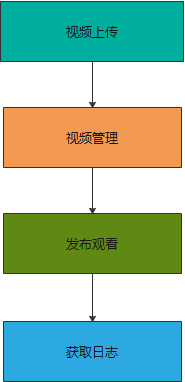

## 目标

&emsp;&emsp;本文档将在10分钟内快速完成一个视频点播的完整业务流程，前提是已经完成[系统的初始化过程](/quick_start?id=_2初始化系统)。


 


## 点播业务介绍


<div id="player"></div>

<script>
  new Vue({
    el: '#player',
    data() {
    return {
      vodPlayerJs: 'https://player.polyv.net/script/player.js',
      vid:'88083abbf5d3d0d1bb3d7f04e231b8d8_8',
    };
  },
  mounted(){
      this.loadPlayerScript(this.loadPlayer);
  },
  methods: {
    loadPlayerScript(callback) {
      if (!window.polyvPlayer) {
        const myScript = document.createElement('script');
        myScript.setAttribute('src', this.vodPlayerJs);
        myScript.onload = callback;
        document.body.appendChild(myScript);
      } else {
        callback();
      }
    },
    loadPlayer() {
      const polyvPlayer = window.polyvPlayer;
      this.player = polyvPlayer({
        wrap: '#player',
        vid: this.vid ,
        autoplay:false
      });
    }
  },
  destroyed() {
    if (this.player) {
        this.player.destroy();
    }
  }
  })
</script>
  

## 流程

  此场景适合于通用的点播视频发布流程，包括视频上传，视频管理，发布观看，获取日志四个环节。 




##  代码示例

[视频上传](/uploadService)

[视频管理](/editService)

[发布管理-通过微信观看](http://go.plvideo.cn/front/video/view?vid=88083abbf5d3d0d1bb3d7f04e231b8d8_8)

发布管理-通过内嵌播放器HTML代码观看

```html
<script src='//player.polyv.net/script/player.js'></script>
<div id='plv_88083abbf5d3d0d1bb3d7f04e231b8d8_8'></div><!-- “plv_”之后为视频id-->
<script>
var player = polyvPlayer({
  'wrap':'#plv_88083abbf5d3d0d1bb3d7f04e231b8d8_8', // ”#plv_“之后为视频id
  'width':'600',
  'height':'338',
  'vid': '88083abbf5d3d0d1bb3d7f04e231b8d8_8', // 视频id
  'playsafe': '' // 播放加密视频的凭证, 取值参考文档: http://dev.polyv.net/?p=16673 
});
</script>
```

视频id为[视频上传接口](/uploadVideoParts)返回的视频id，将此html代码片段置入用户网站html文件中即可播放视频

[获取日志](/dataStatisticsService?id=_1、查询某一天视频观看日志) 