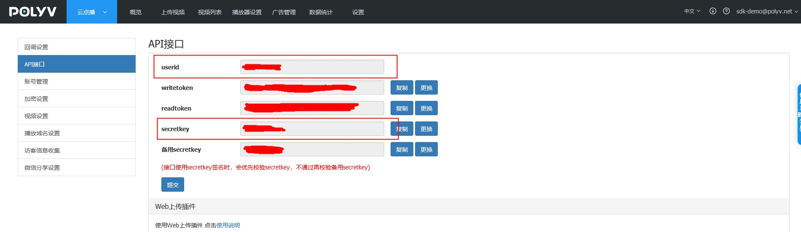

## 前提条件

在安装和使用**保利威点播Java SDK**功能前，确保B端已经具备如下环境：

- 安装Java环境。

  **保利威点播Java SDK**支持1.8或更高版本。

- 注册[保利威账号](https://www.polyv.net/)并获取[访问密钥信息](https://my.polyv.net/secure/setting/api)（userId  、 secretKey）。            

  
  
  
  
## 1.添加Maven依赖  

&emsp;&emsp;将如下依赖加入到项目的POM文件中： 

```xml
<dependency>
    <groupId>net.polyv</groupId>
    <artifactId>polyv-java-vod-sdk</artifactId>
    <version>1.1.1</version>
</dependency> 
```

> 注意：<font color=#FF0000 >为了消除Java的冗长代码，SDK使用了Lombok框架，请在IntelliJ或者Eclipse 中配置对Lombok的支持</font>

```xml
<dependency>
    <groupId>org.projectlombok</groupId>
    <artifactId>lombok</artifactId>
    <version>1.18.16</version>
</dependency>
```

## 2.初始化系统

&emsp;&emsp;在执行测试代码之前，需要B端先初始化系统配置，包括userId、secretKey , 如没有以上信息，请参考本文[前提条件](/quick_start?id=前提条件)部分获取，初始化示例代码如下，任选一种：

````java
   /**
     * 初始化配置,请配置自己的账号信息
     */
    public static void initPolyvVod(){
        String userId = "xxx";
        String secretKey = "xxx";
        VodGlobalConfig.init(userId, secretKey);
        log.debug("--初始化完成--");
    }
````
````java
 	/**
     * 初始化配置并初始化 HTTP CLIENT 连接池超时时间和最大连接数配置,请配置自己的账号信息
     */
    public static void initPolyvVod(){
        String userId = "xxx";
        String secretKey = "xxx";
        Integer timeOut = 20000;  //HTTP CLIENT 连接池超时时间
        Integer maxClientNum = 100;  //HTTP CLIENT 最大连接数      
        VodGlobalConfig.init(userId, secretKey, timeOut, maxClientNum);
        log.debug("--初始化完成--");
    }
````

&emsp;&emsp;以上代码一般配置于随系统启动执行一次的全局初始化中，如用spring框架，可以参考如下：

````java
package net.polyv.vod.config;

import org.springframework.beans.BeansException;
import org.springframework.context.ApplicationContext;
import org.springframework.context.ApplicationContextAware;
import org.springframework.stereotype.Component;

import lombok.extern.slf4j.Slf4j;

/**
 * 默认启动配置类
 * @author: thomas
 **/
@Slf4j
@Component
public class StartupListener implements ApplicationContextAware {
    
    @Override
    public void setApplicationContext(ApplicationContext applicationContext) throws BeansException {
        String userId = "xxx";
        String secretKey = "xxx";
        VodGlobalConfig.init(userId, secretKey);
        log.debug("--初始化完成--");
    }
    
    
}
````

## 3.执行测试代码

&emsp;&emsp;测试获取用户空间及流量情况，单元测试代码如下：

```java
package net.polyv.vod.v1.service;

import java.util.Calendar;

import org.junit.Assert;

import com.alibaba.fastjson.JSON;

import lombok.extern.slf4j.Slf4j;
import net.polyv.common.v1.exception.PloyvSdkException;
import net.polyv.vod.v1.config.VodGlobalConfig;
import net.polyv.vod.v1.entity.account.VodAccountSpaceDataRequest;
import net.polyv.vod.v1.entity.account.VodAccountSpaceDataResponse;
import net.polyv.vod.v1.service.account.impl.VodAccountServiceImpl;
import net.polyv.vod.v1.util.VodSignUtil;

/**
 * @author: sadboy
 **/
@Slf4j
public class VodVideoDemo {

  /**
   * 调用demo，必须处理PloyvSdkException。
   *
   * 参数合法性校验：SDK采用自定义验证框架对输入参数进行校验，如有参数不合格，将抛出PloyvSdkException异常，exception的message
   * 包括具体校验不通过的字段信息，此异常是运行时异常，必须捕获处理相关业务逻辑；
   *
   * 解析返回数据：解析返回数据，如SDK调用正常成功，将封装响应对象，正常返回，如服务器返回错误信息，SDK将将抛出PloyvSdkException异常，exception的message
   * 包括具体服务器执行错误信息，此异常是运行时异常，必须捕获处理相关业务逻辑；
   * @param args
   */
  public static void main(String[] args) {
    String userId = "xxx";
    String secretKey = "xxx";
    VodGlobalConfig.init(userId, secretKey);
    log.debug("--初始化完成--");
    try {
      Calendar instance = Calendar.getInstance();
      instance.set(2020, 10, 13);
      VodAccountSpaceDataRequest vodAccountSpaceDataRequest = new VodAccountSpaceDataRequest();
      VodAccountSpaceDataResponse vodAccountSpaceDataResponse;
      vodAccountSpaceDataRequest.setDate(instance.getTime());
      vodAccountSpaceDataResponse = new VodAccountServiceImpl().getAccountSpaceFlow(vodAccountSpaceDataRequest);
      Assert.assertNotNull(vodAccountSpaceDataResponse);
      if (vodAccountSpaceDataResponse != null) {
        log.debug("测试获取用户空间及流量情况成功,{}", JSON.toJSONString(vodAccountSpaceDataResponse));
      }
    } catch (PloyvSdkException e) {
      //参数校验不合格 或者 请求服务器端500错误，错误信息见PloyvSdkException.getMessage()
      log.error(e.getMessage(), e);
      // 异常返回做B端异常的业务逻辑，记录log 或者 上报到ETL 或者回滚事务
    } catch (Exception e) {
      log.error("SDK调用异常", e);
    }
  }

}
```

&emsp;&emsp;执行代码后，控制台应有如下关键输出，表示整合完成：

```json
2021-04-02 11:31:46:670 +0800 [main] DEBUG net.polyv.common.v1.base.HttpUtil - http 请求 url: https://api.polyv.net/v2/user/1b448be323/main , 请求参数: {"date":"2020-11-13","requestId":"f8a5283094714cb58d9aeefa5e00b1b0","sign":"216C1386579861008123892F76C83E28A8D7564E","ptime":"1617334306444"}
2021-04-02 11:31:47:320 +0800 [main] DEBUG net.polyv.common.v1.base.HttpUtil - HTTP请求耗时分析，请求URL: https://api.polyv.net/v2/user/1b448be323/main ， 请求头信息：[{"elements":[{"name":"application/x-www-form-urlencoded","parameterCount":1,"parameters":[{"name":"charset","value":"UTF-8"}]}],"name":"Content-type","value":"application/x-www-form-urlencoded; charset=UTF-8"},{"elements":[{"name":"1b448be323","parameterCount":0,"parameters":[]}],"name":"java-sdk-user-id","value":"1b448be323"},{"elements":[{"name":"JAVA_VOD_SDK","parameterCount":0,"parameters":[]}],"name":"User-Agent","value":"JAVA_VOD_SDK"},{"elements":[{"name":"JAVA_VOD_SDK","parameterCount":0,"parameters":[]}],"name":"source","value":"JAVA_VOD_SDK"},{"elements":[{"name":"1.1.1","parameterCount":0,"parameters":[]}],"name":"version","value":"1.1.1"}] ，   耗时: 556 ms
2021-04-02 11:31:47:322 +0800 [main] DEBUG net.polyv.common.v1.base.HttpUtil - http 请求结果: {"code":200,"status":"success","message":"success","data":{"videoCount":43,"totalFlow":21474836480,"usedSpace":0,"usedFlow":0,"totalSpace":21474836480,"userId":"1b448be323","email":"sdk-demo@polyv.net"}}
2021-04-02 11:31:47:367 +0800 [main] DEBUG net.polyv.vod.v1.service.VodVideoDemo - 测试获取用户空间及流量情况成功,{"email":"sdk-demo@polyv.net","totalFlow":21474836480,"totalSpace":21474836480,"usedFlow":0,"usedSpace":0,"userId":"1b448be323"}
```

&emsp;&emsp;至此，B端已经完成**保利威点播Java SDK**安装配置，可以使用点播SDK进行其他功能开发和测试，如B端接入过程有任何问题，直接使用<a href="javascript:void(0);" onclick="$('#zhichiBtnBox').click()">在线客服</a>找到售后技术支持提问 ，请将问题的运行环境、操作步骤、错误反馈信息、联系方式同步反馈，便于问题的快速定位和解决。 


